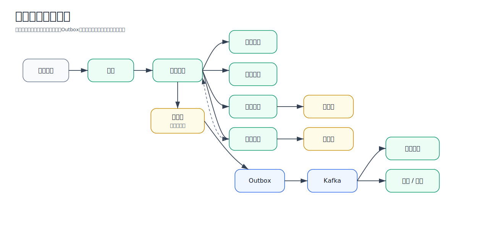

# 架构设计

本文说明 eMall 的整体架构目标、分层、核心服务边界、交易关键链路、一致性策略和下游恢复策略。

## 目标

- 注册用户规模：10 亿。
- 日活用户规模：1 亿。
- 峰值并发：100 万。
- 核心要求：水平扩展、故障隔离、流量治理、最终一致性、自动恢复、可观测、灰度发布。

这些数字是设计目标，不表示当前本地工程已经真实承载了同等规模流量。当前工程的价值是把大型电商系统
需要考虑的问题落到代码、配置、测试和文档中。

## 分层

| 层级 | 组件 | 主要能力 |
| --- | --- | --- |
| 接入层 | CDN、WAF、API Gateway、BFF | 鉴权、防刷、限流、路由、协议适配 |
| 应用层 | 用户、商品、库存、订单、支付、营销、搜索、履约、售后 | 业务域拆分、独立部署、独立扩缩容 |
| 数据层 | MySQL、Redis、OpenSearch、Kafka、对象存储 | 分库分表、缓存、搜索、事件流、冷热分层 |
| 治理层 | 配置、限流、熔断、降级、重试、隔离、灰度 | 故障控制、流量控制、平滑恢复 |
| 运维层 | Kubernetes、Prometheus、Grafana、OpenTelemetry、日志、告警 | 自动扩缩容、观测、发布、回滚 |

## 总体架构图

这张图用于说明系统不是单个应用，而是由接入层、核心交易层、业务扩展层、平台能力层、数据层和运维层共同
组成。面试时可以先用这张图讲全局，再下钻到订单、库存、支付。

## 微服务边界

| 服务 | 职责 | 高并发关注点 |
| --- | --- | --- |
| `user` | 账号、用户资料、状态变更、敏感信息保护 | 读多写少、缓存、敏感字段加密 |
| `product` | 商品创建、查询、上下架、价格变更事件 | 商品详情缓存、缓存击穿、搜索同步 |
| `pricing` | 价格本、报价快照 | 价格版本、订单价格一致性 |
| `inventory` | 库存初始化、预占、确认、释放 | 防超卖、热点 SKU、幂等、补偿 |
| `cart` | 购物车增删改查和选中项清理 | 高频弱一致流量隔离 |
| `order` | 下单、订单状态机、取消、支付确认 | Saga、Outbox、幂等、补偿 |
| `payment` | 支付单、回调、退款、资金流水、对账 | 回调幂等、资金安全、渠道对账 |
| `marketing` | 优惠券、促销报价 | 降级为无优惠，不阻塞下单 |
| `search` | 搜索索引、商品投影查询 | 异步同步、最终一致 |
| `fulfillment` | 履约单、仓库分配、物流轨迹 | 外部依赖隔离、事件驱动 |

## 核心交易链路

下单链路不使用长事务或全局 XA 事务：

1. 网关完成鉴权、限流、防刷和链路 ID 透传。
2. 订单服务根据 `requestId` 做幂等下单。
3. 商品、价格、促销在下单时生成快照。
4. 库存服务执行幂等库存预占。
5. 订单进入 `CREATED` 或 `PENDING_RETRY`。
6. 订单事件写入本地 Outbox。
7. MQ 异步驱动支付超时、库存释放、履约、通知等后续流程。

## 核心交易数据流图

这张图强调数据不是在一个数据库里完成所有更新，而是由各服务本地写入，再通过事件、补偿和对账协作。

## 一致性策略

- 强一致只放在资金、核心库存写入和订单状态变更等关键位置。
- 商品详情、搜索、推荐、评价计数等读模型使用最终一致性。
- 跨服务事务优先使用 Saga、TCC 或 Outbox，不默认使用分布式 XA。
- MQ 消费必须幂等，业务表需要保存 `request_id`、`message_id` 或独立去重记录。

## 下游平滑恢复

`governance` 模块中的 `AdaptiveRecoveryController` 用于表达下游故障后的平滑恢复思路：

- `OPEN`：熔断打开，快速拒绝请求，保护调用方线程池和下游服务。
- `HALF_OPEN`：只放少量探测流量，例如 5%。
- 连续成功后逐步增加流量。
- 恢复阶段出现失败立即重新打开熔断，避免打爆刚恢复的服务。

真实生产中，这套逻辑应结合 Resilience4j 或 Sentinel 指标、实例健康检查、自动扩缩容事件和发布系统一起使用。
