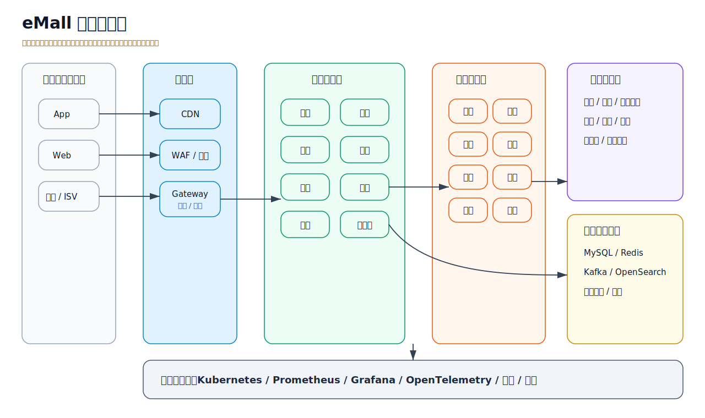
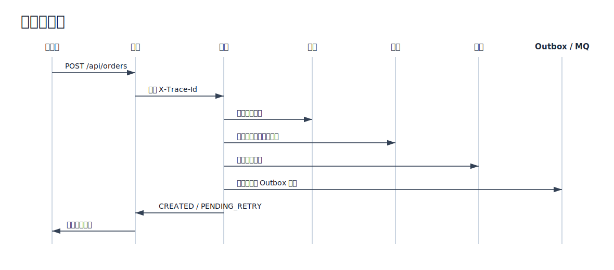
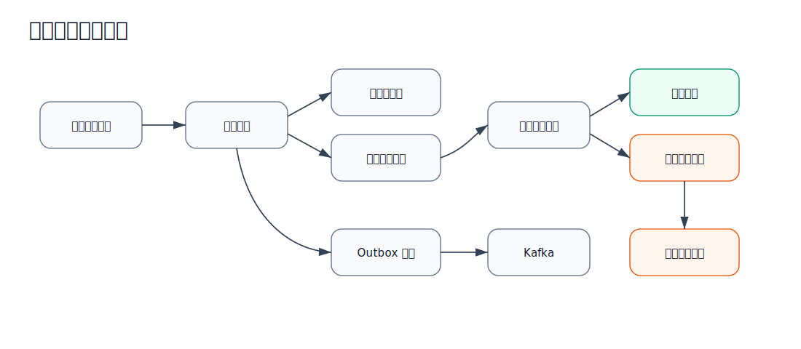
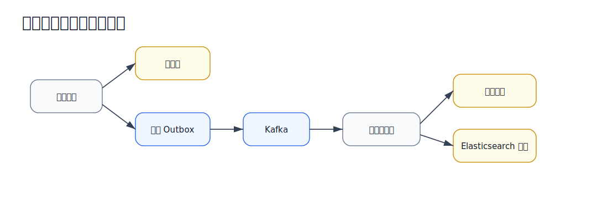
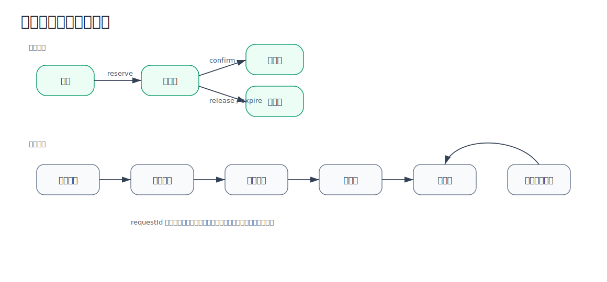
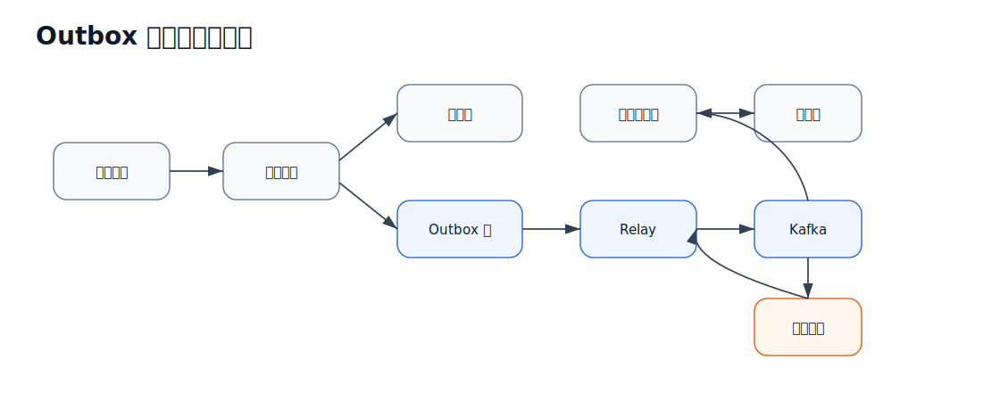
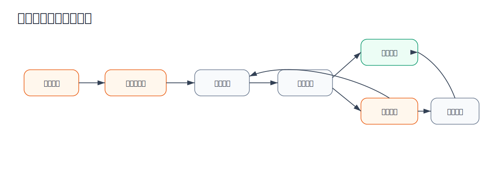
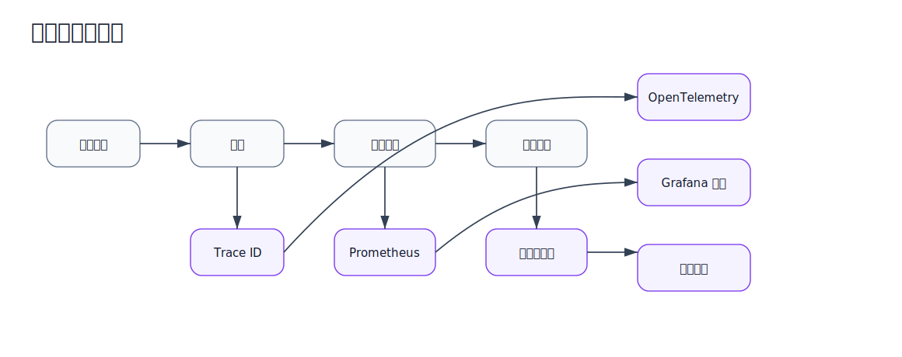

# 设计深度说明

本文用于学习、面试讲解和开源展示，说明 eMall 的设计思路、整体架构、核心数据流、关键实现细节，以及
和常见电商项目方案相比的优势与不足。

## 设计思路

eMall 不是一个简单 CRUD 商城，而是一个面向大型电商场景的 Java 17 微服务工程。它重点模拟以下问题：

- 商品、购物车、搜索、推荐、评价等读多场景。
- 下单、库存预占、支付回调、秒杀等高并发写入场景。
- 不依赖一个全局分布式事务的跨服务一致性。
- 非核心依赖故障时不阻塞核心交易。
- 具备可观测、可测试、可部署、可恢复的工程形态。

核心原则：

- 服务边界按业务域划分，而不是按 controller、service、dao 技术层划分。
- 强一致只用于订单、库存、资金、安全等关键数据。
- 跨服务流程通过快照、幂等、Outbox、补偿、对账实现最终一致。
- 网关、限流、链路追踪、指标、内部运维接口和部署清单都属于生产系统的一部分。
- 本地用 Docker Compose 降低启动成本，生产基线使用 Kubernetes 清单表达。

## 架构图



主要层级：

- 接入层：Spring Cloud Gateway、链路 ID 透传、API 安全响应头、Redis 限流。
- 核心交易层：用户、商品、类目、价格、库存、订单、购物车、支付、营销、搜索、履约、评价、售后。
- 市场和增长层：商家、秒杀、推荐、实验、促销、广告。
- 供应、财务和客服层：供应链、财务、客服、预测。
- 数据和 AI 层：事件平台、数仓、智能决策、分析。
- 信任和治理层：身份、风控、运营、开放平台、混沌、成本治理。
- 生产控制面：流量、可靠性、发布、平台运维。

## 核心数据流

### 下单流程

下单流程避免长事务。每个服务只保证自己的本地事务，跨服务通过幂等和补偿保证最终一致。



关键点：

- `requestId` 防止用户重复提交导致重复下单。
- 价格是关键依赖，价格失败要拒绝下单。
- 营销是非关键依赖，失败时可以降级为无优惠。
- 库存预占必须幂等，失败时进入补偿流程。
- 下单时保存价格和优惠快照，避免后续规则变化影响历史订单。

### 支付回调流程

支付回调来自外部渠道，天然可能重复、乱序或延迟，所以不能简单更新状态。



关键点：

- 渠道交易号要去重，避免重复扣款或重复入账。
- 支付和退款流水采用追加写，不覆盖历史。
- 对账任务对比渠道账单与本地支付、退款记录。
- 内部运维接口可以重试失败的订单确认和对账任务。

### 商品到搜索同步流程

搜索是读模型，不应该让商品写入阻塞在 Elasticsearch 上。



关键点：

- 商品变更先落库，再通过 Outbox 发事件。
- 搜索消费者必须幂等，因为 MQ 可能重复投递。
- 搜索新鲜度是最终一致，不影响下单主链路。

### 库存预占和释放流程

库存是高并发交易中最容易出问题的部分，核心目标是防超卖、可重试、可补偿。



关键点：

- `requestId` 保证重复预占、确认、释放不会改变结果。
- 热点 SKU 通过库存桶降低单行写竞争。
- 订单取消、支付超时和补偿任务都可能触发库存释放。
- 库存释放必须能重复执行，避免补偿任务造成二次加库存。

### Outbox 事件发布流程

Outbox 用于解决“本地事务成功但 MQ 发送失败”的问题。



关键点：

- 业务数据和 Outbox 事件在同一个本地事务中写入。
- MQ 发送失败不会丢事件，因为事件仍保存在 Outbox 表中。
- 消费端必须做幂等，因为事件可能重复投递。
- 内部运维接口可以重放失败事件。

### 补偿和人工恢复流程

自动补偿解决大部分临时失败，内部运维接口用于处理自动恢复仍失败的状态。



典型补偿场景：

- 订单创建时库存服务短暂不可用。
- 支付成功后订单确认失败。
- Outbox 发布失败。
- 库存预占过期但未及时释放。
- 渠道账单和本地支付流水存在差异。

### 可观测数据流

可观测性不是额外功能，而是定位故障和证明系统稳定性的基础。



排障时通常按这个顺序看：

1. 先看业务指标，例如下单成功率、支付成功率、库存失败率。
2. 再看服务指标，例如延迟、错误率、线程池、数据库连接。
3. 再按 `X-Trace-Id` 查完整链路。
4. 最后结合日志定位具体失败原因。

## 关键技术实现细节

### 服务边界

- `order` 负责下单状态和订单生命周期。
- `inventory` 负责库存初始化、预占、确认、释放和热点库存桶。
- `payment` 负责支付单、回调、退款、资金流水和对账。
- `pricing`、`marketing` 在下单时提供快照，而不是让订单引用可变规则。
- `fulfillment`、`after-sales` 从订单中拆出，避免物流和售后复杂度污染订单状态机。
- `identity`、`risk`、`operations`、`openapi` 将信任和治理能力从交易 API 中拆出。

### 一致性与恢复

系统不默认依赖 XA 事务，而是组合使用：

- 服务内部本地事务。
- 可重试命令的幂等键。
- Outbox 表保证事件可靠发布。
- 发布失败和下游确认失败的重试状态。
- 订单、库存、支付的补偿任务。
- 支付和退款的对账任务。

这种方案允许短暂不一致，但要求每种失败状态都能被发现、重试和修复。

### 流量与稳定性

- 网关使用用户、设备、SKU、客户端 IP 等组合键限流。
- `governance` 模块表达熔断后的自适应平滑恢复。
- 非核心依赖支持降级，例如营销失败时下单不使用优惠。
- 模块和服务边界提供故障隔离。
- 热点 SKU 库存桶减少单行库存竞争。
- 秒杀使用令牌和队列隔离突发流量。

### 可观测和运维

- Servlet 服务透传 `X-Trace-Id`。
- 服务返回基础 API 安全响应头。
- Prometheus 和 Grafana 提供基础监控。
- 支持结构化日志和 OpenTelemetry OTLP 导出。
- 内部运维接口支持 Outbox 重放、补偿、库存释放、支付对账。
- Kubernetes 清单包含探针、资源配置、安全上下文、网络策略和优雅关闭。

### 验证策略

- `mvn test` 执行单元测试。
- `mvn verify -DskipITs=false` 执行完整校验和 Failsafe 集成测试。
- Docker 可用时，Testcontainers 测试真实 MySQL、Redis、Kafka 行为。
- 设置 `EMALL_RUN_*_IT` 后，smoke 测试可以验证真实环境端到端链路。
- 混沌和清单测试可以在不依赖真实集群的情况下验证部署和韧性配置。

## 竞品对比

- 相比简单单体商城 Demo：eMall 的服务边界、恢复设计、测试和运维覆盖更完整；缺点是更难启动和维护。
- 相比 CRUD 微服务教程：eMall 包含下单一致性、Outbox、补偿、对账和可观测；缺点是部分模块仍是基线实现。
- 相比单库电商系统：eMall 的数据所有权和故障边界更清晰；缺点是跨服务流程需要更强的运维纪律。
- 相比云原生示例应用：eMall 覆盖财务、风控、数据、AI、发布、平台运维等更宽业务面；缺点是学习成本更高。
- 相比真实京东或 Amazon 级平台：eMall 能展示类似工程问题和设计取舍；差距是真实流量、SRE 流程和专有基础设施。
- 相比商业 SaaS 电商平台：eMall 开放可读、可改、可验证；缺点是缺少成熟后台、租户计费、合规包和生态集成。

## 优势

- 从 API 到部署和验证都有覆盖，适合展示完整工程思维。
- 核心交易链路包含幂等、库存预占、支付确认和补偿。
- 生产关注点落在代码、配置、测试和文档中。
- Maven 可以一条命令验证所有模块。
- 面试时可以自然引出高并发、分布式一致性、故障恢复和可运维性。

## 劣势和风险

- 模块数量较多，小团队学习和维护成本偏高。
- 部分服务是生产基线实现，还需要更深业务规则才能真实上线。
- 没有经过持续压测、真实分库分表和生产指标验证，不能声称已经达到真实大厂规模。
- Docker、Kafka、Redis、MySQL、Elasticsearch、Kubernetes 都需要运维能力。
- 目前缺少完整前端商城、商家后台和内部运维控制台。
- 安全、隐私、税务、结算和合规流程还需要结合国家和行业要求继续深化。

## 面试讲法

可以这样介绍：

```text
我做了一个 Java 17 微服务电商平台，重点不是简单 CRUD，而是围绕大型电商的核心交易链路做工程化设计。
系统覆盖订单、库存、支付、履约和售后，并实现了幂等、Outbox、补偿、对账、限流、熔断、降级、
可观测和 Kubernetes 部署基线。我不会说它已经真实承载京东级流量，但它能体现我对高并发、
分布式一致性、故障恢复和生产可运维性的理解。
```

讲解顺序建议：

1. 先讲核心交易链路，说明为什么不用长事务。
2. 重点讲库存预占、支付回调幂等和对账。
3. 说明非核心依赖如何降级，不阻塞下单。
4. 说明可观测、内部运维接口和测试如何帮助定位和恢复故障。
5. 主动说明当前限制，这样项目更可信。
