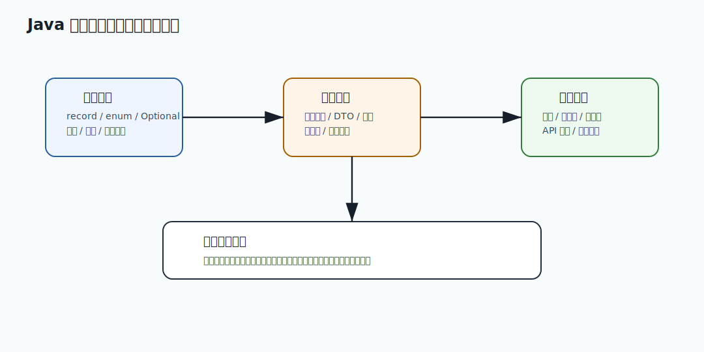

# 010 服务端为什么建议统一存储 UTC 时间？

[返回按分类学习面试题](../README.md)

## 题目

服务端为什么建议统一存储 UTC 时间？

## 先给面试官的短答案

服务端统一存储 UTC 时间，是为了避免多时区、多区域、多服务之间对同一个时间产生不同解释。
订单、支付、库存、Outbox、审计、日志这些事实事件，都应该用统一时间线记录。

展示给用户时，再根据用户所在时区转换。

面试回答：

```text
我会把事实事件时间统一存成 UTC，例如订单创建、支付回调、库存预占过期、审计操作。
这样跨服务排序、对账、日志追踪和多区域部署都没有时区歧义。
用户界面展示时再转换成用户时区；大促活动这类业务日历规则则保存明确业务时区。
```

## 从零基础理解：UTC 是什么？

UTC 可以理解为全球统一的标准时间线。不同地区的本地时间，是在 UTC 基础上加减时区偏移。

例如同一时刻：

```text
UTC: 2026-04-30 12:00
北京: 2026-04-30 20:00
纽约: 2026-04-30 08:00
```

如果数据库只存 `2026-04-30 20:00`，别人不知道它是不是北京时间。
如果统一存 UTC，所有服务都能按同一条时间线理解。

## 为什么分布式系统更需要 UTC？

分布式系统有多个服务、多个数据库、多个日志系统，甚至多个区域。

如果服务 A 用北京时间，服务 B 用 UTC，服务 C 用美国时间，会出现：

- 订单和支付时间排序错乱。
- 对账文件匹配失败。
- 日志排查时间线对不上。
- 定时任务提前或延后执行。
- 夏令时切换导致时间重复或消失。
- 多区域故障切换后业务时间异常。

统一 UTC 可以降低这些问题。

## 哪些时间应该存 UTC？

事实事件时间都应该存 UTC：

- 订单创建时间。
- 支付成功时间。
- 支付渠道回调时间。
- 库存预占过期时间。
- Outbox 事件创建时间。
- MQ 消费时间。
- 审计操作时间。
- 登录时间。
- 风控命中时间。
- 退款发起时间。

这些时间描述的是“事情什么时候发生”，不是“用户看到几点”。

## 哪些时间需要业务时区？

有些时间是业务日历规则，不只是事实时间。

例如：

- 618 活动北京时间 0 点开始。
- 某商家店铺按当地时间每天 9 点营业。
- 优惠券在用户所在地区当天过期。

这类配置需要保存明确时区：

```text
start_time: 2026-06-18T00:00:00
zone_id: Asia/Shanghai
```

执行调度时转换成 UTC `Instant`。

## 数据库怎么设计？

常见做法：

```sql
created_at timestamp not null
updated_at timestamp not null
```

但必须在工程规范中明确：这些字段统一写入 UTC。

如果使用 MySQL，要注意 `timestamp` 和 `datetime` 行为差异，以及 JDBC 驱动时区配置。
关键不是字段名，而是全链路约定一致。

推荐实践：

- Java 内部使用 `Instant`。
- 入库统一 UTC。
- API 输出 ISO-8601，最好带 `Z` 或 offset。
- 前端按用户时区展示。
- 日志系统统一 UTC 或至少带时区。

## 对账为什么特别依赖统一时间？

支付对账经常要匹配：

- 本地支付单。
- 支付渠道账单。
- 银行清算时间。
- 退款记录。

如果本地时间和渠道时间时区不一致，就会出现某笔交易落在不同日期的问题。

例如本地认为是 4 月 30 日晚上，UTC 可能已经跨到另一个结算日。
对账系统必须明确使用哪个时间口径。

专家级回答要补充：

```text
对账不仅要统一时间，还要区分交易发生时间、渠道入账时间、清算日期和本地记录时间。
```

## 日志和 Trace 为什么需要 UTC？

一次请求可能经过：

```text
gateway -> order -> inventory -> payment -> Kafka -> fulfillment
```

如果每个服务日志时区不一致，排查故障时很难把事件串起来。

统一 UTC 或明确时区可以让 trace 时间线可靠。

## 常见坑

### 服务端存本地时间

单区域时看起来没问题，多区域或迁移后会出问题。

### 使用 `LocalDateTime.now()`

它依赖默认时区。不同机器配置不同，结果可能不同。

更推荐：

```java
Instant now = Instant.now();
```

或注入：

```java
Instant now = clock.instant();
```

### 前端直接展示 UTC

存储用 UTC，不代表用户也要看 UTC。用户应该看到本地时间或业务指定时区时间。

## 深度增强：工程化理解图



这类题不能只停留在语法解释。生产系统更关心它如何改善建模、降低误用、保护兼容性、提升可测试性，
以及能否让团队在多人协作中保持稳定边界。回答时要从语言特性落到业务约束和工程治理。

## 深度增强：Java 17 落地示例

```java
import java.util.Objects;

record StableApiField(String name, String type, boolean required) {

    StableApiField {
        Objects.requireNonNull(name);
        Objects.requireNonNull(type);
        if (name.isBlank() || type.isBlank()) {
            throw new IllegalArgumentException("API field metadata must be explicit");
        }
    }
}

final class ApiCompatibilityPolicy {

    boolean canAddField(StableApiField field) {
        return !field.required();
    }
}
```

这段代码体现 Java 17 在工程建模中的价值：用 `record` 表达不可变数据，用构造校验保护边界，
用小的策略类表达兼容规则。面试中要把语法能力和 API 演进、错误预防、团队协作联系起来。

## 深度增强：生产边界

语言特性不是越新越好。核心原则是可读、可测、可维护、可兼容。任何语法选择都要能让代码意图更清晰，
而不是为了炫技。公共 API、金额、时间、状态、异常和 DTO 都要有稳定约束，避免线上数据被随意破坏。

## 深度增强：面试高分表达

我会先回答概念，再说明它在电商系统中的真实作用。例如金额要避免精度错误，状态要可兼容扩展，
DTO 和领域对象要隔离外部契约和内部模型。这样能体现我不是只会写 Java 语法，而是能做工程设计。

## 专家级完整回答

```text
服务端统一存储 UTC，是为了让所有服务、数据库、日志和消息都使用同一条时间线。
订单创建、支付回调、库存预占过期、Outbox 事件和审计记录都是事实事件，
应该用 UTC Instant 存储，避免多时区、多区域和夏令时带来的歧义。

展示层再根据用户时区转换。对于大促开始时间、优惠券有效期这类业务日历规则，
我会保存明确的 ZoneId，例如 Asia/Shanghai，再转换成 UTC 做调度。
对账场景还要区分交易发生时间、渠道入账时间和清算日期，不能混用。
```

## 回答评分点

高分答案应该覆盖：

- 能解释 UTC 是统一时间线。
- 能说明事实事件时间用 UTC。
- 能说明展示时间按用户时区转换。
- 能指出业务日历规则要保存 ZoneId。
- 能联系日志、trace、对账、多区域和夏令时问题。

## 深度完善：面向 L6 的回答框架

围绕「服务端为什么建议统一存储 UTC 时间？」，高分答案不能停在概念定义，而要把「语言特性、建模边界、兼容性和团队编码规范」讲成一条可验证的工程链路。
面试官真正关注的是：你是否知道它解决什么问题、什么时候会失效、如何在生产系统中验证。

### 1. 先界定边界

- 本题属于「Java 语言和工程基础」，先说明它影响的是正确性、稳定性、性能、安全还是协作效率。
- 不要直接背结论，要先说清业务约束、数据规模、调用链位置和失败后果。
- 如果存在多种方案，要说明默认选择、替代方案、迁移成本和放弃条件。

### 2. 结合 eMall 落地

- 可以从 `common、order、inventory、payment 的 DTO、值对象、异常和公共 API` 切入，说明它在真实电商链路中的入口、状态、数据和依赖。
- 回答时至少补一个失败路径，例如超时、重复请求、状态不一致、热点流量或配置误发。
- 再说明如何通过代码规范、测试、灰度、回滚、监控或补偿把风险收敛。

### 3. 生产级验证

- 关键指标：代码评审问题数、缺陷逃逸率、兼容性测试结果、静态检查违规数。
- 验证证据：代码规范、单元测试、契约测试、兼容性用例和重构前后缺陷数据。
- 如果没有这些证据，只能说明方案在理论上成立，不能证明它能长期稳定运行。

### 4. 追问防守

- 被问“为什么不用更简单方案”时，回答当前规模、团队能力和风险收益是否匹配。
- 被问“为什么不用更复杂方案”时，回答复杂方案的运维成本、故障面和迁移成本。
- 最后用一句话收束：先用简单可靠方案闭环，再用指标驱动演进，而不是提前复杂化。

## 补强索引
本题复习重点：服务端为什么建议统一存储 UTC 时间？

- 先看本文的题目专属答案，再按共享框架补齐项目落点、失败路径、取舍和验收。
- 白板复述时用结论 -> 例子 -> 风险 -> 指标四层结构。
