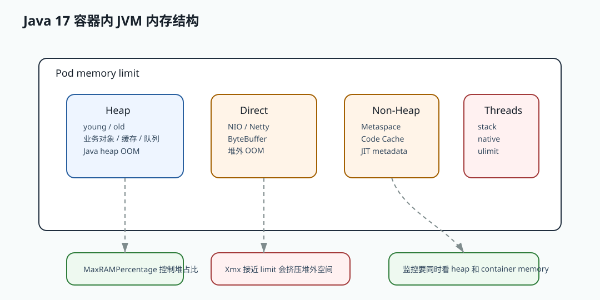

# 068 容器环境下 JVM 如何感知内存限制？

[返回按分类学习面试题](../README.md)

## 核心结论

现代 JVM 能读取 cgroup 信息，感知容器的 CPU 和内存限制。Java 17 默认支持容器感知，
可以根据容器 memory limit 计算默认堆大小，也可以通过 `MaxRAMPercentage` 控制堆占比。

但 JVM 感知容器限制不代表自动安全。Pod 内存还包括堆外内存、线程栈、元空间和 JVM native 开销。

## 为什么容器内存特殊？

传统物理机上，JVM 看到的是机器总内存。

容器中，应用应该受到 Pod 或 container memory limit 限制。

如果 JVM 不感知容器限制，可能按宿主机内存计算堆大小，导致容器内存超限。

现代 JVM 已经解决了这个基础问题，但仍需要合理配置。

## JVM 如何设置堆比例？

可以使用：

```text
-XX:MaxRAMPercentage=65
-XX:InitialRAMPercentage=65
```

含义是让堆按可用 RAM 的百分比设置。

例如容器内存 2 GB，`MaxRAMPercentage=65`，最大堆大约是 1.3 GB。

剩余内存留给 metaspace、direct memory、线程栈、code cache 和 native 开销。

## 为什么不能把堆设满？

容器 memory limit 统计整个进程。

除了 heap，还有：

- direct memory。
- metaspace。
- thread stack。
- code cache。
- GC native memory。
- JIT 编译开销。
- libc 和 TLS 等 native 开销。

如果 `-Xmx` 接近容器上限，heap 还没满，容器也可能 OOMKilled。

## CPU 感知也很重要

JVM 还会根据 CPU 配额调整：

- GC 线程数量。
- JIT 编译线程数量。
- ForkJoinPool 并行度。

如果 CPU limit 设置过小，服务可能出现：

- 启动变慢。
- GC 变慢。
- JIT 编译慢。
- P99 升高。
- CPU throttling。

所以容器中不只要看内存，还要看 CPU limit 和 request。

## 如何确认 JVM 看到的限制？

可以使用：

```powershell
java -XshowSettings:system -version
```

也可以查看：

```powershell
jcmd <pid> VM.flags
jcmd <pid> VM.info
```

线上还应结合容器指标：

- container memory working set。
- heap used。
- non-heap used。
- direct memory。
- thread count。
- CPU throttling。

## OOMKilled 和 Java OOM 的区别

Java OOM 是 JVM 抛出的异常，例如：

```text
java.lang.OutOfMemoryError: Java heap space
```

OOMKilled 是容器被操作系统杀掉，Java 进程可能没有机会打印 heap dump。

如果 Pod 直接重启且日志中没有 Java OOM，要怀疑容器级 OOMKilled。

## 容器内 JVM 内存图



Java 17 能读 cgroup 限制，只解决“JVM 知道容器有多大”这个问题。它不能自动判断业务需要多少 direct memory、
多少线程栈、多少 metaspace，也不能替你避免线程池和缓存把内存吃满。

## 生产边界

容器 CPU limit 也会影响 JVM。CPU 被 throttle 时，GC 线程、JIT 编译和业务线程都会变慢，
表现可能是 P99 升高而不是 CPU 使用率 100%。所以容器排障要看 `throttled_seconds` 和 CPU request/limit。

要区分 Java OOM 和 OOMKilled。Java OOM 通常有异常和 dump；OOMKilled 可能只有 Pod event 和退出码。
如果日志中没有 `OutOfMemoryError`，但 Pod reason 是 OOMKilled，就要看进程总内存，而不是只看 heap。
