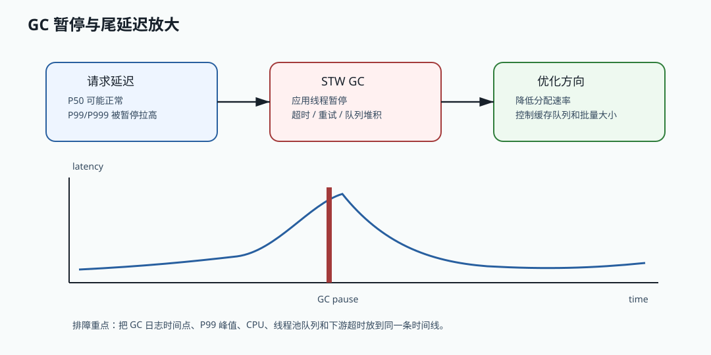

# 074 线程池队列堆积和 JVM 内存上涨有什么关系？

[返回按分类学习面试题](../README.md)

## 核心结论

线程池队列堆积会让任务对象、请求上下文、参数、日志上下文和回调对象长时间留在内存中，
导致 heap 使用上涨。队列越大，排队时间越长，对象越容易跨过多次 young GC 后晋升到 old gen，
最终可能引发频繁 GC、P99 升高甚至 OOM。

所以生产线程池必须使用有界队列，并监控 queue size、active count 和 rejected count。

## 队列里存的是什么？

线程池队列中存放的是等待执行的任务。

这些任务可能引用：

- 请求参数。
- 用户信息。
- 商品列表。
- trace context。
- 日志 MDC。
- 回调对象。
- 数据库查询条件。
- 大集合或大 JSON。

只要任务还在队列中，这些对象就不会被 GC。

## 为什么会导致 heap 上涨？

队列堆积意味着对象生命周期变长。

原本请求结束就能回收的对象，现在要等任务执行完才可回收。

如果堆积持续发生：

- young gen 对象变多。
- 存活对象跨过多次 GC。
- 对象晋升到 old gen。
- old gen 回收压力增加。
- GC pause 变长。

这就是队列堆积和 JVM 内存上涨的直接关系。

## 线程池队列与内存图



线程池队列堆积会先表现为排队时间变长，然后表现为对象生命周期变长，最后可能变成 old gen 上涨和 GC 暂停。
这也是为什么“下游慢”经常能拖垮调用方：不是只慢一个请求，而是把调用方线程和内存一起占住。

## Java 17 有界线程池示例

```java
import java.util.concurrent.ArrayBlockingQueue;
import java.util.concurrent.ThreadPoolExecutor;
import java.util.concurrent.TimeUnit;

final class BoundedExecutorFactory {

    ThreadPoolExecutor createInventoryExecutor() {
        return new ThreadPoolExecutor(
                32,
                32,
                30,
                TimeUnit.SECONDS,
                new ArrayBlockingQueue<>(500),
                new ThreadPoolExecutor.AbortPolicy());
    }
}
```

这个示例的重点是有界队列和明确拒绝策略。无界队列看似保护请求不失败，实际是把过载转移到内存里，
让请求排队、对象滞留、GC 变慢，最终可能 OOM。

## 生产边界

队列大小应该从可接受等待时间倒推，而不是拍脑袋。假设服务每秒处理 1000 个任务，
最大允许排队 200 ms，那么队列容量约 200 更合理；设置成 100000 只会隐藏过载。

对不同下游要做线程池隔离。库存慢不应该占满支付线程池，推荐慢不应该影响订单创建。
如果使用虚拟线程，也仍然需要限流、超时和背压，因为数据库连接、HTTP 连接和下游容量不是无限的。
