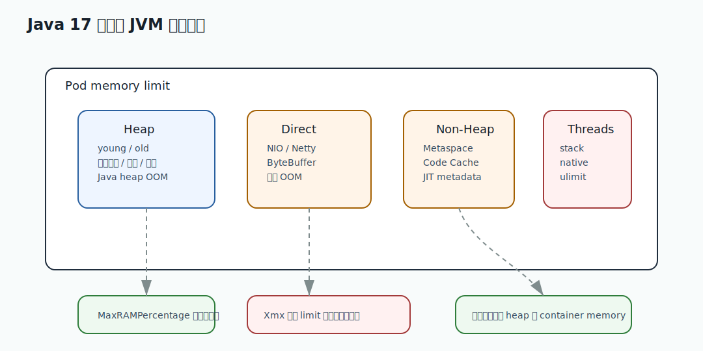

# 076 如何定位锁竞争？

[返回按分类学习面试题](../README.md)

完成标记：已完成

深度完善标记：已完成

## 题目

如何定位锁竞争？

## 先给面试官的短答案

定位锁竞争要看线程状态、阻塞栈和等待时间。常用工具是 `jstack`、JFR、APM 和线程池指标。
如果大量线程处于 `BLOCKED`，或 JFR 中 monitor blocked 时间很高，并且调用栈集中在同一段代码，
就说明存在锁竞争热点。

修复方向是缩小锁粒度、减少锁内逻辑、拆分热点资源、使用无锁结构或异步化。

## 锁竞争是什么？

锁竞争是多个线程争抢同一个锁，只有一个线程能进入临界区，其他线程等待。

轻微锁竞争正常。

严重锁竞争会导致：

- P99 升高。
- 吞吐下降。
- CPU 利用率不高但请求慢。
- 大量线程 `BLOCKED`。
- 线程池被占满。

锁竞争本质上会把并发处理变成串行排队。

## 使用 jstack

`jstack` 可以看到线程状态和阻塞位置。

如果很多线程类似：

```text
java.lang.Thread.State: BLOCKED
    at com.emall.inventory.InventoryService.reserve(...)
```

说明它们在等待 synchronized monitor。

要关注：

- 是否大量线程卡在同一行。
- 等待的是同一个 monitor。
- 持锁线程在做什么。
- 锁内是否有数据库、HTTP 或复杂计算。

## 使用 JFR

JFR 对锁竞争非常有用。

可以看：

- Java Monitor Blocked。
- Thread Park。
- Lock Instances。
- 阻塞时间。
- 阻塞调用栈。

JFR 比单次 `jstack` 更适合看一段时间内的锁等待分布。

## ReentrantLock 和 park

如果使用 `ReentrantLock`，线程可能表现为 `WAITING` 或 `TIMED_WAITING`，栈中出现 `Unsafe.park`。

这不一定说明线程空闲，可能是在等待锁或条件队列。

要结合：

- 线程名。
- 调用栈。
- JFR park 事件。
- 锁对象和业务代码。

## 数据库锁竞争

数据库锁竞争不一定表现为 Java `BLOCKED`。

Java 线程可能是 `RUNNABLE`，但实际卡在 socket read 等待数据库返回。

需要看：

- 慢 SQL。
- 行锁等待。
- 事务持续时间。
- 数据库连接池。
- trace 中 DB span。

库存热点行、优惠券领取、账户余额更新都容易出现数据库锁竞争。

## 修复方向

常见修复：

- 缩小 synchronized 范围。
- 锁内不做 IO。
- 拆分全局锁。
- 按 key 分段锁。
- 使用 CAS 或并发集合。
- 热点库存拆桶。
- 使用队列串行化单个热点。
- 数据库层减少事务范围。

选择哪种方案取决于一致性要求和业务热点形态。

## 在 eMall 项目中怎么讲？

秒杀库存如果所有请求都竞争同一个商品锁，P99 会急剧升高。

可以使用：

- 库存分桶。
- Redis 预扣。
- 本地热点保护。
- MQ 削峰。
- 数据库短事务。
- 按商品维度隔离。

核心目标是避免全局锁和热点资源串行化拖垮整个服务。

## 深度增强：JVM 生产运行图



JVM 题要从运行时资源解释到业务影响。堆、直接内存、元空间、线程栈和容器 memory limit 共同决定服务稳定性；
GC、CPU throttling、线程池队列和下游超时会一起影响 P99，而不是孤立存在。

## 深度增强：Java 17 诊断模型示例

```java
record RuntimeSignal(
        double heapUsage,
        double containerMemoryUsage,
        long gcPauseMillis,
        int threadCount,
        int queuedTasks) {

    boolean requiresTriage() {
        return heapUsage > 0.85
                || containerMemoryUsage > 0.90
                || gcPauseMillis > 500
                || threadCount > 800
                || queuedTasks > 1_000;
    }
}
```

这个模型强调线上诊断要看组合信号。只看 heap 不够，只看 GC 也不够；
要把 JVM、容器、线程池和业务延迟放到同一条时间线。

## 深度增强：生产边界

JVM 调优不能靠背参数。要先明确服务目标：低延迟、吞吐、容器资源、对象分配速率和 P99 SLO。
然后通过 GC 日志、JFR、指标和压测验证。错误地调大 `-Xmx` 可能挤压堆外内存，导致容器 OOMKilled。

## 深度增强：面试高分表达

我会用证据链回答 JVM 问题：先看业务影响，再看 JVM 指标、GC 日志、线程栈、heap dump、容器事件和最近变更。
结论要能解释现象，并能给出降级、扩容、参数调整或代码优化方案。

## 专家级完整回答

```text
定位锁竞争我会先看 jstack 是否有大量 BLOCKED 线程集中在同一行，再用 JFR 看 monitor blocked
和 park 事件的等待时间和调用栈。对于 ReentrantLock 要注意线程可能表现为 park；对于数据库锁，
Java 线程可能卡在 JDBC 调用，需要结合慢 SQL、行锁等待和 trace。

优化时会缩小锁范围，避免锁内 IO，拆分全局锁，按 key 分段，热点库存可用拆桶、队列化或异步削峰。
```

## 回答评分点

高分答案应该覆盖：

- `jstack` 看 `BLOCKED` 和调用栈。
- JFR 看 monitor blocked 和 park。
- ReentrantLock 不一定显示为 `BLOCKED`。
- 数据库锁要看 DB 指标。
- 修复要缩小锁粒度和拆热点。

## 深度完善：面向 L6 的回答框架

围绕「如何定位锁竞争？」，高分答案不能停在概念定义，而要把「内存模型、GC、线程、JIT、诊断命令和容器资源边界」讲成一条可验证的工程链路。
面试官真正关注的是：你是否知道它解决什么问题、什么时候会失效、如何在生产系统中验证。

### 1. 先界定边界

- 本题属于「JVM 和性能诊断」，先说明它影响的是正确性、稳定性、性能、安全还是协作效率。
- 不要直接背结论，要先说清业务约束、数据规模、调用链位置和失败后果。
- 如果存在多种方案，要说明默认选择、替代方案、迁移成本和放弃条件。

### 2. 结合 eMall 落地

- 可以从 `gateway、order、payment、search 在高峰期的 P99、GC、线程池和容器资源` 切入，说明它在真实电商链路中的入口、状态、数据和依赖。
- 回答时至少补一个失败路径，例如超时、重复请求、状态不一致、热点流量或配置误发。
- 再说明如何通过代码规范、测试、灰度、回滚、监控或补偿把风险收敛。

### 3. 生产级验证

- 关键指标：P50/P95/P99、GC pause、allocation rate、线程数、CPU throttle、RSS。
- 验证证据：JFR、GC log、jstack、jcmd、heap dump、压测报告和发布对比曲线。
- 如果没有这些证据，只能说明方案在理论上成立，不能证明它能长期稳定运行。

### 4. 追问防守

- 被问“为什么不用更简单方案”时，回答当前规模、团队能力和风险收益是否匹配。
- 被问“为什么不用更复杂方案”时，回答复杂方案的运维成本、故障面和迁移成本。
- 最后用一句话收束：先用简单可靠方案闭环，再用指标驱动演进，而不是提前复杂化。

## 补强索引

重复补强内容已合并到 [面试补强共享框架](../deepening-framework.md)。

整理标记：重复内容已合并

本题复习重点：如何定位锁竞争？

- 先看本文的题目专属答案，再按共享框架补齐项目落点、失败路径、取舍和验收。
- 白板复述时用结论 -> 例子 -> 风险 -> 指标四层结构。
