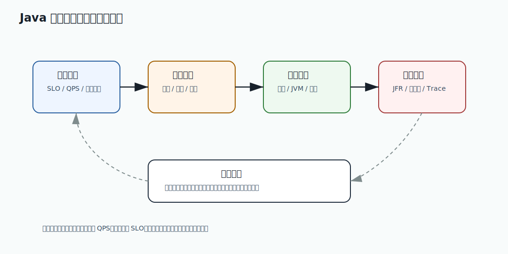

# 077 如何设计一次 Java 服务压测和性能剖析？

[返回按分类学习面试题](../README.md)

## 题目

如何设计一次 Java 服务压测和性能剖析？

## 先给面试官的短答案

一次有效压测要先定义目标和场景，再准备接近生产的数据、流量模型和环境。执行时要分阶段预热、阶梯加压、
稳定压测和故障压测，并同时采集业务指标、JVM 指标、系统指标、数据库、缓存和下游指标。
性能剖析要用 JFR、火焰图、GC 日志和链路追踪定位瓶颈。

压测不是只打 QPS，而是验证 SLO、容量、瓶颈和降级能力。

## 第一步：定义目标

先明确：

- 目标 QPS。
- P95/P99 延迟。
- 错误率上限。
- CPU 和内存水位。
- 单实例容量。
- 最大并发。
- 降级触发条件。
- 成本约束。

没有目标的压测只能得到一堆数字。

## 第二步：设计场景

电商压测不能只测一个接口。

要覆盖：

- 首页浏览。
- 商品详情。
- 搜索。
- 加购。
- 下单。
- 支付前校验。
- 秒杀抢购。
- 订单查询。
- 售后申请。

还要设计比例，例如 80% 浏览、15% 加购、5% 下单。

真实流量模型比单接口极限 QPS 更有价值。

## 第三步：准备数据

数据要接近生产：

- 用户数量。
- 商品数量。
- 热点商品。
- 库存分布。
- 优惠规则。
- 历史订单。
- 缓存状态。
- 数据库索引。

如果数据太小，索引、缓存和锁竞争表现都会失真。

## 第四步：分阶段执行

常见阶段：

- 冷启动观察。
- 预热。
- 阶梯加压。
- 稳定压测。
- 峰值压测。
- 长稳压测。
- 故障注入。
- 恢复观察。

不要一上来打满流量，否则很难判断瓶颈出现的临界点。

## 第五步：采集指标

必须采集：

- QPS。
- P50/P95/P99/P999。
- 错误率。
- 超时率。
- CPU。
- heap 和 direct memory。
- GC pause。
- 线程池队列。
- 数据库连接池。
- 慢 SQL。
- Redis 命中率。
- 下游延迟。
- MQ 堆积。

压测结果要能解释瓶颈，而不是只有压测工具报告。

## 第六步：性能剖析

常用工具：

- JFR。
- async-profiler。
- GC 日志。
- `jstack`。
- 链路追踪。
- 数据库慢日志。

CPU 高看火焰图，GC 抖动看 GC log 和 allocation profile，锁竞争看 JFR monitor blocked，
下游慢看 trace span。

## 第七步：找到瓶颈后验证优化

性能优化必须闭环：

- 记录基线。
- 找到瓶颈。
- 做最小改动。
- 重新压测。
- 对比指标。
- 确认没有引入新瓶颈。

如果优化后 QPS 提升但错误率升高，不能算成功。

## 在 eMall 项目中怎么讲？

eMall 要做京东级链路，压测不能只打订单创建。

要模拟：

- 浏览到下单的混合流量。
- 热点商品秒杀。
- 优惠规则高峰。
- 库存不足。
- 支付下游变慢。
- Redis 部分不可用。
- MQ 堆积和恢复。

这样才能验证限流、熔断、降级、容错和下游平滑恢复。

## 深度增强：压测剖析闭环图



压测的价值是找到容量上限、瓶颈位置和风险边界，而不是得到一个最大 QPS 数字。
成熟压测要能回答：单实例容量是多少，集群扩容是否线性，P99 从哪个点开始恶化，哪个依赖先到瓶颈。

## 深度增强：Java 17 压测结果判定示例

```java
record LoadTestResult(
        int qps,
        long p99Millis,
        double errorRate,
        double cpuUsage,
        long gcPauseP99Millis) {

    boolean meetsSlo(long p99TargetMillis, double maxErrorRate) {
        return p99Millis <= p99TargetMillis
                && errorRate <= maxErrorRate
                && gcPauseP99Millis < p99TargetMillis / 5;
    }

    boolean nearCapacity() {
        return cpuUsage > 0.75 || errorRate > 0.001;
    }
}
```

这个模型强调压测结论要绑定 SLO。QPS 高但 P99 超标、错误率上升或 GC pause 过长，不能算通过。
容量结论应该说明在什么资源配置、什么数据规模、什么流量模型下成立。

## 深度增强：生产边界

压测数据和流量模型必须接近真实业务。小数据量、空缓存、单接口压测、没有热点商品、没有真实优惠规则，
都会让结论失真。电商压测尤其要覆盖热点 SKU、库存争抢、优惠计算、搜索、下单、支付前校验和 MQ 积压。

性能剖析要先记录基线，再做最小改动验证。一次改多个参数会导致无法判断哪个改动有效。
优化成功也不能只看平均延迟，要看 P95/P99/P999、错误率、CPU、GC、连接池、慢 SQL 和下游饱和度。

## 深度增强：面试高分表达

我会把压测讲成工程闭环：定义目标，准备真实场景和数据，分阶段加压，采集全链路指标，
用 JFR、火焰图、GC 日志和 trace 定位瓶颈，再通过最小改动复测。最终产出容量模型、
瓶颈结论、降级策略和扩容建议，而不是只给一个 QPS。

## 专家级完整回答

```text
我会先定义压测目标，包括 QPS、P99、错误率、单实例容量和资源水位，再设计接近生产的混合流量和数据。
执行上分为预热、阶梯加压、稳定压测、峰值压测、长稳压测和故障注入。采集业务、JVM、系统、
数据库、缓存、MQ 和下游指标。

性能剖析会用 JFR、火焰图、GC 日志和链路追踪定位 CPU、GC、锁、数据库或下游瓶颈。
压测结果必须形成容量结论、瓶颈结论和优化闭环。
```

## 回答评分点

高分答案应该覆盖：

- 先定义 SLO 和目标。
- 使用真实流量模型和数据。
- 分阶段压测。
- 指标要覆盖应用、JVM、系统和依赖。
- 使用 JFR、火焰图、GC log、trace。
- 有优化闭环。
## 深度完善：专项验收清单

围绕「如何设计一次 Java 服务压测和性能剖析？」，这道题原本已经有专题深度增强；这里再补一层面向生产和 L6 面试的验收口径。
回答时要把概念、代码、数据、失败路径和指标串起来，证明自己不是只理解单点知识。

### 项目落点

- 先说明它在 eMall 哪个模块或链路中出现，例如交易、库存、支付、搜索、风控、发布或可观测性。
- 再说明它保护的核心目标：正确性、可用性、延迟、成本、安全或协作效率。
- 最后补失败场景：超时、重试、重复请求、状态不一致、热点流量、配置错误或发布回滚。

### 验收证据

- 代码证据：关键类、状态机、唯一约束、事务边界、线程池隔离或配置项。
- 测试证据：单元测试、集成测试、契约测试、压测、故障注入或回归用例。
- 运行证据：指标看板、Trace、结构化日志、告警、Runbook、对账结果或补偿记录。

### 高分收束

面试最后要回到取舍：当前方案为什么足够简单可靠，什么时候需要升级，升级时如何灰度、回滚和验证。
这样回答能体现生产系统判断力，而不是只罗列技术名词。

深度完善标记：专题增强答案已补项目落点、验收证据和取舍收束。
