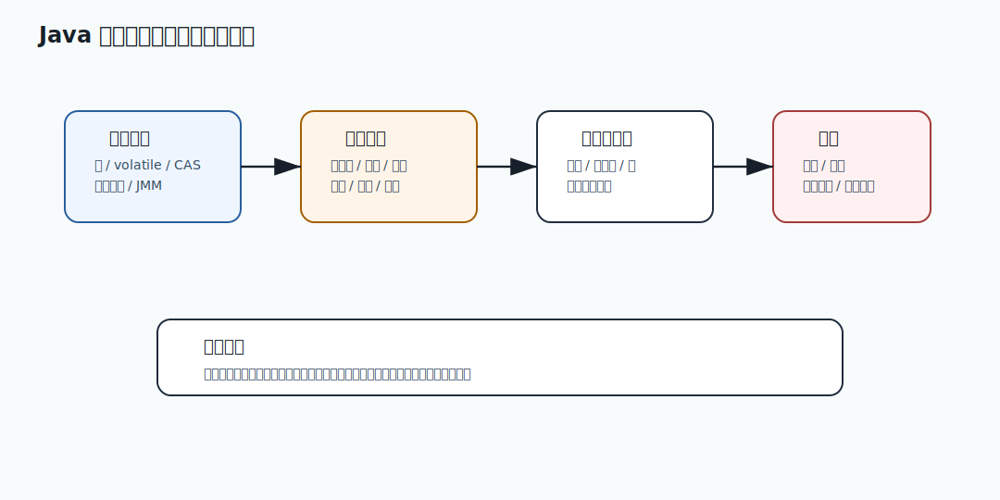

# 079 Java 线程状态有哪些？

[返回按分类学习面试题](../README.md)

## 题目

Java 线程状态有哪些？

## 先给面试官的短答案

Java 线程状态包括 `NEW`、`RUNNABLE`、`BLOCKED`、`WAITING`、`TIMED_WAITING` 和 `TERMINATED`。
排查线程问题时，重点看大量线程是否集中在 `BLOCKED`、`WAITING` 或 `TIMED_WAITING`，
以及它们的调用栈是否集中在锁、连接池、下游调用或队列等待。

## NEW

`NEW` 表示线程对象创建了，但还没有调用 `start()`。

示例：

```java
Thread thread = new Thread(task);
```

此时线程还没有真正开始执行。

## RUNNABLE

`RUNNABLE` 表示线程可运行。

注意它不一定正在占用 CPU，也可能正在等待操作系统调度，或者在 native IO 中等待。

常见场景：

- 正在执行 Java 代码。
- 等待 CPU 时间片。
- socket read 等 native 调用。

所以看到 `RUNNABLE` 不一定代表它真的在消耗 CPU，要结合 CPU 线程和调用栈判断。

## BLOCKED

`BLOCKED` 表示线程正在等待进入 synchronized 临界区。

典型原因：

- 等待对象 monitor。
- synchronized 锁竞争。

如果大量线程 `BLOCKED` 在同一行，说明可能有锁竞争。

`BLOCKED` 是排查 synchronized 问题的重点状态。

## WAITING

`WAITING` 表示线程无限期等待其他线程动作。

常见原因：

- `Object.wait()`。
- `Thread.join()`。
- `LockSupport.park()`。
- 等待队列任务。

线程池空闲线程通常可能处于等待状态，这是正常的。

关键要看等待位置是否合理。

## TIMED_WAITING

`TIMED_WAITING` 表示带超时时间的等待。

常见原因：

- `Thread.sleep()`。
- `Object.wait(timeout)`。
- `Thread.join(timeout)`。
- `LockSupport.parkNanos()`。
- 带超时的阻塞队列操作。

下游 HTTP 调用超时等待也可能表现为类似等待或 native IO。

## TERMINATED

`TERMINATED` 表示线程执行结束。

线程结束后不能再次启动。

如果频繁创建和销毁线程，可能造成性能问题。生产中通常用线程池复用线程。

## 状态和问题的关系

| 状态 | 可能含义 |
| --- | --- |
| 大量 RUNNABLE | CPU 热点、native IO、忙等 |
| 大量 BLOCKED | synchronized 锁竞争 |
| 大量 WAITING | 队列等待、park、条件等待 |
| 大量 TIMED_WAITING | sleep、超时等待、定时任务 |

状态只是入口，调用栈才是证据。

## 在 eMall 项目中怎么讲？

订单服务 P99 升高时，抓 `jstack`：

- 大量 `BLOCKED` 在库存本地锁，说明锁竞争。
- 大量 `WAITING` 在连接池，说明资源不足。
- 大量 `RUNNABLE` 在规则计算，说明 CPU 热点。
- 大量 `TIMED_WAITING` 在下游调用，说明超时等待。

线程状态能帮助快速缩小排查方向。

## 深度增强：并发治理图



并发题不能只回答 API 用法。生产系统要同时考虑线程安全、资源隔离、超时、拒绝、幂等和分布式多实例。
单机锁只能保护当前 JVM，不能保护整个集群；线程池满也不是小问题，而是容量和可用性风险。

## 深度增强：Java 17 有界并发示例

```java
import java.util.concurrent.Semaphore;
import java.util.function.Supplier;

final class BulkheadGuard {
    private final Semaphore permits;

    BulkheadGuard(int maxConcurrentCalls) {
        this.permits = new Semaphore(maxConcurrentCalls);
    }

    <T> T execute(Supplier<T> supplier) {
        if (!permits.tryAcquire()) {
            throw new IllegalStateException("Bulkhead rejected the call");
        }
        try {
            return supplier.get();
        } finally {
            permits.release();
        }
    }
}
```

这段代码展示了并发控制的生产思路：不是让所有请求无限进入系统，而是在入口保护共享资源。
真实项目还要加超时、指标、降级和按下游隔离。

## 深度增强：生产边界

线程安全不等于系统安全。`ConcurrentHashMap` 只能保护当前进程内的数据结构，
不能替代数据库唯一键、幂等表或分布式一致性。线程池也不能使用无界队列，
否则会把过载转化成内存上涨和 P99 恶化。

## 深度增强：面试高分表达

我会把并发问题分成三层：JMM 和锁保证单机正确性，线程池和隔离保证资源不被拖垮，
幂等和唯一键保证分布式正确性。这样能体现我理解 Java 并发，也理解微服务生产稳定性。

## 专家级完整回答

```text
Java 线程状态有 NEW、RUNNABLE、BLOCKED、WAITING、TIMED_WAITING 和 TERMINATED。
排查时不能只看状态名，必须结合调用栈。RUNNABLE 可能是正在运行，也可能在 native IO；
BLOCKED 通常是 synchronized 锁竞争；WAITING 和 TIMED_WAITING 可能是队列、park、sleep 或超时等待。

生产上我会连续抓多次 jstack，看异常状态是否集中在同一段代码或同一个下游。
```

## 回答评分点

高分答案应该覆盖：

- 六种线程状态。
- `RUNNABLE` 不一定真正占 CPU。
- `BLOCKED` 对应 synchronized 等 monitor。
- `WAITING` 和 `TIMED_WAITING` 要看调用栈。
- 能用线程状态定位生产问题。

## 深度完善：面向 L6 的回答框架

围绕「Java 线程状态有哪些？」，高分答案不能停在概念定义，而要把「线程安全、锁、CAS、线程池、隔离、超时和并发容量」讲成一条可验证的工程链路。
面试官真正关注的是：你是否知道它解决什么问题、什么时候会失效、如何在生产系统中验证。

### 1. 先界定边界

- 本题属于「并发和线程治理」，先说明它影响的是正确性、稳定性、性能、安全还是协作效率。
- 不要直接背结论，要先说清业务约束、数据规模、调用链位置和失败后果。
- 如果存在多种方案，要说明默认选择、替代方案、迁移成本和放弃条件。

### 2. 结合 eMall 落地

- 可以从 `order 创建、inventory 扣减、payment 回调、outbox relay 和异步补偿任务` 切入，说明它在真实电商链路中的入口、状态、数据和依赖。
- 回答时至少补一个失败路径，例如超时、重复请求、状态不一致、热点流量或配置误发。
- 再说明如何通过代码规范、测试、灰度、回滚、监控或补偿把风险收敛。

### 3. 生产级验证

- 关键指标：线程池活跃数、队列长度、拒绝数、锁等待、超时率、重复请求数。
- 验证证据：并发单测、压测曲线、线程 dump、拒绝日志、幂等记录和容量评估。
- 如果没有这些证据，只能说明方案在理论上成立，不能证明它能长期稳定运行。

### 4. 追问防守

- 被问“为什么不用更简单方案”时，回答当前规模、团队能力和风险收益是否匹配。
- 被问“为什么不用更复杂方案”时，回答复杂方案的运维成本、故障面和迁移成本。
- 最后用一句话收束：先用简单可靠方案闭环，再用指标驱动演进，而不是提前复杂化。

## 补强索引
本题复习重点：Java 线程状态有哪些？

- 先看本文的题目专属答案，再按共享框架补齐项目落点、失败路径、取舍和验收。
- 白板复述时用结论 -> 例子 -> 风险 -> 指标四层结构。
