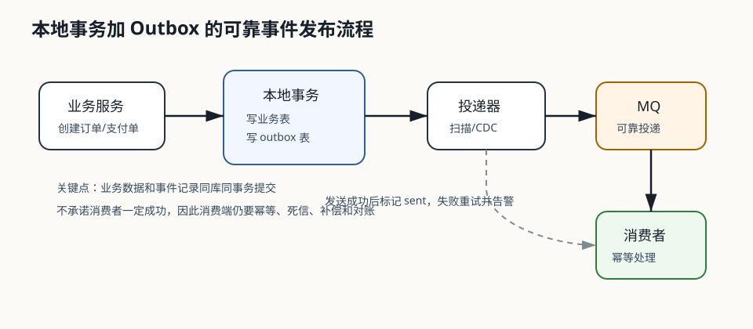

# 217 本地事务加 Outbox 解决什么问题？

[返回按分类学习面试题](../README.md)

## 先给面试官的短答案

本地事务加 Outbox 解决“业务数据写成功，但消息发送失败”导致的数据和消息不一致问题。
做法是在同一个数据库本地事务里写业务表和消息表，再由后台任务或 CDC 把消息可靠投递到 MQ。

它把跨系统原子性问题转换为本地事务加异步可靠投递问题。

## 基本流程

流程：

- 开启本地事务。
- 写业务表。
- 写 outbox 消息表。
- 提交本地事务。
- 投递器扫描或 CDC 捕获消息。
- 发送到 MQ。
- 成功后标记已发送。

业务数据和待发送消息在一个本地事务中提交。

## 解决的问题

解决：

- 业务提交成功但 MQ 发送失败。
- 应用发送 MQ 后宕机。
- MQ 短时不可用。
- 需要可靠发布领域事件。

只要业务事务提交，消息最终能被投递。

## 工程要点

要点包括：

- outbox 表有状态和重试次数。
- 投递器幂等。
- 消息有唯一 ID。
- 消费者幂等。
- 失败进入告警或人工处理。
- 表数据定期归档。

Outbox 只保证消息最终发出，不保证消费者一定处理成功。

## 电商系统实践

订单服务创建订单时，在同一个事务中写订单表和 `OrderCreated` 事件到 outbox 表。

事务提交后，事件投递器把 `OrderCreated` 发送到 MQ，库存、营销、数据仓库等服务再消费。

## 深度增强：流程图



这张图要抓住一个核心点：业务表和 outbox 表必须在同一个数据库本地事务中提交。
只要这个事务提交成功，消息即使暂时没有发到 MQ，也已经以数据形式持久化下来，后续可以重试。

## 深度增强：Java 17 代码实现

下面代码不是完整框架代码，而是面试中最应该讲清楚的核心逻辑：业务写入和事件写入同事务提交。

```java
public record OutboxEvent(
        String eventId,
        String aggregateId,
        String eventType,
        String payload,
        OutboxStatus status,
        int retryCount) {
}

public enum OutboxStatus {
    NEW,
    SENT,
    FAILED
}

@Service
public class OrderApplicationService {

    private final OrderRepository orderRepository;
    private final OutboxRepository outboxRepository;
    private final ObjectMapper objectMapper;

    public OrderApplicationService(
            OrderRepository orderRepository,
            OutboxRepository outboxRepository,
            ObjectMapper objectMapper) {
        this.orderRepository = orderRepository;
        this.outboxRepository = outboxRepository;
        this.objectMapper = objectMapper;
    }

    @Transactional
    public OrderId createOrder(CreateOrderCommand command) {
        Order order = Order.create(command.userId(), command.items());
        orderRepository.save(order);

        OrderCreatedEvent event = new OrderCreatedEvent(
                UUID.randomUUID().toString(),
                order.id().value(),
                command.userId().value(),
                order.totalAmount());

        outboxRepository.save(new OutboxEvent(
                event.eventId(),
                order.id().value(),
                "OrderCreated",
                toJson(event),
                OutboxStatus.NEW,
                0));

        return order.id();
    }

    private String toJson(Object event) {
        try {
            return objectMapper.writeValueAsString(event);
        } catch (JsonProcessingException ex) {
            throw new IllegalStateException("Failed to serialize outbox event.", ex);
        }
    }
}
```

Relay 的完整实现见[手写 Outbox Relay](649-outbox-relay.md)，多实例抢占和重复投递边界见
[Outbox Relay 多实例如何避免重复抢事件](386-outbox-relay-multi-instance.md)。

## 深度增强：失败场景和边界

Outbox 能解决“业务提交成功但消息没发出去”，但不能解决所有一致性问题。

必须继续补齐：

- 投递重复：MQ 或 relay 重试可能导致重复消息，消费者必须幂等。
- 投递乱序：同一聚合根最好按 `aggregateId` 选择同一个 partition。
- 表无限增长：outbox 需要按状态和创建时间归档。
- 毒消息：反序列化失败或业务字段异常时要进入死信和人工处理。
- 端到端失败：Outbox 只保证事件最终发布，不保证消费者一定处理成功。
