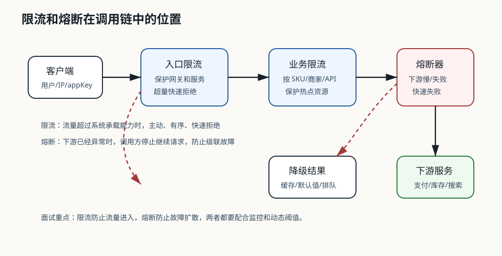

# 250 如何设计限流？

[返回按分类学习面试题](../README.md)

## 先给面试官的短答案

限流是保护系统在超过承载能力时有序拒绝请求，而不是等资源耗尽后整体崩溃。
设计限流要明确保护对象、限流维度、算法、阈值来源、返回策略、监控告警和灰度调整。

限流既要保护服务，也要尽量保证高价值流量优先通过。

## 保护对象

限流可以保护：

- 网关。
- 单个服务。
- 数据库。
- 缓存。
- MQ。
- 第三方接口。
- SKU 或商家热点。

保护对象不同，限流位置和维度也不同。

## 限流维度

常见维度：

- 全局 QPS。
- 用户。
- IP。
- 设备。
- 商家。
- SKU。
- API。
- appKey。

开放平台通常按 appKey 和接口配额限流，秒杀通常按活动和 SKU 限流。

## 返回策略

被限流后要：

- 快速失败。
- 返回明确错误码。
- 告诉客户端是否可重试。
- 可以返回 `Retry-After`。
- 对核心业务提供排队或降级。

不能让请求在服务内部长时间排队。

## 在 eMall 项目中怎么讲？

秒杀活动要在网关按活动和用户限流，在库存服务按 SKU 限流，在数据库前保护热点库存写入。

被限流用户收到明确提示，而不是让请求进入订单服务后超时。

## 深度增强：限流位置图

限流的本质不是“让用户排队等更久”，而是把超过承载能力的请求挡在合适的位置。
越靠入口的限流越适合保护整体容量，越靠业务内部的限流越适合保护热点资源。

算法实现分别见[令牌桶限流器](637-token-bucket.md)和[滑动窗口限流器](638-sliding-window-limiter.md)。
