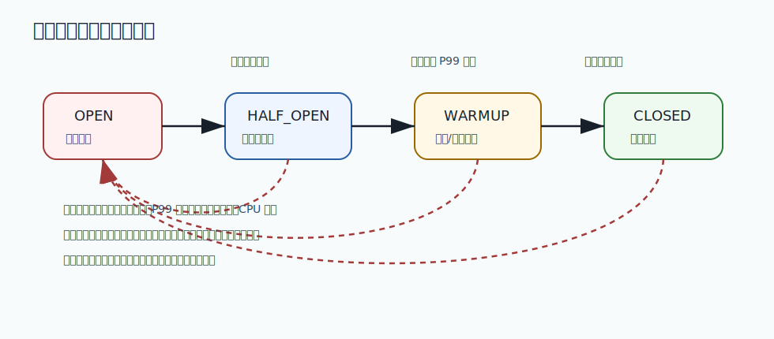

# 252 熔断的 CLOSED、OPEN、HALF_OPEN 如何切换？

[返回按分类学习面试题](../README.md)

## 题目

熔断的 CLOSED、OPEN、HALF_OPEN 如何切换？

## 先给面试官的短答案

`CLOSED` 表示正常放行请求；错误率或慢调用超过阈值后进入 `OPEN`，请求被快速拒绝或降级。
经过一段等待时间后进入 `HALF_OPEN`，只放少量探测请求；探测成功则回到 `CLOSED`，失败则重新进入 `OPEN`。

这三个状态共同实现故障隔离和平滑恢复。

## CLOSED

`CLOSED` 是正常状态。

此时：

- 请求正常调用下游。
- 熔断器统计成功、失败和慢调用。
- 指标超过阈值时触发熔断。

正常状态也要持续观测下游质量。

## OPEN

`OPEN` 是熔断打开状态。

此时：

- 不再调用下游。
- 请求直接快速失败或降级。
- 等待恢复窗口结束。

`OPEN` 的目的是让下游和调用方都获得恢复时间。

## HALF_OPEN

`HALF_OPEN` 是半开探测状态。

此时：

- 只允许少量请求访问下游。
- 探测成功说明下游可能恢复。
- 探测失败说明下游仍不可用。

半开阶段必须限制探测流量，不能一次性恢复全部请求。

## 在 eMall 项目中怎么讲？

优惠服务故障后，订单服务熔断优惠调用，短时间内走无优惠或缓存优惠兜底。

等待窗口后，只放少量订单请求探测优惠服务。如果成功率恢复，再逐步关闭熔断。

## 深度增强：状态转换图



`HALF_OPEN` 是高分回答的关键。很多人只知道熔断打开和关闭，但生产系统最容易出问题的是恢复阶段。
如果下游刚恢复就放开全量请求，历史重试、补偿任务和新流量会叠加，导致二次雪崩。

## 深度增强：Java 17 状态机实现

下面代码展示状态切换核心，不依赖具体框架：

```java
public enum BreakerState {
    CLOSED,
    OPEN,
    HALF_OPEN
}

public final class SlidingCircuitBreaker {

    private final int failureThreshold;
    private final Duration waitInOpenState;
    private BreakerState state = BreakerState.CLOSED;
    private int consecutiveFailures;
    private Instant openedAt = Instant.EPOCH;

    public SlidingCircuitBreaker(int failureThreshold, Duration waitInOpenState) {
        this.failureThreshold = failureThreshold;
        this.waitInOpenState = waitInOpenState;
    }

    public synchronized boolean allowRequest(Instant now) {
        if (state == BreakerState.CLOSED) {
            return true;
        }
        if (state == BreakerState.OPEN && now.isAfter(openedAt.plus(waitInOpenState))) {
            state = BreakerState.HALF_OPEN;
            return true;
        }
        return state == BreakerState.HALF_OPEN;
    }

    public synchronized void onSuccess() {
        consecutiveFailures = 0;
        state = BreakerState.CLOSED;
    }

    public synchronized void onFailure(Instant now) {
        consecutiveFailures++;
        if (state == BreakerState.HALF_OPEN || consecutiveFailures >= failureThreshold) {
            state = BreakerState.OPEN;
            openedAt = now;
        }
    }
}
```

真实系统还要加入最小请求数、慢调用比例、错误率滑动窗口和半开并发上限。
否则低流量服务可能因为一两个失败误熔断，高流量服务可能等到故障扩散后才熔断。

## 深度增强：面试高分表达

```text
CLOSED 是正常放行并统计质量；OPEN 是发现下游持续失败后快速失败或降级；
HALF_OPEN 是恢复探测，只允许少量真实流量进入。探测成功才回到 CLOSED，
探测失败要回到 OPEN。这个设计的核心不是状态名，而是避免故障扩散和避免恢复期二次雪崩。
```

## 专家级完整回答

```text
熔断器有三个典型状态。CLOSED 正常放行并统计指标；当错误率、慢调用或连续失败超过阈值时进入 OPEN，
请求快速失败或降级。等待一段时间后进入 HALF_OPEN，只允许少量探测请求。

如果探测成功，熔断器回到 CLOSED；如果探测失败，重新进入 OPEN。这样可以避免下游刚恢复就被流量再次打垮。
```

## 回答评分点

高分答案应该覆盖：

- `CLOSED` 正常放行。
- `OPEN` 快速失败或降级。
- `HALF_OPEN` 小流量探测。
- 探测成功关闭熔断。
- 探测失败重新打开熔断。
## 深度完善：专项验收清单

围绕「熔断的 CLOSED、OPEN、HALF_OPEN 如何切换？」，这道题原本已经有专题深度增强；这里再补一层面向生产和 L6 面试的验收口径。
回答时要把概念、代码、数据、失败路径和指标串起来，证明自己不是只理解单点知识。

### 项目落点

- 先说明它在 eMall 哪个模块或链路中出现，例如交易、库存、支付、搜索、风控、发布或可观测性。
- 再说明它保护的核心目标：正确性、可用性、延迟、成本、安全或协作效率。
- 最后补失败场景：超时、重试、重复请求、状态不一致、热点流量、配置错误或发布回滚。

### 验收证据

- 代码证据：关键类、状态机、唯一约束、事务边界、线程池隔离或配置项。
- 测试证据：单元测试、集成测试、契约测试、压测、故障注入或回归用例。
- 运行证据：指标看板、Trace、结构化日志、告警、Runbook、对账结果或补偿记录。

### 高分收束

面试最后要回到取舍：当前方案为什么足够简单可靠，什么时候需要升级，升级时如何灰度、回滚和验证。
这样回答能体现生产系统判断力，而不是只罗列技术名词。
