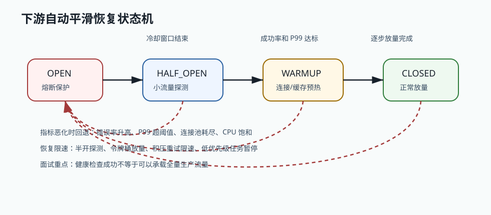

# 252 熔断的 CLOSED、OPEN、HALF_OPEN 如何切换？

[返回按分类学习面试题](../README.md)

## 先给面试官的短答案

`CLOSED` 表示正常放行请求；错误率或慢调用超过阈值后进入 `OPEN`，请求被快速拒绝或降级。
经过一段等待时间后进入 `HALF_OPEN`，只放少量探测请求；探测成功则回到 `CLOSED`，失败则重新进入 `OPEN`。

这三个状态共同实现故障隔离和平滑恢复。

## CLOSED

`CLOSED` 是正常状态。

此时：

- 请求正常调用下游。
- 熔断器统计成功、失败和慢调用。
- 指标超过阈值时触发熔断。

正常状态也要持续观测下游质量。

## OPEN

`OPEN` 是熔断打开状态。

此时：

- 不再调用下游。
- 请求直接快速失败或降级。
- 等待恢复窗口结束。

`OPEN` 的目的是让下游和调用方都获得恢复时间。

## HALF_OPEN

`HALF_OPEN` 是半开探测状态。

此时：

- 只允许少量请求访问下游。
- 探测成功说明下游可能恢复。
- 探测失败说明下游仍不可用。

半开阶段必须限制探测流量，不能一次性恢复全部请求。

## 电商系统实践

优惠服务故障后，订单服务熔断优惠调用，短时间内走无优惠或缓存优惠兜底。

等待窗口后，只放少量订单请求探测优惠服务。如果成功率恢复，再逐步关闭熔断。

## 深度增强：状态转换图

`HALF_OPEN` 是高分回答的关键。很多人只知道熔断打开和关闭，但生产系统最容易出问题的是恢复阶段。
如果下游刚恢复就放开全量请求，历史重试、补偿任务和新流量会叠加，导致二次雪崩。

代码实现见[手写熔断器状态机](645-circuit-breaker.md)，恢复斜坡和积压限速见
[下游如何自动平滑恢复](276-downstream-smooth-recovery.md)。
