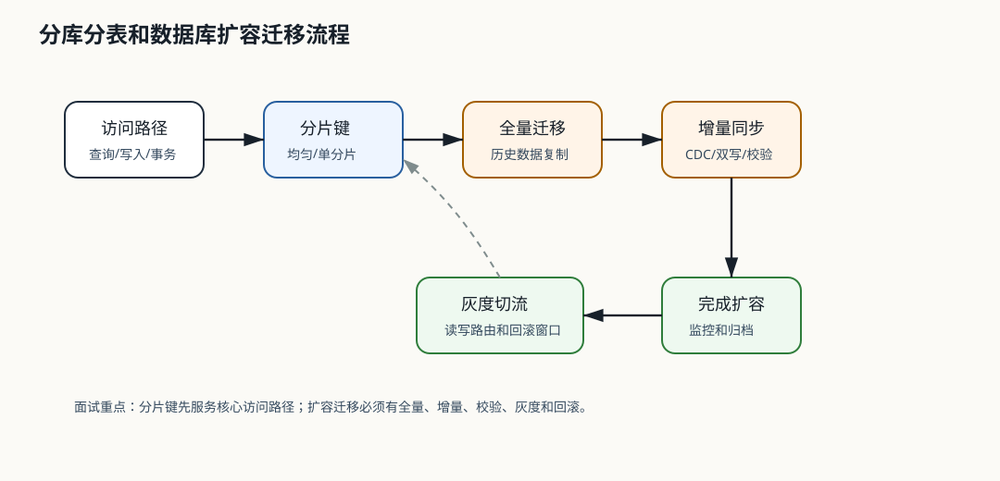

# 307 如何设计分库分表？

[返回按分类学习面试题](../README.md)

## 先给面试官的短答案

分库分表是把数据按规则拆到多个库表，解决单库单表容量、写入吞吐和索引维护瓶颈。
设计时要确定分片键、路由规则、全局 ID、查询模式、扩容迁移、事务边界、跨分片查询和运维能力。

分库分表不是第一选择，只有单库优化到瓶颈后才应引入。

## 设计步骤

步骤：

- 明确数据增长和 QPS。
- 分析核心查询路径。
- 选择分片键。
- 确定分片数量。
- 设计全局 ID。
- 设计路由和中间件。
- 处理跨分片查询。
- 设计扩容迁移方案。

查询模式决定分片策略。

## 关键问题

要考虑：

- 分片键是否均匀。
- 是否支持高频查询。
- 是否产生热点分片。
- 跨分片事务如何避免。
- 分片扩容如何迁移。
- 唯一约束如何保证。
- 数据归档如何做。

这些问题必须在设计前回答。

## 常见拆法

拆法包括：

- 按用户 ID 哈希。
- 按订单 ID 哈希。
- 按商家 ID 哈希。
- 按时间分表。
- 哈希加时间组合。

没有万能分片键，只有最适合主查询路径的分片键。

## 在 eMall 项目中怎么讲？

订单表可以按用户 ID 或订单 ID 分片，取决于最核心查询是用户查订单还是订单号定位。

商家后台和运营报表如果跨分片复杂查询，应构建读模型或进入数据仓库。

## 深度增强：分片和扩容图



分库分表首先是访问路径设计，其次才是中间件和路由实现。
如果没有明确主查询路径，分片会把单库问题变成跨分片查询、跨分片事务和运维复杂度问题。

## 深度增强：Java 17 路由实现

```java
public record ShardRoute(String database, String table) {
}

public final class HashShardRouter {

    private final int databaseCount;
    private final int tableCountPerDatabase;

    public HashShardRouter(int databaseCount, int tableCountPerDatabase) {
        this.databaseCount = databaseCount;
        this.tableCountPerDatabase = tableCountPerDatabase;
    }

    public ShardRoute routeByUserId(long userId) {
        int totalTables = databaseCount * tableCountPerDatabase;
        int tableIndex = Math.floorMod(Long.hashCode(userId), totalTables);
        int databaseIndex = tableIndex / tableCountPerDatabase;
        int tableInDatabase = tableIndex % tableCountPerDatabase;
        return new ShardRoute(
                "order_db_" + databaseIndex,
                "orders_" + tableInDatabase);
    }
}
```

这个代码只能说明路由思想。生产上还要支持配置化路由、扩容版本、灰度路由和路由审计。

## 深度增强：生产边界

- 分片键要服务最高频查询，非主查询路径要用读模型或路由表补齐。
- 跨分片事务要尽量避免，用本地事务、Outbox、补偿和对账解决。
- 扩容前要设计全量迁移、增量同步、校验、灰度切流和回滚。
- 唯一约束只能在单分片内天然保证，跨分片唯一要靠全局 ID 或中心校验。
- 报表查询不要直接扫所有分片，应该进数据仓库或搜索读模型。

## 深度增强：面试高分表达

```text
我会先确认订单的核心访问路径。如果最重要的是用户订单列表，就按 userId 分片；
如果最重要的是订单号定位和写入均匀，就按 orderId 分片，并为用户列表构建读模型。
分库分表不是只改路由，还要解决全局 ID、跨分片查询、扩容迁移、对账和运维监控。
```
