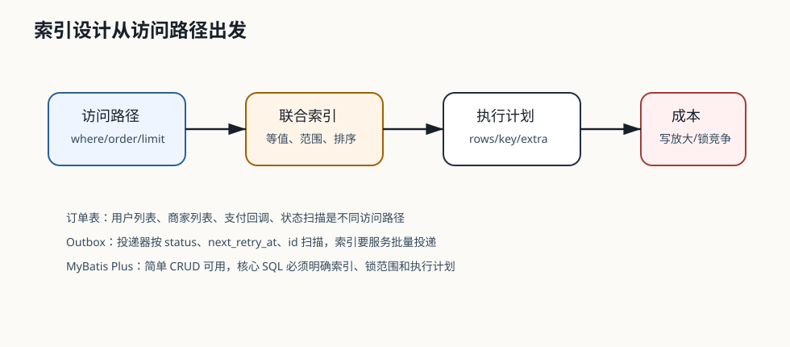

# 323 MyBatis Plus 和手写 SQL 如何取舍？

[返回按分类学习面试题](../README.md)

## 先给面试官的短答案

MyBatis Plus 适合标准 CRUD、简单条件查询、审计字段填充和通用分页。手写 SQL 适合复杂查询、
强性能要求、明确索引设计、批处理、状态机更新和需要控制锁范围的场景。

原则是：非核心简单路径用 MyBatis Plus 提升效率，核心高并发路径用手写 SQL 保证可控。

## 适合 MyBatis Plus 的场景

适合：

- 用户资料查询。
- 地址管理。
- 配置表维护。
- 后台简单分页。
- 字典数据管理。
- 单表普通 CRUD。

这些场景的 SQL 简单，性能风险相对低。

## 适合手写 SQL 的场景

适合：

- 库存条件扣减。
- 订单状态机流转。
- 支付单唯一约束写入。
- Outbox 批量扫描。
- 慢查询优化后的固定 SQL。
- 多表复杂查询。
- 需要使用特定索引的查询。

这些场景需要明确 SQL 形态和执行计划。

## 判断标准

可以按以下问题判断：

- SQL 是否在核心链路。
- QPS 是否高。
- 是否涉及锁竞争。
- 是否必须命中特定索引。
- 是否需要条件更新保证幂等。
- 是否需要批量处理。
- 是否方便做 SQL 审计。

越核心、越高并发、越复杂，就越应该手写和评审。

## 电商系统实践

大型电商系统的 `user` 模块可以大量使用 MyBatis Plus 处理资料维护。

`inventory` 的扣库存必须手写：

```sql
UPDATE sku_inventory
SET available = available - #{quantity}
WHERE sku_id = #{skuId}
  AND available >= #{quantity}
```

这个 SQL 的条件更新是防超卖的核心，不能交给通用 CRUD 隐式生成。

## 深度增强：索引和 SQL 可控性图



MyBatis Plus 的价值是提升简单 CRUD 效率；手写 SQL 的价值是让核心链路的 SQL 形态、索引、锁范围和执行计划可控。
高分回答不是否定 MyBatis Plus，而是说明哪里可以用，哪里必须手写。

## 深度增强：Java 17 分层示例

普通配置表可以使用 MyBatis Plus：

```java
@Service
public class AddressBookService {

    private final UserAddressMapper userAddressMapper;

    public List<UserAddressEntity> listUserAddresses(long userId) {
        return userAddressMapper.selectList(
                Wrappers.<UserAddressEntity>lambdaQuery()
                        .eq(UserAddressEntity::getUserId, userId)
                        .eq(UserAddressEntity::getDeleted, false)
                        .orderByDesc(UserAddressEntity::getUpdatedAt));
    }
}
```

库存扣减、订单状态机和 Outbox 扫描要手写：

```java
public interface OrderStateMapper {

    int markPaid(
            @Param("orderId") long orderId,
            @Param("paymentId") long paymentId,
            @Param("paidAt") Instant paidAt);
}
```

```xml
<update id="markPaid">
    UPDATE orders
    SET status = 'PAID',
        payment_id = #{paymentId},
        paid_at = #{paidAt}
    WHERE id = #{orderId}
      AND status = 'PENDING_PAYMENT'
</update>
```

这类 SQL 的条件就是业务状态机约束，不能丢给通用更新。

## 深度增强：取舍标准

- 简单单表 CRUD、后台维护、字典表、地址表：优先 MyBatis Plus。
- 高 QPS 核心链路、库存扣减、支付确认、订单状态机：优先手写 SQL。
- 需要命中特定索引、控制锁范围、控制批次大小：优先手写 SQL。
- 复杂报表和分析：不要强行用 ORM 拼，走数仓或专门查询模型。
- 所有核心 SQL 都要做执行计划评审和慢 SQL 监控。
