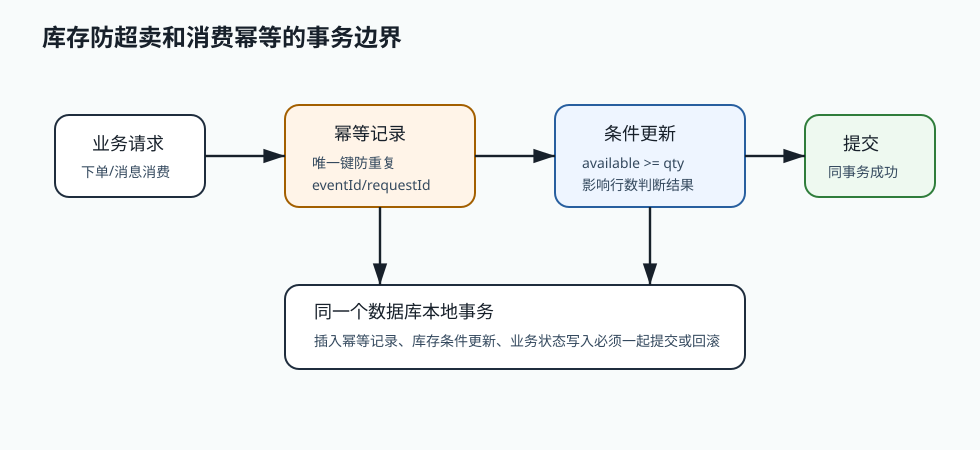

# 380 消费者幂等表如何设计？

[返回按分类学习面试题](../README.md)

## 先给面试官的短答案

消费者幂等表用于记录某个事件是否已经被某个业务消费者处理过。核心字段包括事件 ID、消费组、
业务键、处理状态、处理时间、错误信息和唯一约束。

最重要的是用唯一约束防止重复插入，并让幂等记录和业务写入处于同一个本地事务。

## 表结构

常见字段：

- `event_id`。
- `consumer_group`。
- `business_key`。
- `status`。
- `processed_at`。
- `retry_count`。
- `error_code`。
- `created_at`。
- `updated_at`。

唯一键通常是 `consumer_group + event_id`。

## 处理流程

流程：

- 开启本地事务。
- 插入幂等记录。
- 如果唯一冲突，说明已处理或处理中。
- 执行业务写入。
- 更新幂等记录为成功。
- 提交事务。
- 再提交 Kafka offset。

这样重复消息不会重复执行业务。

## 状态设计

状态可以包括：

- `PROCESSING`。
- `SUCCESS`。
- `FAILED`。

如果消费者宕机在 `PROCESSING`，需要根据超时时间判断是否可重新处理。

## 电商系统实践

大型电商系统库存消费者处理订单创建事件时，以 `event_id` 和 `inventory-group` 建唯一键。

插入幂等记录和库存扣减在同一个数据库事务里。如果重复消费同一事件，唯一键冲突后直接返回已处理，
避免重复扣库存。

## 深度增强：事务边界图



消费幂等的核心不是“查一下有没有处理过”，而是用数据库唯一约束和本地事务保证并发正确。
幂等记录和业务写入必须一起提交，否则会出现“幂等记录成功但业务失败”或“业务成功但幂等记录失败”。

## 深度增强：Java 17 代码实现

幂等表建议至少包含消费组、事件 ID、业务键和状态：

```java
public record ConsumerDedupKey(String consumerGroup, String eventId) {
}

public enum ConsumeStatus {
    PROCESSING,
    SUCCESS,
    FAILED
}

public record ConsumerDedupRecord(
        ConsumerDedupKey key,
        String businessKey,
        ConsumeStatus status,
        Instant createdAt,
        Instant updatedAt) {
}
```

消费者处理时，先插入幂等记录，再执行业务写入，最后更新为成功：

```java
@Service
public class OrderCreatedConsumer {

    private static final String GROUP = "inventory-order-created";

    private final ConsumerDedupRepository dedupRepository;
    private final InventoryReservationService reservationService;

    public OrderCreatedConsumer(
            ConsumerDedupRepository dedupRepository,
            InventoryReservationService reservationService) {
        this.dedupRepository = dedupRepository;
        this.reservationService = reservationService;
    }

    @Transactional
    public void consume(OrderCreatedEvent event) {
        ConsumerDedupKey key = new ConsumerDedupKey(GROUP, event.eventId());
        boolean inserted = dedupRepository.insertProcessingIfAbsent(
                key,
                event.orderId());

        if (!inserted) {
            return;
        }

        reservationService.reserveFromOrderCreated(event);
        dedupRepository.markSuccess(key);
    }
}
```

`insertProcessingIfAbsent` 底层应该依赖唯一键，而不是只靠应用层先查：

```sql
CREATE UNIQUE INDEX uk_consumer_event
ON consumer_dedup (consumer_group, event_id);
```

## 深度增强：失败场景

- 消费者在 `PROCESSING` 状态宕机，需要超时重置或人工处理。
- 业务成功后提交 offset 失败，消息会重复投递，幂等表必须拦住。
- 幂等表不能无限增长，要按事件时间归档。
- 不同消费组要独立幂等，同一个事件被库存和履约消费不能互相阻塞。
