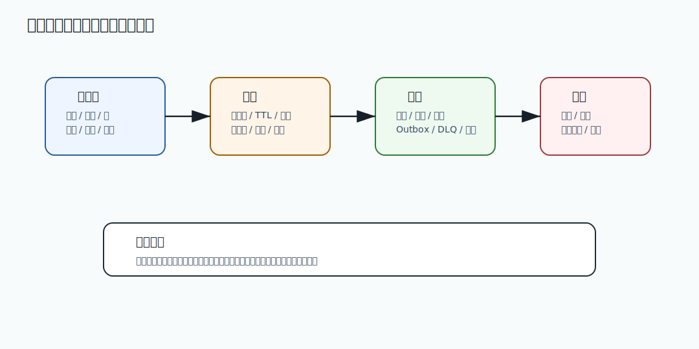

# 396 OpenSearch 分片和副本如何设置？

[返回按分类学习面试题](../README.md)

## 题目

OpenSearch 分片和副本如何设置？

## 先给面试官的短答案

OpenSearch 分片和副本要根据数据量、查询 QPS、写入吞吐、节点数量、可用性要求和未来增长设置。
主分片决定数据分布和并行能力，副本提升查询吞吐和高可用。

分片不是越多越好，过多会增加管理开销和查询协调成本。

## 主分片

主分片影响：

- 单分片数据大小。
- 写入并行度。
- 查询并行度。
- 扩展空间。
- shard 迁移成本。

主分片数量创建后通常不方便随意减少。

## 副本

副本作用：

- 提高查询吞吐。
- 提供高可用。
- 节点故障时保护数据。
- 支持查询负载分散。

副本会增加存储成本和写入复制成本。

## 设置原则

原则：

- 控制单分片大小在合理范围。
- 分片数与节点数匹配。
- 预估未来数据增长。
- 核心索引至少一副本。
- 写多读少时副本不宜过多。
- 监控查询延迟和 shard 分布。

具体数值要压测验证。

## 在 eMall 项目中怎么讲？

eMall 商品搜索索引如果商品量很大，可以按数据规模设置多个主分片，并至少设置一个副本保证查询
高可用。

大促期间搜索 QPS 升高，可以通过增加副本扩展读能力，但如果分片设计过细，查询协调开销也会上升。

## 深度增强：缓存和消息治理图



缓存和消息题要关注一致性、削峰、延迟、积压和恢复。
Redis 很快，但会遇到穿透、击穿、雪崩、热点 key 和内存淘汰；
MQ 能解耦和削峰，但会带来重复消费、乱序、积压和死信处理。

## 深度增强：Java 17 幂等消费示例

```java
import java.util.Set;
import java.util.concurrent.ConcurrentHashMap;

final class LocalIdempotentConsumer {
    private final Set<String> processedKeys = ConcurrentHashMap.newKeySet();

    boolean tryHandle(String messageKey, Runnable handler) {
        if (!processedKeys.add(messageKey)) {
            return false;
        }
        handler.run();
        return true;
    }
}
```

这个示例只适合解释幂等思想。生产环境不能用本地内存做全局幂等，要使用数据库唯一键、Redis 原子操作或业务状态机。

## 深度增强：生产边界

缓存要有 TTL、容量、降级和回源保护；消息要有重试、死信、延迟队列、消费幂等和积压告警。
缓存不一致要能修复，消息失败要能回放，不能只依赖人工查日志。

## 深度增强：面试高分表达

我会把缓存和消息都看成性能与稳定性工具，而不是正确性事实来源。
正确性由数据库事实、状态机、幂等和对账保证；缓存和 MQ 负责降低延迟、削峰填谷和解耦系统。

## 专家级完整回答

```text
OpenSearch 主分片决定数据如何切分和并行处理，副本用于高可用和读扩展。设置时要考虑数据量、
QPS、写入速率、节点数、单分片大小和未来增长。

分片不是越多越好。过多 shard 会增加内存、文件句柄、集群状态和查询协调成本。生产中应结合容量
规划和压测确定。
```

## 回答评分点

高分答案应该覆盖：

- 主分片影响数据分布。
- 副本提升读能力和高可用。
- 分片过多有成本。
- 根据数据量、QPS 和节点数设置。
- 需要压测和监控验证。

## 深度完善：面向 L6 的回答框架

围绕「OpenSearch 分片和副本如何设置？」，高分答案不能停在概念定义，而要把「倒排索引、读模型、异步同步、重建、排序、降级和一致性边界」讲成一条可验证的工程链路。
面试官真正关注的是：你是否知道它解决什么问题、什么时候会失效、如何在生产系统中验证。

### 1. 先界定边界

- 本题属于「搜索和读模型」，先说明它影响的是正确性、稳定性、性能、安全还是协作效率。
- 不要直接背结论，要先说清业务约束、数据规模、调用链位置和失败后果。
- 如果存在多种方案，要说明默认选择、替代方案、迁移成本和放弃条件。

### 2. 结合 eMall 落地

- 可以从 `search、product、catalog、recommendation 的商品索引和查询链路` 切入，说明它在真实电商链路中的入口、状态、数据和依赖。
- 回答时至少补一个失败路径，例如超时、重复请求、状态不一致、热点流量或配置误发。
- 再说明如何通过代码规范、测试、灰度、回滚、监控或补偿把风险收敛。

### 3. 生产级验证

- 关键指标：索引延迟、查询 P99、召回率、零结果率、重建耗时、同步失败数。
- 验证证据：索引构建任务、同步事件、查询 Explain、降级策略和回放重建记录。
- 如果没有这些证据，只能说明方案在理论上成立，不能证明它能长期稳定运行。

### 4. 追问防守

- 被问“为什么不用更简单方案”时，回答当前规模、团队能力和风险收益是否匹配。
- 被问“为什么不用更复杂方案”时，回答复杂方案的运维成本、故障面和迁移成本。
- 最后用一句话收束：先用简单可靠方案闭环，再用指标驱动演进，而不是提前复杂化。

## 补强索引
本题复习重点：OpenSearch 分片和副本如何设置？

- 先看本文的题目专属答案，再按共享框架补齐项目落点、失败路径、取舍和验收。
- 白板复述时用结论 -> 例子 -> 风险 -> 指标四层结构。
