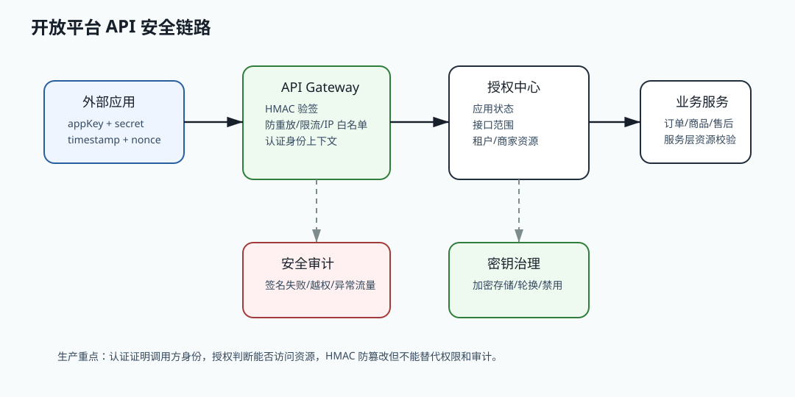

# 421 SQL 注入如何防止？

[返回按分类学习面试题](../README.md)

## 先给面试官的短答案

SQL 注入的根因是把用户输入当成 SQL 代码拼接执行。防护核心是使用参数化查询、预编译语句、ORM
安全绑定、输入校验、最小数据库权限和安全审计。

不要靠简单转义或黑名单作为主要防线。

## 主要防线

防线包括：

- 使用 PreparedStatement。
- MyBatis 使用 `#{}` 而不是 `${}`。
- 动态排序字段使用白名单。
- 输入格式校验。
- 数据库账号最小权限。
- 错误信息不暴露 SQL 细节。

参数绑定是最关键的防线。

## 危险写法

危险点：

- 字符串拼接 SQL。
- MyBatis `${}` 拼接用户输入。
- 动态表名和字段名不校验。
- order by 字段直接来自请求。
- 拼接 in 条件不做参数化。

这些都可能变成注入入口。

## 纵深防御

还需要：

- 代码扫描。
- SQL 审计。
- WAF 辅助拦截。
- 慢 SQL 和异常 SQL 告警。
- 数据库权限隔离。
- 敏感操作审计。

安全不能只靠某一层。

## 电商系统实践

大型电商系统搜索或订单后台查询如果支持按字段排序，排序字段必须是服务端白名单，例如 `created_at`、
`amount` 和 `status`。

用户输入的订单号、手机号 hash 和状态条件都必须通过参数绑定传入 SQL。

## 深度增强：开放平台安全图



SQL 注入不是只发生在登录框。开放平台、商家后台、运营查询、数据导出和搜索筛选都可能把外部输入
带入数据库。安全设计要把“可变值”和“SQL 结构”分开：值用参数绑定，结构只能来自服务端白名单。

## 深度增强：Java 17 白名单排序示例

```java
import java.util.Map;
import java.util.Optional;

record OrderQuery(String status, String orderNo, String sortBy, boolean desc) {
}

final class OrderSqlBuilder {
    private static final Map<String, String> SORT_COLUMNS = Map.of(
            "createdAt", "created_at",
            "amount", "pay_amount",
            "status", "order_status");

    String buildOrderBy(OrderQuery query) {
        String column = Optional.ofNullable(SORT_COLUMNS.get(query.sortBy()))
                .orElse("created_at");
        String direction = query.desc() ? "DESC" : "ASC";
        return " ORDER BY " + column + " " + direction;
    }
}
```

MyBatis 中普通条件应该使用 `#{}`：

```xml
<select id="selectOrders" resultType="OrderEntity">
    SELECT order_id, user_id, order_status, pay_amount
    FROM orders
    WHERE user_id = #{userId}
      AND order_status = #{status}
</select>
```

如果确实需要动态列名或排序，不能直接写 `${sortBy}` 接收用户输入，而是像上面的 Java 代码一样
把外部字段映射到固定 SQL 片段。这样 SQL 结构仍由服务端控制。

## 深度增强：生产边界

参数化查询是第一防线，但不是唯一防线。数据库账号要最小权限，订单查询账号不应该有删表权限；
错误响应不能暴露 SQL；导出、模糊查询和后台组合查询要限制范围，避免注入和拖垮数据库同时发生。

安全扫描可以发现常见拼接，但无法替代代码评审。对于 `${}`、动态表名、动态字段、分表路由和报表 SQL，
应建立专项审查规则，因为这些地方最容易被“业务灵活性”绕开安全边界。
