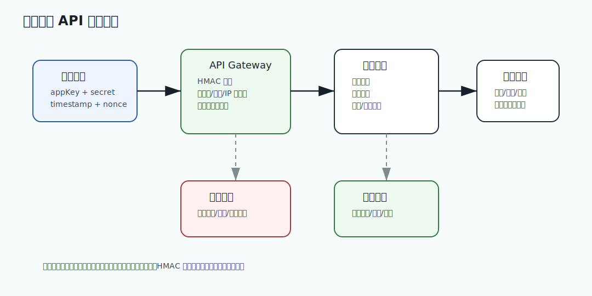

# 422 XSS 和 CSRF 在前后端系统中如何防护？

[返回按分类学习面试题](../README.md)

## 题目

XSS 和 CSRF 在前后端系统中如何防护？

## 先给面试官的短答案

XSS 是攻击者把恶意脚本注入页面，防护重点是输出编码、输入清洗、CSP、HttpOnly Cookie 和避免
危险 HTML 渲染。CSRF 是诱导用户浏览器带着登录态发起请求，防护重点是 CSRF token、SameSite
Cookie、校验 Origin/Referer 和高危操作二次确认。

二者攻击方式不同，防护手段也不同。

## XSS 防护

做法：

- 默认 HTML 转义。
- 富文本白名单清洗。
- 禁止直接渲染不可信 HTML。
- 设置 CSP。
- Cookie 设置 HttpOnly。
- 前端依赖安全升级。

XSS 的目标常常是窃取 token 或执行高危操作。

## CSRF 防护

做法：

- CSRF token。
- SameSite Cookie。
- 校验 Origin 和 Referer。
- 高危操作要求二次验证。
- 不用 GET 做状态变更。

CSRF 利用的是浏览器自动携带 Cookie。

## 后端责任

后端要做：

- 状态变更接口校验 CSRF。
- 鉴权不能只靠前端。
- 返回内容做安全头。
- 高危接口校验用户意图。
- 审计异常操作。

前后端要共同防护。

## 在 eMall 项目中怎么讲？

eMall 商品评价富文本必须清洗，不能允许用户提交 `<script>`。后台管理系统 Cookie 设置 HttpOnly、
Secure 和 SameSite。

批量退款、改价和下架商品等状态变更接口必须使用 POST，并校验 CSRF token 或 Origin。

## 深度增强：安全治理图



安全题要从身份、权限、数据、审计和攻击面分层回答。认证只证明是谁，授权判断能做什么；
加密保护机密性，签名保护完整性；审计负责事后追踪，风控负责发现异常行为。

## 深度增强：Java 17 安全策略示例

```java
import java.util.Set;

record SecurityDecision(boolean allowed, String reason) {
}

final class ScopePolicy {

    SecurityDecision check(Set<String> scopes, String requiredScope) {
        if (scopes.contains(requiredScope)) {
            return new SecurityDecision(true, "allowed");
        }
        return new SecurityDecision(false, "missing scope: " + requiredScope);
    }
}
```

这段代码体现最小权限原则。生产系统还要结合租户、资源归属、IP、设备、风险等级和操作审计。

## 深度增强：生产边界

安全不能只靠前端隐藏按钮，也不能只在网关做一次判断。核心资源要在服务层做资源级授权，
敏感数据要脱敏，密钥要支持轮换，失败日志不能泄露 token、secret、身份证号和银行卡号。

## 深度增强：面试高分表达

我会把安全问题拆成认证、授权、防篡改、防重放、数据保护、审计和风控。
每一层解决的问题不同，不能互相替代。这能体现我理解开放平台和电商系统的真实攻击面。

## 专家级完整回答

```text
XSS 是脚本注入，防护重点是输出编码、富文本清洗、CSP、HttpOnly Cookie 和避免危险渲染。CSRF
是借用户登录态发起伪造请求，防护重点是 CSRF token、SameSite Cookie、Origin 校验和高危操作
二次确认。

两者都不能只靠前端解决。后端必须做鉴权、资源校验、安全头和审计。
```

## 回答评分点

高分答案应该覆盖：

- XSS 是脚本注入。
- CSRF 是伪造用户请求。
- XSS 防输出编码和 CSP。
- CSRF 防 token、SameSite 和 Origin。
- 高危操作要二次确认。

## 深度完善：面向 L6 的回答框架

围绕「XSS 和 CSRF 在前后端系统中如何防护？」，高分答案不能停在概念定义，而要把「认证、授权、签名、防重放、加密、脱敏、审计、风控和数据保留」讲成一条可验证的工程链路。
面试官真正关注的是：你是否知道它解决什么问题、什么时候会失效、如何在生产系统中验证。

### 1. 先界定边界

- 本题属于「安全、身份和合规」，先说明它影响的是正确性、稳定性、性能、安全还是协作效率。
- 不要直接背结论，要先说清业务约束、数据规模、调用链位置和失败后果。
- 如果存在多种方案，要说明默认选择、替代方案、迁移成本和放弃条件。

### 2. 结合 eMall 落地

- 可以从 `identity、risk、openapi、operations、payment 的身份、权限、签名和审计` 切入，说明它在真实电商链路中的入口、状态、数据和依赖。
- 回答时至少补一个失败路径，例如超时、重复请求、状态不一致、热点流量或配置误发。
- 再说明如何通过代码规范、测试、灰度、回滚、监控或补偿把风险收敛。

### 3. 生产级验证

- 关键指标：签名失败率、权限拒绝数、风控命中率、敏感日志数、密钥轮换成功率。
- 验证证据：审计日志、权限矩阵、密钥轮换记录、脱敏测试、安全扫描和合规策略。
- 如果没有这些证据，只能说明方案在理论上成立，不能证明它能长期稳定运行。

### 4. 追问防守

- 被问“为什么不用更简单方案”时，回答当前规模、团队能力和风险收益是否匹配。
- 被问“为什么不用更复杂方案”时，回答复杂方案的运维成本、故障面和迁移成本。
- 最后用一句话收束：先用简单可靠方案闭环，再用指标驱动演进，而不是提前复杂化。

## 补强索引

重复补强内容已合并到 [面试补强共享框架](../deepening-framework.md)。

整理标记：重复内容已合并

本题复习重点：XSS 和 CSRF 在前后端系统中如何防护？

- 先看本文的题目专属答案，再按共享框架补齐项目落点、失败路径、取舍和验收。
- 白板复述时用结论 -> 例子 -> 风险 -> 指标四层结构。
