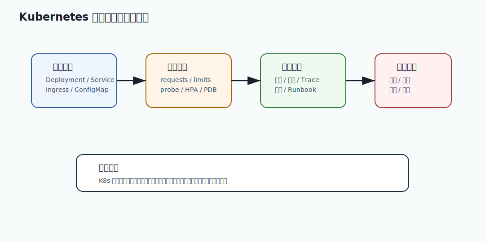

# 442 库存预占失败率升高如何排查？

[返回按分类学习面试题](../README.md)

## 题目

库存预占失败率升高如何排查？

## 先给面试官的短答案

库存预占失败率升高要先区分业务失败和系统失败。业务失败可能是真无库存、限购、活动规则拒绝；
系统失败可能是数据库锁竞争、Redis 令牌异常、库存桶倾斜、库存服务超时或消息积压。

排查要按 SKU、活动、仓库、渠道和错误码拆分。

## 先分类

分类：

- 库存不足。
- 限购拒绝。
- 风控拒绝。
- 幂等冲突。
- 锁等待超时。
- 数据库更新失败。
- 库存服务超时。
- 令牌获取失败。

错误码要能区分这些原因。

## 热点排查

检查：

- 是否集中在少数 SKU。
- 是否秒杀活动开始。
- 库存桶是否倾斜。
- Redis 热 key 是否出现。
- 数据库行锁等待是否升高。
- 下游仓库服务是否变慢。

库存问题常常是热点问题。

## 数据一致性

还要检查：

- 可售库存是否正确。
- 预占库存是否释放。
- 订单取消是否回补。
- 超时订单释放任务是否积压。
- 库存流水是否连续。

失败率升高可能来自库存释放异常。

## 在 eMall 项目中怎么讲？

eMall 发现某秒杀 SKU 预占失败率升高时，先看令牌发放、库存桶扣减、数据库条件更新和订单取消释放。

如果只有一个库存桶失败率高，说明分桶不均或热点集中，应调整桶分配或临时限流。

## 深度增强：Kubernetes 运维治理图



Kubernetes 题不能只背 Deployment、Service 和 Ingress。生产稳定性还取决于资源 requests/limits、探针、HPA、PDB、
灰度发布、配置回滚、日志指标 Trace 和故障 Runbook。

## 深度增强：Java 17 发布门禁示例

```java
record ReleaseSignal(double errorRate, long p99Millis, double cpuThrottleRate, boolean rollbackSafe) {

    boolean canContinue() {
        return errorRate < 0.001
                && p99Millis < 300
                && cpuThrottleRate < 0.05
                && rollbackSafe;
    }
}
```

这段代码表达发布平台的核心：放量不是人工拍脑袋，而是由错误率、延迟、资源和回滚安全共同决定。

## 深度增强：生产边界

K8s 会重启失败容器，但不保证业务一定恢复。错误的 liveness probe 可能造成重启风暴；
过低的 CPU limit 会造成 throttling；不兼容数据库变更会让回滚失效。平台能力要和应用设计配合。

## 深度增强：面试高分表达

我会把 K8s 视为运行平台，而不是稳定性的全部答案。真正生产级要有容量规划、灰度门禁、配置治理、可观测性、
自动回滚和数据库兼容检查，才能支撑核心交易链路。

## 专家级完整回答

```text
库存预占失败率升高要先区分业务失败和系统失败。业务上可能是真无库存、限购和风控，系统上可能是
锁竞争、热点 SKU、Redis 令牌异常、库存桶倾斜、数据库慢 SQL 或释放任务积压。

排查要按 SKU、仓库、活动、渠道和错误码拆分，并同时检查库存流水、预占释放和超时回补。
```

## 回答评分点

高分答案应该覆盖：

- 区分业务失败和系统失败。
- 按 SKU、活动和仓库拆分。
- 热点和锁竞争是重点。
- 检查库存释放和流水。
- 秒杀场景看令牌和库存桶。
