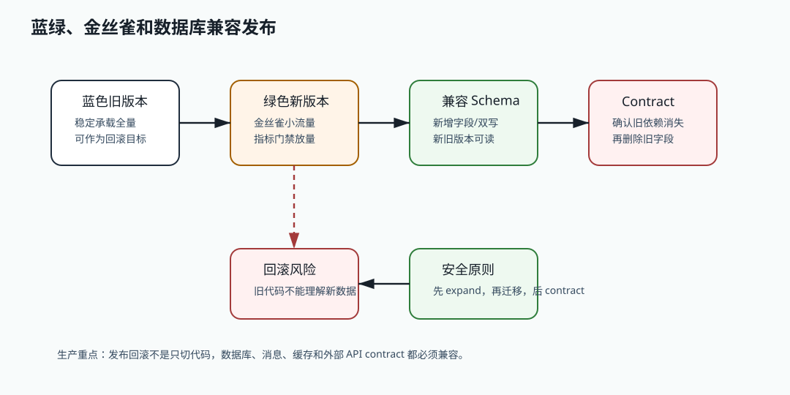

# 479 什么是 expand-contract 发布模式？

[返回按分类学习面试题](../README.md)

## 先给面试官的短答案

expand-contract 是一种面向兼容性的发布模式。expand 阶段先扩展系统能力，例如新增字段、表、接口或消息字段，
并保证旧版本仍可运行；中间阶段让新旧版本并存、双写或兼容读写；contract 阶段在确认所有旧依赖消失后，
再删除旧字段、旧接口或旧逻辑。

## 为什么需要它

分布式系统里，服务不会同时升级完成。滚动发布、灰度发布和回滚都会让新旧版本共存。如果直接删除字段或接口，
旧版本可能立即失败。expand-contract 的目标是把破坏性变更拆成多个安全变更。

## 一个数据库例子

假设订单表要把 `address` 字段拆成 `province`、`city` 和 `detail`：

1. expand：先新增三个字段，旧字段继续保留。
2. migrate：新版本同时写旧字段和新字段，后台迁移历史数据。
3. switch：应用读取新字段，读不到时兼容旧字段。
4. verify：通过对账确认新字段完整。
5. contract：所有旧版本下线后，删除旧 `address` 字段。

这个过程比一次性改表慢，但能支持灰度、回滚和数据修复。

## 接口和消息也适用

expand-contract 不只用于数据库。API 新增字段时要保证老客户端能忽略；消息 schema 新增字段要有默认值；
删除接口前要先下线调用方；改变字段语义前要提供新字段，而不是复用旧字段。

## 在 eMall 项目中怎么讲？

eMall 的订单、支付、库存、促销和开放平台都应该采用 expand-contract。尤其是开放平台 API 和 Kafka 事件，
存在外部或异步消费者，不能假设所有调用方能同时升级。

## 深度增强：expand-contract 发布图



expand-contract 的核心是把破坏性变更拆成多个非破坏性步骤。它不是只适用于数据库，
也适用于 API 字段、Kafka 事件、缓存 key、搜索索引和配置项。关键目标是让新旧版本能共存。

## 深度增强：订单地址拆分代码示例

```java
record OrderAddress(
        String province,
        String city,
        String detail,
        String legacyAddress) {
}

final class AddressCompatibilityMapper {

    String readDisplayAddress(OrderAddress address) {
        if (hasText(address.province()) && hasText(address.city()) && hasText(address.detail())) {
            return address.province() + address.city() + address.detail();
        }
        return address.legacyAddress();
    }

    OrderAddress dualWrite(String province, String city, String detail) {
        String legacy = province + city + detail;
        return new OrderAddress(province, city, detail, legacy);
    }

    private static boolean hasText(String value) {
        return value != null && !value.isBlank();
    }
}
```

迁移期间新版本双写新旧字段，读取时优先读新字段，缺失时回退旧字段。等历史数据迁移完成、
所有旧版本下线、监控确认没有旧字段读写后，才进入 contract 阶段删除旧字段。

## 深度增强：生产边界

expand 阶段可以新增字段、表、索引、API 字段或消息字段，但要保证旧消费者能忽略。
migrate 阶段要有对账，确认新旧字段语义一致。contract 阶段最危险，必须有调用方下线证明、
读写流量为零证明和回滚预案。

大表加字段、建索引和回填数据不能一次性阻塞线上。要使用在线 DDL、分批迁移、限速、断点续跑、
校验任务和灰度读切换。否则 expand-contract 的设计正确，执行仍可能造成数据库事故。
