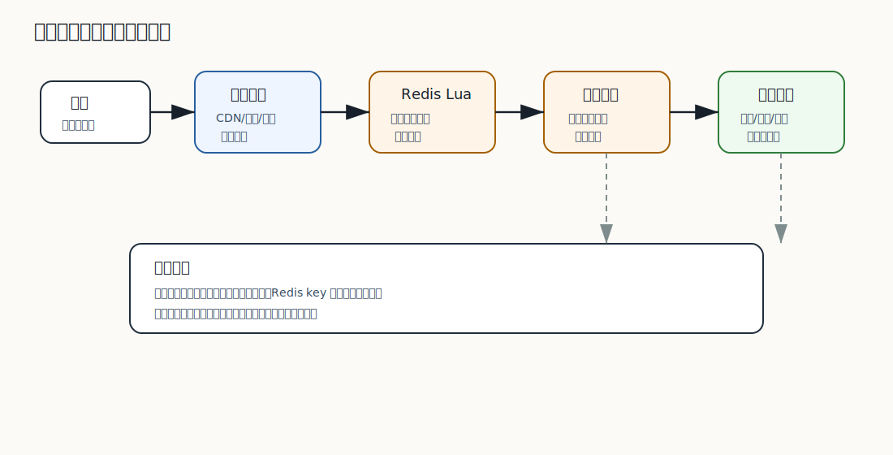

# 521 设计秒杀系统

[返回按分类学习面试题](../README.md)

## 题目

设计秒杀系统。

## 先给面试官的短答案

秒杀系统的核心是限流、削峰、防刷、防超卖和快速失败。典型设计是活动预热、静态资源 CDN、网关限流、资格校验、
Redis 原子扣减、排队令牌、异步下单、库存数据库兜底和补偿对账。不能让秒杀流量冲击普通交易链路。

## 核心挑战

秒杀的特点是瞬时流量极高、热点 SKU 集中、库存很少、恶意刷单多、用户对响应敏感。系统目标不是让所有请求都进入下单，
而是快速筛掉无效请求，让少量合法请求进入核心链路。

## 架构设计

活动开始前预热商品、库存、活动规则和页面静态资源。活动页走 CDN，减少源站压力。

入口层做用户限流、设备限流、IP 限流、验证码、风控和活动资格校验。无资格或库存已售罄的请求快速失败。

库存层用 Redis Lua 原子扣减秒杀库存，成功后生成排队令牌或预订单。订单创建可以异步化，避免瞬时写库。

最终订单和库存仍要落数据库，并通过对账修复 Redis 与数据库差异。

## 防超卖和幂等

Redis 预扣只能解决高并发入口，不代表最终事实。数据库中仍要有订单唯一约束、库存预占记录和状态机。

同一用户同一活动同一 SKU 要有购买限制和幂等键。重复请求不能重复占库存。

## 隔离和降级

秒杀服务要和普通下单隔离，包括线程池、连接池、Redis key、数据库表或分库、网关路由和限流策略。
秒杀异常时应优先保护普通购物链路。

## 在 eMall 项目中怎么讲？

eMall 的 `flash-sale` 模块负责活动规则、资格校验、秒杀库存预扣和排队令牌，再调用 `order` 和 `inventory` 完成最终确认。
`traffic` 和 `risk` 负责入口限流和防刷。

## 深度增强：秒杀链路图



这张图要讲出一个核心思想：秒杀系统不是把普通下单系统水平扩容，而是让大多数请求不要进入普通交易链路。
秒杀入口、Redis key、队列、线程池和数据库写入节奏都要和普通下单隔离。

## 深度增强：Redis Lua 原子预扣

秒杀库存预扣常用 Lua 保证“校验一人一单”和“扣减库存”在 Redis 内原子执行：

```lua
local stockKey = KEYS[1]
local userKey = KEYS[2]
local userId = ARGV[1]

if redis.call('SISMEMBER', userKey, userId) == 1 then
    return -2
end

local stock = tonumber(redis.call('GET', stockKey) or '0')
if stock <= 0 then
    return -1
end

redis.call('DECR', stockKey)
redis.call('SADD', userKey, userId)
return stock - 1
```

Java 侧只根据结果决定是否发放排队令牌，不能在 Redis 成功后直接认为订单已经创建成功：

```java
public enum FlashSaleAcquireResult {
    ACCEPTED,
    SOLD_OUT,
    DUPLICATE
}

public final class FlashSaleApplicationService {

    private final FlashSaleStockGateway stockGateway;
    private final FlashSaleQueue queue;

    public FlashSaleApplicationService(
            FlashSaleStockGateway stockGateway,
            FlashSaleQueue queue) {
        this.stockGateway = stockGateway;
        this.queue = queue;
    }

    public FlashSaleAcquireResult acquire(FlashSaleCommand command) {
        FlashSaleAcquireResult result = stockGateway.tryAcquire(command.activityId(), command.userId());
        if (result == FlashSaleAcquireResult.ACCEPTED) {
            queue.enqueue(command);
        }
        return result;
    }
}
```

## 深度增强：生产边界

- Redis 预扣是入口削峰，不是最终库存事实。
- 数据库仍要有订单唯一约束和库存条件更新兜底。
- 异步下单失败后要回补 Redis 库存或生成差异单。
- 秒杀链路要独立限流，不能拖垮普通下单。
- 防刷要结合登录态、设备指纹、验证码、行为风控和黑名单。

## 深度增强：面试高分表达

```text
秒杀的目标不是让所有请求排队进入下单，而是让无效请求尽早失败，让少量合法请求拿到令牌。
我会用 CDN 和预热降低读压力，用网关限流和风控挡流量，用 Redis Lua 原子预扣和一人一单防超卖，
成功后异步下单，最终由数据库唯一约束、库存条件更新、补偿和对账兜底。
```

## 专家级完整回答

```text
秒杀系统不是普通下单系统加大机器，而是要把大部分流量挡在核心交易链路之外。

我会在活动前预热缓存和静态资源，入口做限流、防刷和资格校验，库存用 Redis Lua 做原子预扣，
成功请求进入队列或异步下单，最终由订单和库存数据库确认。

关键是隔离和兜底。秒杀不能拖垮普通下单；Redis 预扣不能替代数据库最终一致；
重复请求、支付超时和订单失败都要有幂等、释放和对账。
```

## 回答评分点

高分答案应该覆盖：

- 说明秒杀核心是削峰、防刷、防超卖和隔离。
- 覆盖预热、CDN、网关限流、资格校验和 Redis Lua。
- 知道最终仍要数据库兜底和对账。
- 能处理重复请求、异步下单和库存释放。
- 强调秒杀不能影响普通交易链路。
## 深度完善：专项验收清单

围绕「设计秒杀系统」，这道题原本已经有专题深度增强；这里再补一层面向生产和 L6 面试的验收口径。
回答时要把概念、代码、数据、失败路径和指标串起来，证明自己不是只理解单点知识。

### 项目落点

- 先说明它在 eMall 哪个模块或链路中出现，例如交易、库存、支付、搜索、风控、发布或可观测性。
- 再说明它保护的核心目标：正确性、可用性、延迟、成本、安全或协作效率。
- 最后补失败场景：超时、重试、重复请求、状态不一致、热点流量、配置错误或发布回滚。

### 验收证据

- 代码证据：关键类、状态机、唯一约束、事务边界、线程池隔离或配置项。
- 测试证据：单元测试、集成测试、契约测试、压测、故障注入或回归用例。
- 运行证据：指标看板、Trace、结构化日志、告警、Runbook、对账结果或补偿记录。

### 高分收束

面试最后要回到取舍：当前方案为什么足够简单可靠，什么时候需要升级，升级时如何灰度、回滚和验证。
这样回答能体现生产系统判断力，而不是只罗列技术名词。

深度完善标记：专题增强答案已补项目落点、验收证据和取舍收束。
