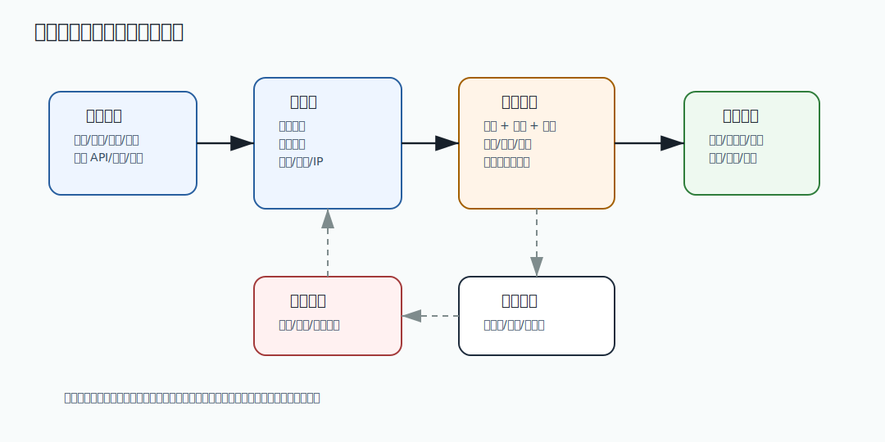

# 528 设计风控系统

[返回按分类学习面试题](../README.md)

完成标记：已完成

深度完善标记：已完成

## 题目

设计风控系统。

## 先给面试官的短答案

风控系统负责识别账号、交易、支付、营销和开放平台中的异常风险。它通常由实时特征、规则引擎、模型评分、
名单体系、策略编排、处置动作、灰度发布和审计复盘组成。核心要求是低延迟、可解释、可灰度、可回滚和低误杀。

## 风控场景

电商风控包括账号注册登录、薅羊毛、刷单、恶意退款、支付盗刷、商家违规、爬虫、接口滥用和大促攻击。

不同场景对延迟和准确率要求不同。登录风控需要毫秒级响应，售后欺诈可以异步审核，支付风控要兼顾安全和成交率。

## 架构设计

数据层收集用户、设备、IP、地理位置、历史订单、支付、退款、优惠、行为日志和黑白名单。

特征层提供实时特征和离线特征，例如短时间下单次数、设备关联账号数、退款率和优惠使用异常。

决策层包含规则引擎、模型评分和策略编排。处置层执行放行、验证码、二次验证、限流、冻结、拒绝、人工审核等动作。

## 生产要点

规则必须支持灰度、回滚和版本管理。高风险规则不能直接全量上线，避免误杀核心交易。

风控结果要可解释，至少能说明命中了哪些规则、特征和策略版本。否则客服、运营和事故复盘无法处理。

## 在 eMall 项目中怎么讲？

eMall 的 `risk` 模块可以接入 `identity`、`order`、`payment`、`promotion`、`openapi` 的行为数据。
`traffic` 做入口限流，`operations` 做规则审批和审计，`analytics` 做离线分析。

## 深度增强：风控系统架构图



风控系统可以分成数据接入、特征计算、决策引擎、处置动作和效果评估五层。实时链路负责毫秒级判断，
离线链路负责训练、回放、复盘和规则优化。两条链路要通过规则版本、特征版本和指标回流闭环。

## 深度增强：Java 17 风控决策代码示例

```java
import java.util.List;
import java.util.Map;

record RiskEvent(String scene, long userId, String deviceId, Map<String, Long> features) {
}

record RuleHit(String ruleId, String reason) {
}

record RiskDecision(RiskAction action, int score, List<RuleHit> hits) {
}

interface RiskRule {
    RuleHit hit(RiskEvent event);
}

final class RiskEngine {

    RiskDecision decide(RiskEvent event, List<RiskRule> rules) {
        List<RuleHit> hits = rules.stream()
                .map(rule -> rule.hit(event))
                .filter(hit -> hit != null)
                .toList();
        int score = hits.size() * 20;
        RiskAction action = switch (Math.min(score, 100)) {
            case 0 -> RiskAction.ALLOW;
            case 20, 40 -> RiskAction.CAPTCHA;
            case 60, 80 -> RiskAction.REVIEW;
            default -> RiskAction.REJECT;
        };
        return new RiskDecision(action, score, hits);
    }
}
```

代码里的 `RuleHit` 很重要，它让结果可解释。生产风控如果只返回拒绝，不返回规则、版本和特征原因，
客服、运营、申诉、事故复盘都很难判断是攻击、误杀还是规则配置错误。

## 深度增强：生产边界

实时风控要控制延迟。登录、下单和支付链路不能依赖慢查询和复杂离线计算，常用做法是提前准备
实时特征、热点名单、本地缓存和超时兜底。模型服务不可用时，应根据场景选择保守放行、
验证码、人工审核或拒绝，不能统一一个兜底动作。

风控不是越严越好。过度拦截会降低成交率、引发投诉和伤害商家。高成熟度风控会同时看安全收益、
误杀成本、人工审核成本、用户体验和长期转化，并通过灰度规则和实验验证策略价值。

## 深度增强：面试高分表达

我会先按场景拆风险，再按实时决策链路设计系统。风控的高分点不是列规则，而是说明特征、
规则、模型、处置、灰度、可解释和效果评估如何形成闭环。对于电商，支付盗刷、薅羊毛、
刷单和开放 API 滥用都要覆盖，但任何策略都要可回滚、可审计、低误杀。

## 专家级完整回答

```text
风控系统的核心是实时决策和可解释治理。

我会先定义风险场景，再建设特征、规则、模型和处置动作。实时链路要低延迟，
规则和模型要支持灰度、回滚、审计和效果评估。

风控不能只追求拦截率，还要控制误杀率。对电商系统来说，支付、优惠和开放平台都是高风险点，
但任何策略上线都必须可解释、可观察、可回滚。
```

## 回答评分点

高分答案应该覆盖：

- 覆盖账号、交易、支付、营销和开放平台风险。
- 能说明特征、规则、模型、名单和处置动作。
- 强调规则灰度、回滚、审计和可解释。
- 知道不同场景对延迟和误杀要求不同。
- 能结合 eMall 的 risk、traffic、operations 模块。
## 深度完善：专项验收清单

围绕「设计风控系统」，这道题原本已经有专题深度增强；这里再补一层面向生产和 L6 面试的验收口径。
回答时要把概念、代码、数据、失败路径和指标串起来，证明自己不是只理解单点知识。

### 项目落点

- 先说明它在 eMall 哪个模块或链路中出现，例如交易、库存、支付、搜索、风控、发布或可观测性。
- 再说明它保护的核心目标：正确性、可用性、延迟、成本、安全或协作效率。
- 最后补失败场景：超时、重试、重复请求、状态不一致、热点流量、配置错误或发布回滚。

### 验收证据

- 代码证据：关键类、状态机、唯一约束、事务边界、线程池隔离或配置项。
- 测试证据：单元测试、集成测试、契约测试、压测、故障注入或回归用例。
- 运行证据：指标看板、Trace、结构化日志、告警、Runbook、对账结果或补偿记录。

### 高分收束

面试最后要回到取舍：当前方案为什么足够简单可靠，什么时候需要升级，升级时如何灰度、回滚和验证。
这样回答能体现生产系统判断力，而不是只罗列技术名词。

深度完善标记：专题增强答案已补项目落点、验收证据和取舍收束。
