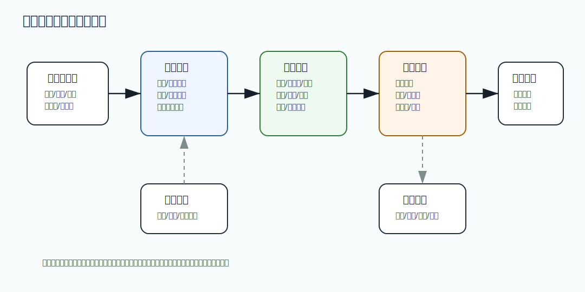

# 529 设计推荐系统的在线服务部分

[返回按分类学习面试题](../README.md)

完成标记：已完成

深度完善标记：已完成

## 题目

设计推荐系统的在线服务部分。

## 先给面试官的短答案

推荐在线服务负责在低延迟下为用户返回个性化商品列表，通常包括召回、过滤、排序、重排、特征读取、实验分流和降级。
在线服务不负责完整模型训练，但要接入离线模型、实时特征、用户画像、商品特征和埋点反馈。

## 核心链路

请求进入推荐服务后，先识别用户、场景、设备和实验桶。然后从多个召回源获取候选商品，例如协同过滤、热门商品、
类目偏好、相似商品和实时行为召回。

候选集经过过滤，去掉下架、无库存、违规、已购买或不符合场景的商品。然后用排序模型打分，最后做多样性、
商家公平、广告混排和规则重排。

## 特征和缓存

在线推荐需要低延迟读取用户特征、商品特征、上下文特征和实时行为特征。特征可以来自 Redis、特征服务或本地缓存。

热门召回和降级结果可以缓存。用户级结果缓存要谨慎，避免过期推荐和过滤不及时。

## 可用性和降级

推荐不是核心交易正确性链路，可以强降级。模型服务不可用时返回热门商品、类目榜单或编辑精选。

推荐结果必须过滤下架、违规和无库存商品。降级也不能突破合规和商品状态约束。

## 实验和指标

推荐系统要支持 A/B 实验和灰度。指标包括点击率、转化率、GMV、停留时长、负反馈、延迟和错误率。

实验要避免污染核心交易，不能只看点击率而忽略用户体验和长期质量。

## 在 eMall 项目中怎么讲？

eMall 的 `recommendation` 模块提供在线推荐，`intelligence` 和 `analytics` 提供模型和特征，`experiment` 做实验分流，
`product` 和 `inventory` 提供商品可用性过滤。

## 深度增强：推荐在线链路图



推荐在线服务的核心不是训练模型，而是在有限延迟内把候选商品变成可展示的结果。通常先多路召回，
再做商品可用性过滤，然后排序、重排、实验打标和埋点回传。召回可以不完美，但过滤不能失效。

## 深度增强：Java 17 推荐链路代码示例

```java
import java.util.Comparator;
import java.util.List;
import java.util.Set;

record RecommendRequest(long userId, String scene, String city) {
}

record CandidateItem(long itemId, double recallScore, double modelScore, String merchantId) {
}

record ItemState(long itemId, boolean onShelf, boolean hasStock, boolean compliant) {
}

final class RecommendationPipeline {

    List<CandidateItem> recommend(
            RecommendRequest request,
            List<CandidateItem> candidates,
            Set<Long> unavailableItems) {
        return candidates.stream()
                .filter(item -> !unavailableItems.contains(item.itemId()))
                .sorted(Comparator.comparingDouble(this::finalScore).reversed())
                .limit(50)
                .toList();
    }

    private double finalScore(CandidateItem item) {
        return item.recallScore() * 0.2 + item.modelScore() * 0.8;
    }
}
```

这个示例简化了过滤逻辑，但能说明关键思想：推荐结果返回前必须过滤不可售商品。
真实系统还会做商家多样性、类目多样性、广告混排、去重、冷启动保护和实验分流。

## 深度增强：生产边界

推荐链路要明确降级层级：特征服务失败可以用默认特征，模型失败可以用热门榜单，
召回失败可以返回类目热销，但下架、违规、无库存过滤不能降级。否则推荐服务会把不可买商品推给用户。

指标不能只看 CTR。短期点击高可能来自标题党或低质商品，长期会伤害转化和留存。高质量指标应同时看
CTR、CVR、GMV、负反馈、复购、页面停留、延迟、错误率和实验置信度。

## 深度增强：面试高分表达

我会把推荐在线服务讲成低延迟决策系统：多路召回扩大候选，过滤保证业务正确性，
排序和重排优化用户体验，实验和埋点负责持续迭代。推荐不是交易正确性链路，可以降级，
但不能突破商品状态、库存和合规边界。

## 专家级完整回答

```text
推荐在线服务的核心是低延迟地完成召回、过滤、排序和重排。

我会让在线服务接入多个召回源，读取用户、商品和上下文特征，然后用模型排序。
结果返回前必须过滤下架、违规和无库存商品，并支持实验分流和指标回收。

推荐链路要可降级。模型或特征服务失败时，可以返回热门商品或类目榜单，但不能影响下单链路，
也不能把不可售商品推荐给用户。
```

## 回答评分点

高分答案应该覆盖：

- 覆盖召回、过滤、排序、重排和实验分流。
- 知道在线服务依赖用户、商品、上下文和实时特征。
- 能说明缓存、低延迟和降级。
- 强调下架、违规、无库存过滤。
- 能用 CTR、转化率、GMV、延迟等指标评估。
## 深度完善：专项验收清单

围绕「设计推荐系统的在线服务部分」，这道题原本已经有专题深度增强；这里再补一层面向生产和 L6 面试的验收口径。
回答时要把概念、代码、数据、失败路径和指标串起来，证明自己不是只理解单点知识。

### 项目落点

- 先说明它在 eMall 哪个模块或链路中出现，例如交易、库存、支付、搜索、风控、发布或可观测性。
- 再说明它保护的核心目标：正确性、可用性、延迟、成本、安全或协作效率。
- 最后补失败场景：超时、重试、重复请求、状态不一致、热点流量、配置错误或发布回滚。

### 验收证据

- 代码证据：关键类、状态机、唯一约束、事务边界、线程池隔离或配置项。
- 测试证据：单元测试、集成测试、契约测试、压测、故障注入或回归用例。
- 运行证据：指标看板、Trace、结构化日志、告警、Runbook、对账结果或补偿记录。

### 高分收束

面试最后要回到取舍：当前方案为什么足够简单可靠，什么时候需要升级，升级时如何灰度、回滚和验证。
这样回答能体现生产系统判断力，而不是只罗列技术名词。

深度完善标记：专题增强答案已补项目落点、验收证据和取舍收束。
