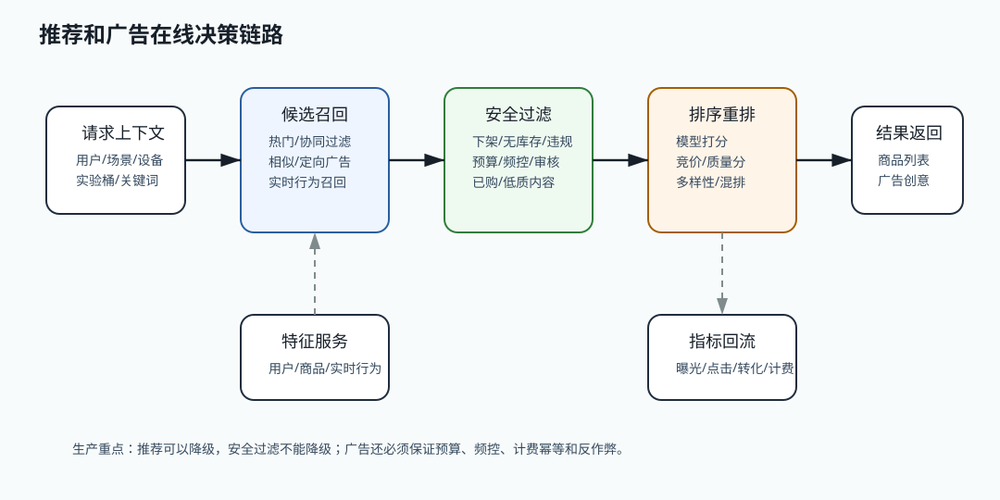

# 530 设计广告投放系统的核心链路

[返回按分类学习面试题](../README.md)

## 先给面试官的短答案

广告投放核心链路包括广告请求、候选召回、定向过滤、预算校验、竞价排序、频控、创意渲染、曝光点击埋点和计费。
关键要求是低延迟、预算准确、频控有效、反作弊、可审计和实验可控。

## 核心流程

用户访问搜索页或详情页时，广告服务接收场景、用户、关键词、类目和设备信息。

系统召回候选广告，再根据地域、用户标签、类目、关键词、商家、商品状态和审核状态过滤。

对剩余广告进行预算校验、出价和质量分排序，选择最终展示广告。曝光和点击通过埋点进入计费和效果分析。

## 预算和计费

预算控制要避免超花。可以使用 Redis 原子扣减日预算、活动预算和广告主预算，并异步落库。

计费要防重复，曝光和点击事件需要唯一 ID。点击计费要做反作弊和无效点击过滤。

## 频控和体验

频控限制同一用户、设备或 IP 在一定时间窗口看到同一广告的次数，避免用户体验下降和广告浪费。

广告必须过滤下架商品、违规商品和预算耗尽广告。广告系统不能为了收入突破平台规则。

## 在 eMall 项目中怎么讲？

eMall 的 `advertising` 模块负责广告投放，`risk` 做反作弊，`experiment` 做投放实验，`analytics` 做效果分析，
`product` 和 `merchant` 提供商品与商家审核状态。

## 深度增强：广告在线链路图



广告和推荐的链路相似，都要低延迟完成召回、过滤、排序和返回。但广告多了商业约束：
预算不能超花，频控不能失效，计费要幂等，反作弊要过滤无效曝光和点击，审核不通过不能投放。

## 深度增强：Java 17 预算和频控示例

```java
import java.math.BigDecimal;
import java.util.List;

record AdCandidate(
        long adId,
        long advertiserId,
        BigDecimal bid,
        double qualityScore,
        boolean approved,
        boolean productAvailable) {
}

interface BudgetService {
    boolean tryReserve(long adId, BigDecimal maxCost);
}

interface FrequencyCapService {
    boolean allow(long userId, long adId);
}

final class AdSelector {

    AdCandidate select(long userId, List<AdCandidate> candidates,
            BudgetService budgetService, FrequencyCapService frequencyCapService) {
        return candidates.stream()
                .filter(AdCandidate::approved)
                .filter(AdCandidate::productAvailable)
                .filter(ad -> frequencyCapService.allow(userId, ad.adId()))
                .sorted((left, right) -> Double.compare(score(right), score(left)))
                .filter(ad -> budgetService.tryReserve(ad.adId(), ad.bid()))
                .findFirst()
                .orElse(null);
    }

    private double score(AdCandidate ad) {
        return ad.bid().doubleValue() * ad.qualityScore();
    }
}
```

预算预占要使用原子操作，常见实现是 Redis Lua、数据库条件更新或预算服务串行化分片。
如果只是先查余额再扣减，在高并发广告请求下很容易超花。

## 深度增强：生产边界

广告计费要有唯一事件 ID，曝光、点击、转化都要幂等。点击计费还要通过风控过滤机器人、
异常 IP、异常设备、短时间重复点击和商家自点。计费和报表通常允许最终一致，但资金结算要可对账。

广告系统不能只追求收入。下架商品、违规创意、审核未通过、预算耗尽和频控超限都必须过滤。
如果投放链路失败，可以不展示广告或展示自然推荐，不能为了填充率突破平台治理规则。
