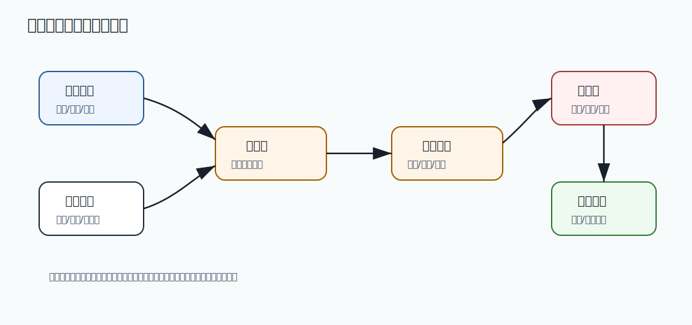

# 532 设计支付渠道对账系统

[返回按分类学习面试题](../README.md)

完成标记：已完成

深度完善标记：已完成

## 题目

设计支付渠道对账系统。

## 先给面试官的短答案

支付渠道对账系统负责核对第三方支付渠道账单和本地支付、退款、手续费、结算数据。核心是下载账单、解析标准化、
按渠道交易号和本地单号匹配，识别渠道成功本地失败、本地成功渠道失败、金额不一致和退款差异，并触发补单或人工处理。

## 核心流程

系统定时从支付渠道下载账单，校验文件完整性和签名。然后解析为统一账单模型，包含渠道交易号、商户单号、金额、
状态、手续费、退款和结算时间。

本地支付流水和退款流水按时间窗口抽取，与渠道账单做双向匹配。

## 差异类型

渠道成功本地失败：通常要补单，更新支付单和订单状态，但要先校验金额和订单合法性。

本地成功渠道失败：可能是本地状态错误，需要冲正或人工处理。

金额不一致：必须进入人工或财务审核，不能自动改金额。

渠道有退款本地无退款，或本地退款渠道未成功，都要生成退款差异单。

## 可靠性设计

账单下载、解析和匹配要幂等，支持重跑。原始账单文件要归档，解析结果和差异结果要可审计。

对账任务要处理渠道账单延迟、跨天交易、部分退款、多币种和手续费。

## 在 eMall 项目中怎么讲？

eMall 的 `payment` 负责渠道流水和退款流水，`finance` 负责对账任务和差异单，`operations` 提供人工处理后台。
支付对账结果可以反向驱动订单补偿。

## 深度增强：支付对账数据流图



支付对账是资金链路的兜底校验。它不能只比较“支付成功数量”，而要比较渠道交易号、商户单号、金额、
手续费、退款、结算时间和状态。

## 深度增强：统一账单模型

```java
public enum BillDirection {
    PAYMENT,
    REFUND
}

public record ChannelBillEntry(
        String channel,
        String channelTradeNo,
        String merchantOrderNo,
        BillDirection direction,
        BigDecimal amount,
        BigDecimal fee,
        String status,
        Instant settledAt) {
}

public enum PaymentDifferenceType {
    CHANNEL_SUCCESS_LOCAL_MISSING,
    LOCAL_SUCCESS_CHANNEL_MISSING,
    AMOUNT_MISMATCH,
    REFUND_MISMATCH,
    FEE_MISMATCH
}
```

差异生成要保留证据，方便财务、客服和技术一起追踪：

```java
public record PaymentDifference(
        String differenceId,
        PaymentDifferenceType type,
        String merchantOrderNo,
        String channelTradeNo,
        String evidence,
        Instant detectedAt) {
}
```

## 深度增强：自动处理边界

- 渠道成功本地缺失：可自动补支付流水，但必须校验金额、订单和签名证据。
- 本地成功渠道缺失：高风险，通常需要人工审核或渠道查询确认。
- 金额不一致：不能自动覆盖金额，要进入财务审核。
- 退款差异：要关联原支付单、退款单和渠道退款号。
- 原始账单文件必须归档，方便审计和监管。

## 深度增强：面试高分表达

```text
支付渠道对账是资金系统的最后一道防线。我会先下载并验签渠道账单，标准化成统一模型，
再和本地支付、退款、手续费流水做双向匹配。差异单要保留原始账单、匹配证据和处理记录。
渠道成功本地缺失可以补单，但金额不一致必须人工或财务审核，不能自动覆盖。
```

## 专家级完整回答

```text
支付渠道对账是资金系统的兜底真相校验。

我会下载并校验渠道账单，解析成统一模型，再和本地支付流水、退款流水双向匹配。
差异类型包括渠道成功本地失败、本地成功渠道失败、金额不一致和退款不一致。

涉及金额的差异不能简单自动覆盖。系统要生成差异单，保留原始账单、匹配证据和处理记录，
确保财务、客服和技术都能追溯。
```

## 回答评分点

高分答案应该覆盖：

- 覆盖账单下载、验签、解析、标准化和匹配。
- 能说明支付、退款、手续费和结算差异。
- 知道渠道成功本地失败需要补单。
- 强调金额不一致要审计和人工处理。
- 知道任务要幂等、重跑和归档原始账单。
## 深度完善：专项验收清单

围绕「设计支付渠道对账系统」，这道题原本已经有专题深度增强；这里再补一层面向生产和 L6 面试的验收口径。
回答时要把概念、代码、数据、失败路径和指标串起来，证明自己不是只理解单点知识。

### 项目落点

- 先说明它在 eMall 哪个模块或链路中出现，例如交易、库存、支付、搜索、风控、发布或可观测性。
- 再说明它保护的核心目标：正确性、可用性、延迟、成本、安全或协作效率。
- 最后补失败场景：超时、重试、重复请求、状态不一致、热点流量、配置错误或发布回滚。

### 验收证据

- 代码证据：关键类、状态机、唯一约束、事务边界、线程池隔离或配置项。
- 测试证据：单元测试、集成测试、契约测试、压测、故障注入或回归用例。
- 运行证据：指标看板、Trace、结构化日志、告警、Runbook、对账结果或补偿记录。

### 高分收束

面试最后要回到取舍：当前方案为什么足够简单可靠，什么时候需要升级，升级时如何灰度、回滚和验证。
这样回答能体现生产系统判断力，而不是只罗列技术名词。

深度完善标记：专题增强答案已补项目落点、验收证据和取舍收束。
