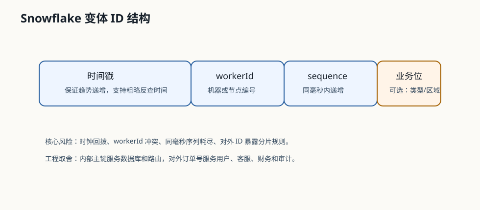

# 535 设计分布式 ID 服务

[返回按分类学习面试题](../README.md)

## 先给面试官的短答案

分布式 ID 服务要把策略选择、节点身份或号段分配、故障保护和观测统一治理，同时让数据面能够本地低延迟发号。
电商订单号通常要求高吞吐、趋势递增和可路由，但内部主键与外部展示号不必采用同一种格式。

## 需求

ID 生成要满足全局唯一、低延迟、高可用、可水平扩展和不依赖单点。订单号还需要避免暴露敏感信息，
并支持按时间粗略排序，方便分库分表和排查。

不同业务可以使用不同 ID。订单号、支付单号、用户 ID、消息 ID 不一定使用同一个生成策略。

## 服务架构

控制面负责分配 workerId 或号段、记录租约和冲突、发布策略并提供审计；数据面在业务实例内本地生成 ID，
避免每次请求都远程调用中心服务。控制面短时不可用时，尚未过期的租约或已领取号段仍可继续工作。

关键设计包括：

- workerId 使用带期限租约，过期后必须经过隔离窗口才能重新分配。
- 号段模式使用双 buffer，在当前号段耗尽前异步预取下一段。
- 策略和租约持久化多副本，防止控制面恢复后分配重复身份。
- 客户端导出生成失败、时钟回拨、序列耗尽、租约剩余时间和号段余量指标。
- 生成器按业务隔离，避免一个热点业务耗尽其他业务的号码预算。

ID 方案的横向比较见[全局唯一 ID 如何生成](312-global-unique-id.md)，Snowflake 位结构与风险见
[Snowflake ID 的结构和风险](313-snowflake-id.md)。

## 生产设计

如果使用 Snowflake，要监控时钟回拨，机器号不能冲突。workerId 不能只靠静态配置复制到所有实例，
应由带持久化和租约语义的控制面分配。

如果使用号段，要双 buffer 预取，避免号段耗尽时阻塞。号段表要高可用，步长要根据业务峰值调整。

## 电商系统实践

大型电商系统的订单、支付、退款、履约、消息都需要稳定 ID。订单号可以用时间前缀加分布式序列，内部主键可以用 Long ID。
对外展示 ID 和内部数据库 ID 可以分离，避免暴露分片规则。

## 深度增强：ID 结构图

分布式 ID 不是只要唯一就行。订单、支付、消息、用户对 ID 的要求不同：
内部主键关注索引友好和路由，对外订单号关注可读性、客服查询和不暴露敏感信息。

## 深度增强：生产边界

- workerId 必须统一分配，不能两个实例拿到同一个 workerId。
- 时钟回拨要告警，不能静默生成重复 ID。
- 同毫秒序列耗尽时要等待下一毫秒或扩展序列位。
- 对外订单号和内部主键建议分离，避免暴露分片和业务规模。
- ID 服务要监控生成 QPS、时钟回拨、worker 冲突和号段剩余量。

简化编码实现见[手写分布式 ID 生成器](655-distributed-id.md)。
