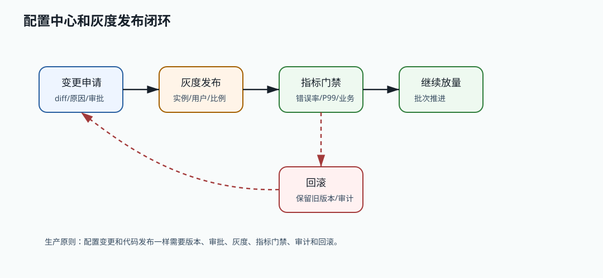

# 536 设计配置中心

[返回按分类学习面试题](../README.md)

## 先给面试官的短答案

配置中心负责集中管理应用配置，支持环境隔离、版本管理、灰度发布、实时推送、权限审批、审计、回滚和客户端容错。
生产配置变更要像代码发布一样治理，不能直接全量推送危险配置。

## 核心能力

配置中心要支持应用、环境、集群、命名空间和配置项管理。每次变更要有版本、diff、变更人、审批人和原因。

发布能力要支持全量发布、灰度发布、按实例发布和快速回滚。高风险配置需要审批。

客户端要支持拉取、长轮询或推送、本地缓存、默认值、配置校验和失败降级。

## 数据模型

配置可以按 app、env、cluster、namespace、key 组织。配置版本表记录每次变更，发布表记录哪个版本发布到哪些实例。

审计表记录读取、修改、发布、回滚和审批。

## 高可用设计

配置中心服务要多副本部署，存储层高可用。客户端必须有本地快照，配置中心不可用时服务仍能使用最近一次成功配置启动。

配置推送失败时，客户端要能定期拉取兜底。配置解析失败时不能用坏配置覆盖好配置。

## 在 eMall 项目中怎么讲？

eMall 的支付通道权重、限流阈值、风控规则开关、灰度比例和降级开关都适合进入配置中心。
`governance` 和 `release` 可以承载配置治理，`operations` 提供审批和审计。

## 深度增强：配置发布闭环图



配置中心不是简单的 key-value 存储，而是动态配置发布平台。
核心交易配置变更必须像代码发布一样有 diff、审批、灰度、指标观察、审计和回滚。

## 深度增强：Java 17 配置模型

```java
public record ConfigKey(
        String app,
        String env,
        String cluster,
        String namespace,
        String key) {
}

public record ConfigVersion(
        ConfigKey key,
        String value,
        long version,
        String operator,
        String reason,
        Instant createdAt) {
}

public record ConfigRelease(
        ConfigKey key,
        long version,
        String targetExpression,
        int percentage,
        Instant releasedAt) {
}
```

客户端要保护最后一次有效配置：

```java
public final class SafeConfigClient {

    private final ConfigRemoteClient remoteClient;
    private final LocalConfigSnapshot snapshot;

    public String get(ConfigKey key, String defaultValue) {
        try {
            String value = remoteClient.get(key);
            snapshot.save(key, value);
            return value;
        } catch (RuntimeException ex) {
            return snapshot.get(key).orElse(defaultValue);
        }
    }
}
```

## 深度增强：生产边界

- 坏配置不能覆盖最后一次有效配置。
- 高风险配置要审批和灰度，不能全量推送。
- 配置要做类型、范围、语法和业务校验。
- 客户端要有本地快照，配置中心故障不应影响服务启动。
- 配置读取、修改、发布和回滚都要审计。
