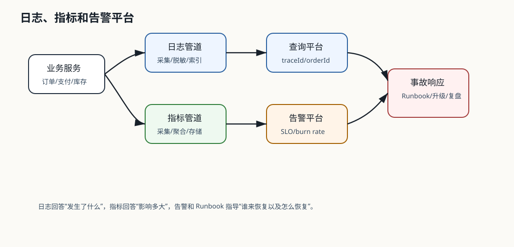

# 541 设计指标和告警平台

[返回按分类学习面试题](../README.md)

## 先给面试官的短答案

指标和告警平台负责采集系统、应用、依赖和业务指标，存储时序数据，提供看板、告警、SLO 和事故响应。
核心要求是指标标准化、低延迟、可聚合、告警准确、降噪、分级、Runbook 关联和业务指标覆盖。

## 指标分类

系统指标包括 CPU、内存、磁盘、网络和容器重启。应用指标包括 QPS、错误率、P99、线程池、连接池和 JVM。

依赖指标包括 MySQL、Redis、Kafka、搜索和第三方支付通道。业务指标包括下单成功率、支付成功率、库存失败率、
GMV、退款率和 Outbox 积压。

## 架构设计

服务通过 Micrometer 或 OpenTelemetry 暴露指标，采集器抓取或接收指标，写入 Prometheus、Mimir、VictoriaMetrics
或其他时序存储。Grafana 展示看板，Alertmanager 或告警平台负责通知和升级。

## 告警设计

告警要基于用户影响和 SLO，而不是所有指标波动都报警。可以使用多窗口 burn rate 检测错误预算消耗。

告警要分级，例如 P0 影响核心交易，P1 影响部分用户，P2 是容量或趋势风险。每条高等级告警应关联 Runbook。

## 降噪和治理

告警太多会导致无人响应。要做聚合、抑制、依赖关联、维护窗口和告警复盘。

告警规则也要版本化和评审，避免错误规则制造告警风暴。

## 电商系统实践

大型电商系统应为 `order`、`payment`、`inventory`、`gateway` 建立核心看板，覆盖成功率、P99、错误率、库存失败率、
支付回调延迟和 Outbox 积压。`operations` 可以承载告警治理。

## 深度增强：可观测平台图



指标和告警平台的目标不是“采集越多越好”，而是尽早发现用户影响，并指导值班人员恢复。
高等级告警必须关联 Runbook、负责人、升级路径和业务影响。

## 深度增强：核心指标模型

```java
public enum MetricCategory {
    SYSTEM,
    APPLICATION,
    DEPENDENCY,
    BUSINESS
}

public record AlertRule(
        String ruleId,
        String metricName,
        MetricCategory category,
        String expression,
        String severity,
        String runbookUrl) {
}
```

电商核心告警不应只看机器指标：

```text
order_success_rate < 99.5% for 5m
payment_callback_p99 > 1000ms for 10m
inventory_reserve_failure_rate > 2% for 5m
outbox_oldest_pending_age > 300s
kafka_consumer_lag > 100000 for 10m
```

## 深度增强：告警治理

- P0：核心交易大面积失败，需要立即响应和升级。
- P1：部分用户或关键依赖异常，需要值班处理。
- P2：容量、趋势或非核心功能异常，进入工作时间处理。
- 告警要聚合、抑制、维护窗口和复盘。
- 每条 P0/P1 告警都要有 Runbook。
