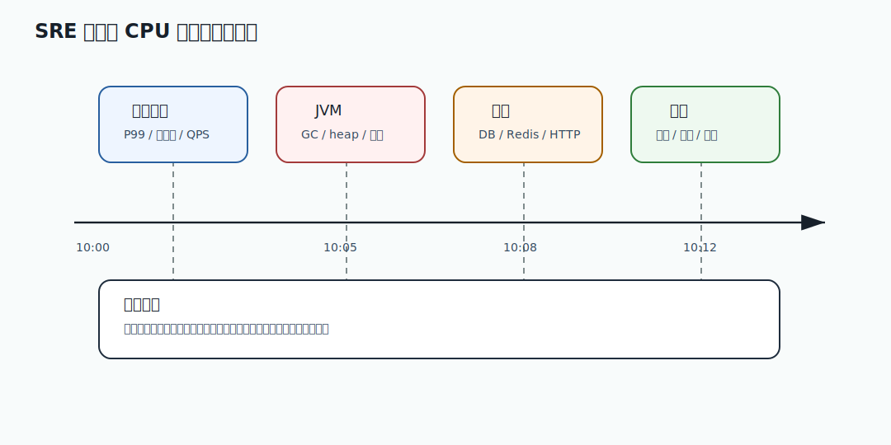

# 566 一个 Pod 频繁重启，如何排查？

[返回按分类学习面试题](../README.md)

## 题目

一个 Pod 频繁重启，如何排查？

## 先给面试官的短答案

生产排障要按止血、定位、恢复、复盘推进，先保护用户和核心链路，再用证据链定位根因。

## 核心拆解

- 先判断用户影响面、核心指标和是否需要止血。
- 对齐发布、配置、流量、依赖、数据库、缓存和 MQ 时间线。
- 通过限流、降级、回滚、隔离或暂停任务恢复服务。
- 恢复后补数据、补监控、补测试和自动化防线。

## 深度增强：图解



这张图用于把问题放到生产系统中理解。面试时不要只讲单点技术，而要说明它在容量、稳定性、
一致性、可观测性和故障恢复中的位置。

## 深度增强：Java 17 或 SQL 示例

```text
止血：限流、降级、回滚、隔离故障依赖，先恢复核心用户路径。
定位：对齐 P99、错误率、QPS、发布、配置、数据库、缓存、MQ 和下游指标。
恢复：修复数据和状态，补偿失败请求，确认核心指标回到基线。
复盘：补监控、补测试、补自动化防线，避免同类问题重复发生。
```

## 生产边界和常见坑

这个问题的关键不是“能不能做”，而是能否在高并发、灰度发布、故障恢复和数据修复场景下安全运行。
如果方案缺少监控、限流、幂等、回滚、审计或补偿，就只能算 demo，不能算生产级方案。

## 在 eMall 项目中怎么讲？

可以结合 eMall 的 `gateway`、`order`、`inventory`、`payment`、`risk`、`traffic`、
`reliability`、`release`、`operations` 和 `analytics` 模块说明。核心表达是：
先保护交易主链路，再保证数据可追踪，最后通过观测、补偿和复盘把风险沉淀为平台能力。

## 专家级完整回答

```text
我会先明确这个问题影响的是容量、可用性、一致性、安全还是工程效率。
然后拆解核心链路和失败场景，给出当前规模下最务实的方案。
生产系统里我会同时设计指标、告警、灰度、回滚、审计和补偿，避免方案只在正常路径成立。
如果规模继续增长，我会再从分片、异步化、多区域、自动化治理和成本优化上演进。
```

## 回答评分点

- 能先讲业务目标和生产影响。
- 能拆解核心链路、数据流和失败场景。
- 能给出 Java 17、SQL 或工程实现示例。
- 能说明监控、告警、回滚、补偿和审计。
- 能结合 eMall 项目说明落地方式。

## 深度完善：生产事故 Runbook

围绕「一个 Pod 频繁重启，如何排查？」，事故题不要直接猜根因。高分回答要按时间线推进：先止血，再定位，再恢复，
最后补齐长期防线。面试官更看重你是否能控制影响面，而不是一次性猜中答案。

### T0 到 T5 时间线

- T0 确认影响：看成功率、错误率、P99、QPS、投诉、核心业务指标和影响租户。
- T1 立即止血：暂停灰度、回滚配置、限流、降级、隔离下游或暂停非核心任务。
- T2 建立时间线：对齐发布、配置、流量突增、数据库、缓存、MQ、下游和定时任务。
- T3 定位根因：用 Trace 定调用链，用日志定错误码，用指标定资源瓶颈。
- T4 数据恢复：补偿失败请求，重放消息，修复状态，执行对账，保留审计记录。
- T5 复盘固化：补告警、补测试、补 Runbook、补自动化门禁，防止同类事故重复。

### 常用证据

```text
gateway: QPS、4xx、5xx、限流命中、请求体大小、认证失败
service: P99、线程池、连接池、熔断状态、异常类型、Trace span
database: 慢 SQL、锁等待、死锁、连接数、主从延迟、事务耗时
cache/mq: 命中率、热 key、Redis P99、consumer lag、DLQ、重试次数
release: 版本、配置、灰度比例、变更人、变更时间、回滚记录
```

### 面试表达模板

```text
我不会先猜根因。我会先判断是否影响核心交易链路，如果影响就立即止血。
然后按发布时间线、流量、依赖、数据库、缓存和 MQ 建证据链。
恢复后我会对失败请求和异常状态做补偿或对账，并把缺失的告警和测试补上。
```

### eMall 落地

可以把排查落到 `gateway -> order -> inventory -> payment -> event-platform`。
如果是交易成功率问题，优先保护下单和支付；如果是数据问题，优先保证状态可恢复和可审计。
所有人工修复都要有审批、执行记录、回滚脚本和对账结果。

## 补强索引
本题复习重点：一个 Pod 频繁重启，如何排查？

- 先看本文的题目专属答案，再按共享框架补齐项目落点、失败路径、取舍和验收。
- 白板复述时用结论 -> 例子 -> 风险 -> 指标四层结构。
## 二轮完善：事故题现场追问防守

围绕「一个 Pod 频繁重启，如何排查？」，面试官通常会继续追问“你先做什么、怎么证明、谁来决策、如何避免误操作”。
回答时要把动作拆成可执行指令，而不是只说“看日志、看监控”。

### 决策分层

- 值班工程师：确认告警、影响面、最近变更和是否触发预案。
- 模块 owner：判断是否降级、回滚、暂停任务或切流。
- 事故指挥：统一时间线、对外口径、恢复目标和复盘责任人。
- 数据 owner：负责补偿、对账、重放和人工修复审批。

### 不要犯的错误

- 没有止血就开始深挖根因，导致影响面继续扩大。
- 没有保存现场就重启服务，丢掉关键 dump、日志和指标。
- 手工修数据没有审批、没有备份、没有回滚脚本。
- 恢复后没有补自动化告警和测试，导致同类问题再次发生。

二轮完善标记：事故题已补现场追问防守和责任分层。
