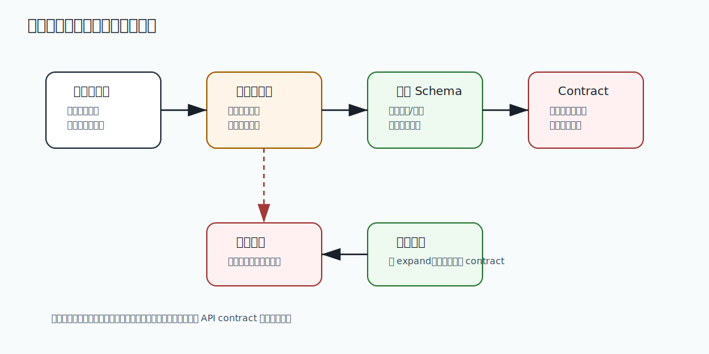

# 608 当前系统最大的技术债是什么？

[返回按分类学习面试题](../README.md)

完成标记：已完成

深度完善标记：已完成

## 题目

当前系统最大的技术债是什么？

## 先给面试官的短答案

这类题考察架构判断力，要讲清收益、成本、风险、适用边界和替代方案。

## 核心拆解

- 说明为什么需要这个方案。
- 比较替代方案的收益、成本和失败场景。
- 给出当前规模下的合理选择。
- 说明未来规模变化时如何演进。

## 深度增强：图解



这张图用于把问题放到生产系统中理解。面试时不要只讲单点技术，而要说明它在容量、稳定性、
一致性、可观测性和故障恢复中的位置。

## 深度增强：Java 17 或 SQL 示例

```java
record ArchitectureDecision(String goal, String option, String benefit, String risk) {

    String explain() {
        return goal + " -> choose " + option + ", benefit=" + benefit + ", risk=" + risk;
    }
}
```

## 生产边界和常见坑

这个问题的关键不是“能不能做”，而是能否在高并发、灰度发布、故障恢复和数据修复场景下安全运行。
如果方案缺少监控、限流、幂等、回滚、审计或补偿，就只能算 demo，不能算生产级方案。

## 在 eMall 项目中怎么讲？

可以结合 eMall 的 `gateway`、`order`、`inventory`、`payment`、`risk`、`traffic`、
`reliability`、`release`、`operations` 和 `analytics` 模块说明。核心表达是：
先保护交易主链路，再保证数据可追踪，最后通过观测、补偿和复盘把风险沉淀为平台能力。

## 专家级完整回答

```text
我会先明确这个问题影响的是容量、可用性、一致性、安全还是工程效率。
然后拆解核心链路和失败场景，给出当前规模下最务实的方案。
生产系统里我会同时设计指标、告警、灰度、回滚、审计和补偿，避免方案只在正常路径成立。
如果规模继续增长，我会再从分片、异步化、多区域、自动化治理和成本优化上演进。
```

## 回答评分点

- 能先讲业务目标和生产影响。
- 能拆解核心链路、数据流和失败场景。
- 能给出 Java 17、SQL 或工程实现示例。
- 能说明监控、告警、回滚、补偿和审计。
- 能结合 eMall 项目说明落地方式。

## 深度完善：架构取舍防守

围绕「当前系统最大的技术债是什么？」，取舍题的重点不是证明某个方案永远正确，而是证明你能在约束下做理性决策。
要主动讲清当前规模、团队能力、失败成本、迁移路径和未来演进条件。

### 决策矩阵

| 维度 | 选择当前方案时要证明什么 | 放弃或演进的信号 |
| --- | --- | --- |
| 正确性 | 核心业务不变量能被保护 | 出现不可接受的数据差异 |
| 可用性 | 故障时有降级、补偿或回滚 | 故障半径扩大到核心链路 |
| 复杂度 | 团队能理解、运维和排障 | 维护成本超过收益 |
| 成本 | 单请求、存储和运维成本可控 | 成本增长快于业务增长 |
| 演进 | 有灰度、迁移和回滚路径 | 架构锁死，无法低风险升级 |

### 高分回答结构

- 先说结论：在什么前提下我会选择这个方案。
- 再说收益：它解决了哪个真实业务风险。
- 再说代价：它带来哪些复杂度和运维成本。
- 再说边界：什么规模、团队或故障场景下不适合。
- 最后说演进：指标触发后如何迁移到下一阶段。

### 反驳问题

如果面试官挑战“为什么不选另一种方案”，不要防御式回答。
应该承认另一种方案在某些场景下更合适，然后回到当前约束：
核心链路规模、数据一致性要求、团队成熟度、上线窗口和可恢复能力。

深度完善标记：取舍题已补决策矩阵、反驳边界和演进信号。

## 补强索引

重复补强内容已合并到 [面试补强共享框架](../deepening-framework.md)。

整理标记：重复内容已合并

本题复习重点：当前系统最大的技术债是什么？

- 先看本文的题目专属答案，再按共享框架补齐项目落点、失败路径、取舍和验收。
- 白板复述时用结论 -> 例子 -> 风险 -> 指标四层结构。
## 二轮完善：取舍题高压追问回答

围绕「当前系统最大的技术债是什么？」，取舍题最容易被面试官连续反驳。高分回答要主动承认没有银弹，
然后用约束、证据和演进路径把方案守住。

### 三段式回答

`	ext
第一，我选择这个方案是因为当前主要矛盾是明确的，例如一致性、可用性、成本或交付速度。
第二，我知道它的代价，所以配套了监控、灰度、回滚、补偿和 owner。
第三，如果指标证明它不再适合，我会按预设迁移路径演进，而不是硬扛。
`

### 反驳时怎么说

- 如果被问“为什么不做最简单方案”，回答最简单方案在哪个失败场景下会丢数据、扩大故障或阻碍扩容。
- 如果被问“为什么不做最复杂方案”，回答复杂方案的维护成本、故障面、团队理解成本和上线风险。
- 如果被问“怎么证明不是拍脑袋”，回答用压测、事故数据、成本曲线、交付周期和缺陷数据做证据。

### 和 eMall 项目结合

可以把取舍落到交易主链路：核心写路径优先正确性和可恢复，非核心读路径优先可用性和成本。
例如订单、库存、支付使用状态机、幂等、Outbox 和对账；推荐、广告、搜索可以接受降级和最终一致。

二轮完善标记：取舍题已补高压追问、证据口径和 eMall 主链路表达。
