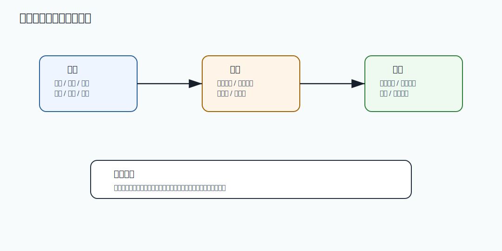

# 658 手写限时任务执行器。

[返回按分类学习面试题](../README.md)

完成标记：已完成

深度完善标记：已完成

## 题目

手写限时任务执行器。

## 先给面试官的短答案

现场编码要先澄清输入输出、边界和复杂度，再写最小正确实现，并说明生产化改造。

## 核心拆解

- 先澄清输入、输出、异常和并发边界。
- 用 Java 17 或 SQL 写小而正确的核心实现。
- 补充复杂度、测试用例和失败场景。
- 说明面试实现与生产实现的差异。

## 深度增强：图解



这张图用于把问题放到生产系统中理解。面试时不要只讲单点技术，而要说明它在容量、稳定性、
一致性、可观测性和故障恢复中的位置。

## 深度增强：Java 17 或 SQL 示例

```java
final class CloseableWorker implements AutoCloseable {
    private volatile boolean running = true;
    private final Thread thread = new Thread(this::loop, "worker");

    void start() {
        thread.start();
    }

    private void loop() {
        while (running && !Thread.currentThread().isInterrupted()) {
            java.util.concurrent.locks.LockSupport.parkNanos(1_000_000);
        }
    }

    public void close() {
        running = false;
        thread.interrupt();
    }
}
```

## 生产边界和常见坑

这个问题的关键不是“能不能做”，而是能否在高并发、灰度发布、故障恢复和数据修复场景下安全运行。
如果方案缺少监控、限流、幂等、回滚、审计或补偿，就只能算 demo，不能算生产级方案。

## 在 eMall 项目中怎么讲？

可以结合 eMall 的 `gateway`、`order`、`inventory`、`payment`、`risk`、`traffic`、
`reliability`、`release`、`operations` 和 `analytics` 模块说明。核心表达是：
先保护交易主链路，再保证数据可追踪，最后通过观测、补偿和复盘把风险沉淀为平台能力。

## 专家级完整回答

```text
我会先明确这个问题影响的是容量、可用性、一致性、安全还是工程效率。
然后拆解核心链路和失败场景，给出当前规模下最务实的方案。
生产系统里我会同时设计指标、告警、灰度、回滚、审计和补偿，避免方案只在正常路径成立。
如果规模继续增长，我会再从分片、异步化、多区域、自动化治理和成本优化上演进。
```

## 回答评分点

- 能先讲业务目标和生产影响。
- 能拆解核心链路、数据流和失败场景。
- 能给出 Java 17、SQL 或工程实现示例。
- 能说明监控、告警、回滚、补偿和审计。
- 能结合 eMall 项目说明落地方式。

## 深度完善：现场编码到生产代码

围绕「手写限时任务执行器。」，现场编码题要先保证小而正确，再补边界、复杂度、测试和生产化差异。
面试时不要一上来堆代码，先澄清输入规模、线程安全要求、异常策略和是否允许使用 JDK 容器。

### 参考实现或关键片段

```java
import java.time.Duration;
import java.util.concurrent.CompletableFuture;
import java.util.concurrent.Executor;
import java.util.concurrent.TimeUnit;
import java.util.function.Supplier;

static <T> T runWithTimeout(Supplier<T> task, Duration timeout, Executor executor) {
    return CompletableFuture.supplyAsync(task, executor)
            .orTimeout(timeout.toMillis(), TimeUnit.MILLISECONDS)
            .join();
}
```

### 必测用例

- 正常路径：最小输入、典型输入和容量边界。
- 异常路径：空输入、重复输入、超限输入、非法状态和超时中断。
- 并发路径：多线程同时调用时是否丢数据、重复执行或破坏顺序。
- 复杂度：说明时间复杂度、空间复杂度，以及为什么满足题目约束。

### 生产化差异

- 现场实现追求清晰正确，生产实现还要补指标、日志、超时、限流、配置和回滚。
- 如果涉及状态写入，要考虑幂等、唯一约束、事务边界和失败补偿。
- 如果涉及并发，要说明锁粒度、线程池隔离、队列容量和拒绝策略。

深度完善标记：手写题已补关键实现、测试边界和生产化差异。

## 补强索引

重复补强内容已合并到 [面试补强共享框架](../deepening-framework.md)。

整理标记：重复内容已合并

本题复习重点：手写限时任务执行器。

- 先看本文的题目专属答案，再按共享框架补齐项目落点、失败路径、取舍和验收。
- 白板复述时用结论 -> 例子 -> 风险 -> 指标四层结构。
## 二轮完善：编码题面试步骤

围绕「手写限时任务执行器。」，现场编码题的高分点不是写得最长，而是澄清、实现、验证、优化四步完整。

### 开始前先澄清

- 输入规模是多少，是否可能为空、重复、乱序或超限。
- 是否要求线程安全，是否允许使用 JDK 集合或并发包。
- 失败时返回错误、抛异常还是忽略，是否需要幂等。
- 复杂度目标是什么，是否需要考虑内存上限。

### 写完后主动验证

- 用一个正常用例证明主路径。
- 用一个边界用例证明容量、空值、重复或非法输入。
- 用一个失败用例证明异常或冲突处理。
- 最后说出时间复杂度、空间复杂度和生产化差异。

### 生产化补充

面试代码通常不等于生产代码。生产中还要补参数校验、指标、日志、限流、超时、配置化、
并发安全、资源释放、灰度开关和回滚策略。涉及数据库或 MQ 时，还要补事务、唯一约束、幂等和补偿。

二轮完善标记：编码题已补澄清步骤、验证路径和生产化补充。
