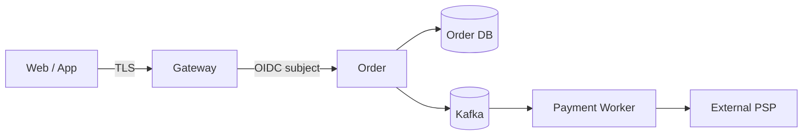

# 705 如何用威胁建模推动一次安全设计评审？

[返回按分类学习面试题](../README.md)

## 目标不是列一份漏洞词典

威胁建模是在编码前回答四件事：我们在构建什么、哪里可能出错、准备怎么处理、处理是否有效。最终产物应进入架构决策、代码任务、自动化测试和上线门禁，而不是会议后归档一张图。

## 第一步：定义资产和信任边界

先画数据流图，标出外部实体、进程、数据存储、数据流和信任边界：

互联网到网关、服务到数据库、Kafka 消费者和外部支付机构都是边界。资产包括资金、库存、账号、Token、个人信息、订单状态和审计证据。

## 第二步：按 STRIDE 和业务滥用分析

STRIDE 帮助系统化枚举：身份冒充、数据篡改、抵赖、信息泄漏、拒绝服务和权限提升。但电商还必须分析业务序列：

- 修改客户端价格或运费字段能否低价下单？
- 同一优惠券并发核销、回放消息或切换账号能否重复获利？
- 支付回调能否伪造、重放、乱序或引用其他订单？
- 导出接口是否能通过逐页遍历获取全部用户数据？
- 商品 URL 抓取是否能 SSRF 访问云元数据和内网？

每个威胁写清攻击前提、路径、影响资产和现有控制，不用“加强校验”这种无法验收的描述。

## 第三步：排序并设计纵深防御

风险按可利用性、影响、暴露范围和可检测性排序。高风险交易控制落到多层：网关认证与限流、服务端重新定价、数据库唯一/检查约束、事件签名与幂等、出站网络白名单、敏感字段加密和不可篡改审计。

防护必须指定 owner 和验证方式。例如“支付回调防重放”对应：验签、时间窗、nonce/事件 ID 唯一约束、订单状态机，以及重复回调集成测试。

## 第四步：持续验证

- 单元测试验证授权策略和状态机拒绝路径。
- 集成测试使用真实数据库验证唯一约束、租户隔离和幂等。
- DAST/渗透测试覆盖越权、注入、SSRF 和业务竞态。
- 监控异常核销率、签名失败、跨租户拒绝、导出量和高风险配置变更。
- 架构或数据流改变时更新模型，不等年度审计。

## 评审的完成标准

没有未定义的信任边界；每个高风险威胁都有接受、规避、转移或缓解决定；缓解措施有代码/配置任务、负责人、期限和测试证据。剩余风险由有权限的业务负责人显式接受，而不是开发者口头认为“概率很低”。

参考：[OWASP Threat Modeling Cheat Sheet](https://cheatsheetseries.owasp.org/cheatsheets/Threat_Modeling_Cheat_Sheet.html)
