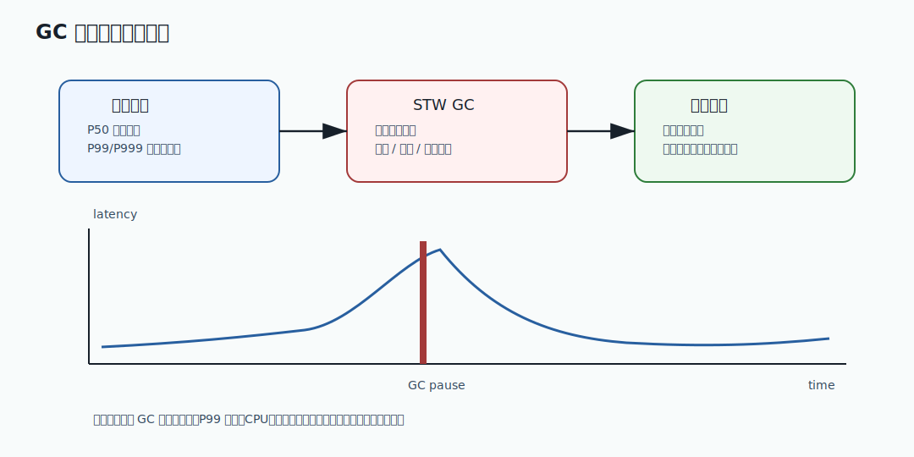

# 047 为什么低延迟服务要关注 GC 暂停？

[返回逐题精讲目录](README.md) | [返回答案手册](../README.md)

完成标记：已完成

## 题目

为什么低延迟服务要关注 GC 暂停？

## 先给面试官的短答案

GC 暂停会让应用线程停止执行。低延迟服务关注 P95、P99、P999，如果一次 GC 暂停几十或几百毫秒，
就会直接放大尾延迟，影响用户体验和上下游超时。

在电商系统中，下单、支付回调、网关转发、库存预占都属于低延迟敏感链路，因此必须关注 GC 暂停。

## 从零基础理解

用户请求进入服务后，应用线程处理请求。
如果此时发生 Stop-The-World GC，应用线程暂停，请求就只能等待。

即使平均延迟很好，少量 GC 暂停也会让 P99 变差。

## 为什么 P99 重要？

平均延迟可能掩盖问题。

例如：

```text
99 个请求 20 ms
1 个请求 2000 ms
平均看起来还可以
但 P99 非常差
```

大型电商系统中，用户、网关、服务、数据库、下游调用串在一起，尾延迟会被放大。

## GC 暂停带来的影响

- HTTP 请求超时。
- 网关重试。
- 下游调用堆积。
- 线程池占满。
- MQ 消费延迟。
- 支付回调处理延迟。
- 熔断误判。

## 哪些服务最敏感？

- Gateway。
- Order。
- Inventory。
- Payment。
- Search API。
- Risk synchronous check。

离线报表、批处理对暂停相对不敏感，但也不能完全忽略。

## 如何降低 GC 暂停影响？

- 减少不必要对象分配。
- 控制响应对象和批量查询大小。
- 避免无界缓存。
- 避免无界队列。
- 选择合适 GC。
- 调整堆大小和年轻代。
- 压测观察 P99 和 GC 日志。
- 对核心服务做容量冗余。

## 在 eMall 项目中怎么讲？

如果订单服务在大促中频繁 Full GC：

- 下单 P99 升高。
- 用户重复点击。
- requestId 幂等冲突增多。
- 库存预占请求堆积。
- 补偿任务压力上升。

所以 GC 不是 JVM 内部小事，而是交易链路稳定性问题。

## 深度增强：GC 暂停与尾延迟图



低延迟服务关注 GC，不是因为 GC 本身一定有问题，而是因为 Stop-The-World 会把正在处理的请求一起暂停。
如果一次暂停发生在订单创建或支付回调链路上，业务线程、HTTP client、数据库连接和线程池队列都会同步受到影响。

## 深度增强：Java 17 低分配写法示例

```java
import java.util.ArrayList;
import java.util.List;

record OrderLine(long skuId, int quantity) {
}

final class OrderLineConverter {

    List<Long> extractSkuIds(List<OrderLine> lines) {
        List<Long> skuIds = new ArrayList<>(lines.size());
        for (OrderLine line : lines) {
            skuIds.add(line.skuId());
        }
        return skuIds;
    }
}
```

这段代码不是说所有地方都要手写循环，而是强调在核心高频路径中要关注分配速率。
大促下每秒几十万次请求时，临时对象、巨大 JSON、无界集合和过大的批量查询都会放大 GC 压力。

## 深度增强：生产边界

GC 优化不能只看单次 pause。要同时看 allocation rate、old gen 回收效果、GC 总耗时占比、
P99/P999、CPU throttling 和业务超时。`MaxGCPauseMillis` 只是目标，不是硬保证。

如果 GC pause 已经影响交易链路，优先处理对象分配、缓存容量、队列堆积和批量大小。
只有在确认业务分配模型合理后，再考虑调整堆大小、G1 参数或评估 ZGC。

## 深度增强：面试高分表达

我会把 GC 暂停和尾延迟联系起来讲。平均延迟正常不代表用户体验稳定，P99 被 GC 拉高后，
会触发超时、重试、线程池堆积和熔断误判。排查时我会把 GC 日志、接口 P99、线程池队列、
下游超时和发布变更放到同一条时间线，而不是只看一条 GC 日志。

## 专家级完整回答

```text
低延迟服务关注 GC 暂停，因为 Stop-The-World 会暂停应用线程，直接影响 P99 和 P999。
在电商核心链路中，下单、库存预占、支付回调和网关转发都有超时预算，
一次长 GC 可能导致请求超时、线程池堆积、重试放大和熔断。

我会结合 GC 日志、P99、分配速率、堆使用、线程池队列和下游超时一起分析，
通过减少对象分配、控制缓存队列、选择合适 GC 和压测调参降低风险。
```

## 回答评分点

高分答案应该覆盖：

- GC 暂停会暂停应用线程。
- 能解释 P99/P999。
- 能联系超时、重试、线程池堆积。
- 能举订单、支付、网关等低延迟链路。
- 能提出监控和优化手段。
