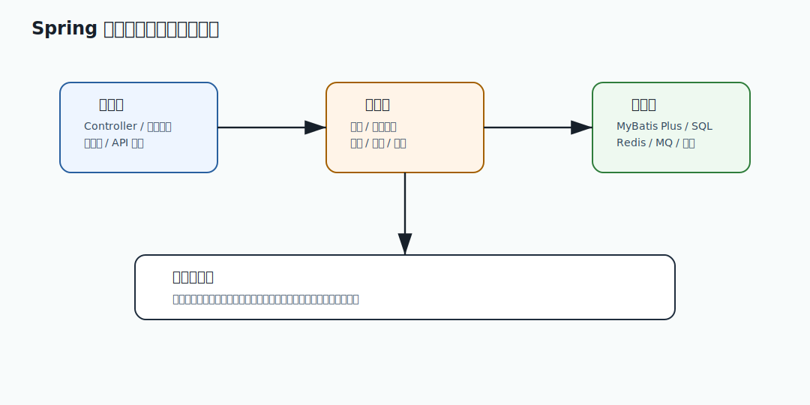

# 138 RestClient、WebClient、Feign 如何取舍？

[返回逐题精讲目录](README.md) | [返回答案手册](../README.md)

完成标记：已完成

深度完善标记：已完成

## 题目

RestClient、WebClient、Feign 如何取舍？

## 先给面试官的短答案

RestClient 是 Spring 新一代同步阻塞 HTTP 客户端，适合 MVC 和普通同步调用；WebClient 是响应式非阻塞客户端，
适合响应式链路、高并发 IO 和流式场景；Feign 是声明式 HTTP 客户端，适合微服务接口调用和统一治理。
选择取决于编程模型、团队规范、调用复杂度和治理能力。

不要为了“新”而混用多个客户端。

## RestClient

RestClient 是 Spring Framework 6 引入的同步 HTTP 客户端。

特点：

- 阻塞式。
- API 比 RestTemplate 更现代。
- 适合 Spring MVC。
- 易理解。

适合大多数同步微服务调用。

## WebClient

WebClient 是响应式客户端。

特点：

- 非阻塞。
- 基于 Reactor。
- 支持流式响应。
- 适合 WebFlux。

如果在 MVC 阻塞链路中使用 WebClient 后又 `.block()`，收益会下降，还会增加复杂度。

## Feign

Feign 是声明式 HTTP 客户端。

特点：

- 接口定义远程调用。
- 适合微服务调用。
- 易集成负载均衡、熔断、重试、日志。
- 调用代码简洁。

但要统一超时、连接池、错误解码和重试策略。

## 如何选择？

建议：

- MVC 同步服务：RestClient 或 Feign。
- 声明式内部服务调用：Feign。
- 响应式端到端链路：WebClient。
- 流式、SSE、大量非阻塞 IO：WebClient。
- 简单外部 API 调用：RestClient。

团队最好统一一种主客户端，避免治理碎片化。

## 生产治理点

无论选哪个，都必须配置：

- 连接池。
- 连接超时。
- 读取超时。
- 总超时。
- 重试策略。
- 熔断降级。
- 日志脱敏。
- trace ID 透传。
- 指标监控。

客户端类型不是生产能力的全部。

## 在 eMall 项目中怎么讲？

eMall 内部服务如果采用 Spring Cloud，可以用 Feign 做声明式调用并统一治理。

网关或高并发流式场景可以用 WebClient。

普通同步外部 HTTP API 可以用 RestClient。

关键是统一规范，避免订单服务里同时混用三套超时和重试策略。

## 深度增强：Spring 服务治理图



Spring 题要从框架机制讲到业务边界。Controller 负责协议适配，Service 负责业务事务，Repository 负责数据访问；
事务、AOP、校验、错误码、配置和观测都是为了让微服务在复杂调用中保持稳定。

## 深度增强：Java 17 分层示例

```java
record CreateOrderCommand(long userId, long skuId, int quantity) {
}

record CreateOrderResult(long orderId, String status) {
}

interface OrderApplicationService {
    CreateOrderResult create(CreateOrderCommand command);
}

final class OrderControllerAdapter {
    private final OrderApplicationService service;

    OrderControllerAdapter(OrderApplicationService service) {
        this.service = service;
    }

    CreateOrderResult submit(CreateOrderCommand command) {
        return service.create(command);
    }
}
```

这个示例表达分层边界：接口层不堆业务逻辑，业务层不依赖 Web 协议，命令和结果对象形成稳定契约。

## 深度增强：生产边界

框架默认值不能替代设计。事务传播、异常回滚、异步线程池、连接池、序列化、超时和重试都要显式治理。
尤其在订单、支付、库存链路中，要避免长事务、隐式重试和跨服务事务误用。

## 深度增强：面试高分表达

我会先解释框架原理，再说明在电商系统里怎么落地。高分回答要能把自动配置、AOP、事务、MVC、WebFlux、
校验和错误处理，连接到可维护性、可观测性、稳定性和故障恢复。

## 专家级完整回答

```text
RestClient 适合同步阻塞调用，是 RestTemplate 的现代替代；WebClient 是响应式非阻塞客户端，
适合 WebFlux、流式和高并发 IO；Feign 是声明式客户端，适合内部微服务调用和统一治理。

我会按应用编程模型和治理能力选择，而不是追新。无论哪种客户端，都必须统一连接池、超时、重试、熔断、日志和 trace 透传。
```

## 回答评分点

高分答案应该覆盖：

- RestClient 是同步阻塞。
- WebClient 是响应式非阻塞。
- Feign 是声明式。
- 不能为了新而混用。
- 生产治理比客户端类型更重要。

## 深度完善：面向 L6 的回答框架

围绕「RestClient、WebClient、Feign 如何取舍？」，高分答案不能停在概念定义，而要把「Bean 生命周期、AOP、事务、配置、HTTP 客户端、健康检查和公共配置」讲成一条可验证的工程链路。
面试官真正关注的是：你是否知道它解决什么问题、什么时候会失效、如何在生产系统中验证。

### 1. 先界定边界

- 本题属于「Spring Boot 和服务工程」，先说明它影响的是正确性、稳定性、性能、安全还是协作效率。
- 不要直接背结论，要先说清业务约束、数据规模、调用链位置和失败后果。
- 如果存在多种方案，要说明默认选择、替代方案、迁移成本和放弃条件。

### 2. 结合 eMall 落地

- 可以从 `各服务的 Controller、ApplicationService、MyBatis Plus Mapper、Actuator 和 RestClient` 切入，说明它在真实电商链路中的入口、状态、数据和依赖。
- 回答时至少补一个失败路径，例如超时、重复请求、状态不一致、热点流量或配置误发。
- 再说明如何通过代码规范、测试、灰度、回滚、监控或补偿把风险收敛。

### 3. 生产级验证

- 关键指标：事务失败率、健康检查状态、依赖调用耗时、配置变更次数、启动耗时。
- 验证证据：Spring Boot 测试、集成测试、配置审计、Actuator 指标和链路 Trace。
- 如果没有这些证据，只能说明方案在理论上成立，不能证明它能长期稳定运行。

### 4. 追问防守

- 被问“为什么不用更简单方案”时，回答当前规模、团队能力和风险收益是否匹配。
- 被问“为什么不用更复杂方案”时，回答复杂方案的运维成本、故障面和迁移成本。
- 最后用一句话收束：先用简单可靠方案闭环，再用指标驱动演进，而不是提前复杂化。

## 补强索引

重复补强内容已合并到 [面试补强共享框架](../shared/deepening-framework.md)。

整理标记：重复内容已合并

本题复习重点：RestClient、WebClient、Feign 如何取舍？

- 先看本文的题目专属答案，再按共享框架补齐项目落点、失败路径、取舍和验收。
- 白板复述时用结论 -> 例子 -> 风险 -> 指标四层结构。

