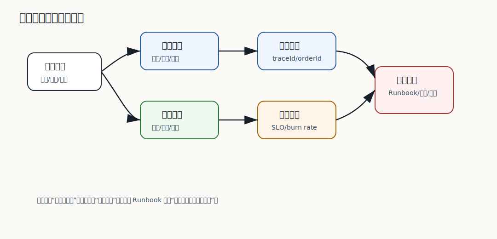

# 212 2PC 的流程是什么？

[返回逐题精讲目录](README.md) | [返回答案手册](../README.md)

完成标记：已完成

深度完善标记：已完成

## 题目

2PC 的流程是什么？

## 先给面试官的短答案

2PC 是两阶段提交，包含准备阶段和提交阶段。
协调者先询问所有参与者能否提交，所有参与者都准备成功后，协调者再通知提交；只要有一个失败，就通知全部回滚。

它试图保证多个参与者原子提交，但会带来阻塞和可用性问题。

## 第一阶段：Prepare

流程：

- 协调者向所有参与者发送 prepare 请求。
- 参与者执行本地事务检查。
- 参与者写入预提交日志。
- 参与者锁定相关资源。
- 参与者回复 yes 或 no。

回复 yes 表示参与者承诺后续可以提交。

## 第二阶段：Commit 或 Rollback

如果所有参与者回复 yes：

- 协调者发送 commit。
- 参与者提交本地事务。
- 参与者释放资源。
- 参与者回复完成。

如果任一参与者回复 no 或超时：

- 协调者发送 rollback。
- 参与者回滚本地事务。
- 参与者释放资源。

## 关键角色

角色包括：

- 协调者：决定全局提交或回滚。
- 参与者：执行本地准备、提交和回滚。
- 日志：用于故障恢复。

日志很重要，因为节点宕机后要根据日志恢复事务状态。

## 在 eMall 项目中怎么讲？

如果强行用 2PC 处理下单，订单、库存、支付都要先 prepare 并锁住资源，等协调者决定后再提交。

这会让库存和支付资源被长时间占用，不适合高并发下单主链路。

## 深度增强：可观测与配置治理图



配置、日志、指标和 Trace 不是附属能力，而是生产系统定位问题和控制变更风险的基础。
没有可观测性，限流、熔断、回滚和补偿都很难判断是否有效。

## 深度增强：Java 17 观测信号示例

```java
import java.time.Instant;
import java.util.Map;

record ObservabilityEvent(
        Instant time,
        String traceId,
        String service,
        String eventType,
        Map<String, String> tags) {
}

final class TraceTagPolicy {

    boolean shouldKeep(String key) {
        return !key.equalsIgnoreCase("password")
                && !key.equalsIgnoreCase("secret")
                && !key.equalsIgnoreCase("token");
    }
}
```

这段代码体现生产观测的两个重点：所有关键事件要能关联 traceId，敏感信息不能进入日志和标签。

## 深度增强：生产边界

日志越多不代表越好。核心链路要控制日志成本、采样率、脱敏和索引字段。告警也不能只看机器指标，
还要看下单成功率、支付成功率、库存失败率、Outbox 积压和用户投诉。

## 深度增强：面试高分表达

我会把可观测性讲成故障闭环：指标发现异常，Trace 定位慢在哪里，日志解释发生了什么，
告警和 Runbook 指导恢复。配置变更也要有版本、审批、灰度、审计和回滚，避免配置事故变成全站事故。

## 专家级完整回答

```text
2PC 分为 prepare 和 commit 两阶段。第一阶段协调者询问所有参与者是否可以提交，
参与者完成本地检查、写日志并锁定资源后返回 yes 或 no。第二阶段如果全部 yes，协调者通知 commit；
如果任一失败或超时，通知 rollback。

它可以实现多个参与者的原子提交，但因为资源在 prepare 后被锁住，所以存在阻塞和可用性问题。
```

## 回答评分点

高分答案应该覆盖：

- 2PC 有协调者和参与者。
- 第一阶段是 prepare。
- 第二阶段是 commit 或 rollback。
- 参与者 prepare 后会锁资源。
- 日志用于故障恢复。

## 深度完善：面向 L6 的回答框架

围绕「2PC 的流程是什么？」，高分答案不能停在概念定义，而要把「本地事务、Outbox、Saga、TCC、幂等、状态机、对账和补偿」讲成一条可验证的工程链路。
面试官真正关注的是：你是否知道它解决什么问题、什么时候会失效、如何在生产系统中验证。

### 1. 先界定边界

- 本题属于「分布式一致性和补偿」，先说明它影响的是正确性、稳定性、性能、安全还是协作效率。
- 不要直接背结论，要先说清业务约束、数据规模、调用链位置和失败后果。
- 如果存在多种方案，要说明默认选择、替代方案、迁移成本和放弃条件。

### 2. 结合 eMall 落地

- 可以从 `order、inventory、payment、fulfillment、event-platform 的交易事件和补偿任务` 切入，说明它在真实电商链路中的入口、状态、数据和依赖。
- 回答时至少补一个失败路径，例如超时、重复请求、状态不一致、热点流量或配置误发。
- 再说明如何通过代码规范、测试、灰度、回滚、监控或补偿把风险收敛。

### 3. 生产级验证

- 关键指标：Outbox 积压、补偿成功率、对账差异数、重复消费数、非法状态迁移数。
- 验证证据：状态机测试、幂等表、补偿任务记录、对账报表、DLQ 和事件重放记录。
- 如果没有这些证据，只能说明方案在理论上成立，不能证明它能长期稳定运行。

### 4. 追问防守

- 被问“为什么不用更简单方案”时，回答当前规模、团队能力和风险收益是否匹配。
- 被问“为什么不用更复杂方案”时，回答复杂方案的运维成本、故障面和迁移成本。
- 最后用一句话收束：先用简单可靠方案闭环，再用指标驱动演进，而不是提前复杂化。

## 补强索引

重复补强内容已合并到 [面试补强共享框架](../shared/deepening-framework.md)。

整理标记：重复内容已合并

本题复习重点：2PC 的流程是什么？

- 先看本文的题目专属答案，再按共享框架补齐项目落点、失败路径、取舍和验收。
- 白板复述时用结论 -> 例子 -> 风险 -> 指标四层结构。

