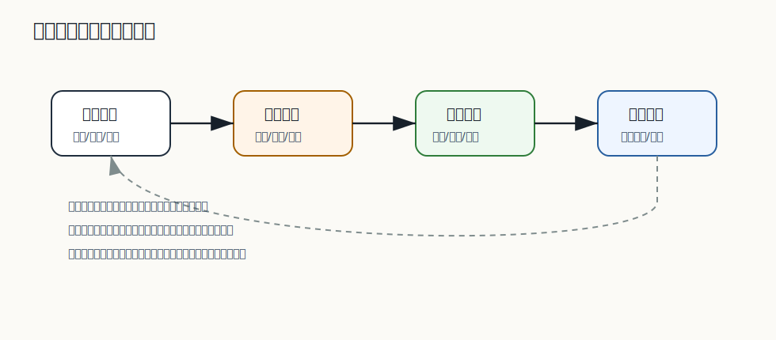

# 233 支付成功但订单更新失败怎么办？

[返回逐题精讲目录](README.md) | [返回答案手册](../README.md)

完成标记：已完成

## 题目

支付成功但订单更新失败怎么办？

## 先给面试官的短答案

支付成功是资金事实，不能因为订单更新失败就忽略。
应以支付服务或支付渠道的成功记录为准，通过可靠事件、重试、主动查询、对账和补偿任务把订单状态推进到已支付。

如果最终确认无法履约，要走退款和异常处理流程。

## 处理原则

原则：

- 支付成功事实不能丢。
- 订单更新要幂等。
- 支付事件要可靠投递。
- 订单状态机防止非法回退。
- 长时间不一致要告警和对账。

资金相关异常必须可追踪。

## 恢复路径

恢复方式：

- 支付服务重发支付成功事件。
- 订单服务消费事件重试更新。
- 订单服务主动查询支付单。
- 对账任务发现支付成功订单未更新。
- 人工审核后退款或补单。

多条路径保证状态最终收敛。

## 用户体验

用户侧可以显示：

- 支付结果确认中。
- 已支付，订单处理中。
- 异常处理中。

不能让用户认为钱丢了或订单不存在。

## 在 eMall 项目中怎么讲？

支付服务收到渠道回调后，本地记录支付成功并发布 `PaymentSucceeded` 事件。

订单服务更新失败时，事件会重试；如果仍失败，对账任务按支付单和订单号修复订单状态。

## 深度增强：一致性闭环图



支付成功是资金事实，比订单本地状态更强。订单更新失败时，不能把支付成功事件丢掉，也不能让用户长期看到订单未支付。
必须通过可靠事件、补偿和对账让订单最终收敛。

## 深度增强：Java 17 补偿任务

补偿任务要有业务键、状态、重试次数和下次执行时间：

```java
public enum CompensationStatus {
    PENDING,
    RUNNING,
    SUCCESS,
    DEAD
}

public record CompensationTask(
        String taskId,
        String businessKey,
        String taskType,
        CompensationStatus status,
        int retryCount,
        Instant nextRunAt) {
}
```

支付成功但订单未更新时，可以生成“确认订单支付状态”的补偿任务：

```java
public final class PaymentOrderCompensationHandler {

    private final PaymentRepository paymentRepository;
    private final OrderClient orderClient;
    private final CompensationRepository compensationRepository;

    public void compensate(CompensationTask task) {
        Payment payment = paymentRepository.findByPaymentId(task.businessKey());
        if (!payment.isSucceeded()) {
            compensationRepository.markSuccess(task.taskId());
            return;
        }

        ConfirmPaymentCommand command = new ConfirmPaymentCommand(
                payment.orderId(),
                payment.paymentId(),
                payment.amount());

        orderClient.confirmPaid(command);
        compensationRepository.markSuccess(task.taskId());
    }
}
```

订单服务的 `confirmPaid` 必须幂等：如果订单已经是已支付，重复调用直接返回成功。

## 深度增强：面试高分表达

```text
支付成功是资金事实，不能因为订单服务更新失败就回滚或忽略。我会在支付服务本地落支付成功流水，
通过 Outbox 发布 PaymentSucceeded 事件。订单消费失败会重试，长时间不一致由对账发现并生成补偿任务。
订单确认支付接口必须幂等，最终如果无法履约再走退款和人工审核。
```

## 专家级完整回答

```text
支付成功但订单更新失败时，支付成功是资金事实，必须被保留并推动订单最终一致。
我会用支付本地事务、Outbox 事件、订单幂等更新、重试、主动查询和对账任务修复状态。

如果订单最终无法履约，要进入异常处理和退款流程，而不是把支付成功事件丢掉。
```

## 回答评分点

高分答案应该覆盖：

- 支付成功是不可忽略的资金事实。
- 订单更新要幂等和可重试。
- 可靠事件和对账是关键。
- 用户侧要有可理解状态。
- 无法履约时要退款或人工处理。
