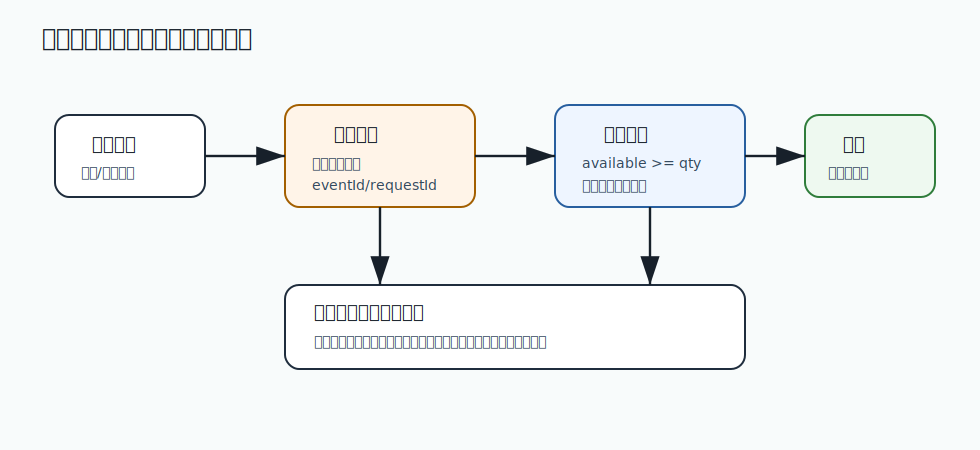

# 234 订单取消但库存释放失败怎么办？

[返回逐题精讲目录](README.md) | [返回答案手册](../README.md)

完成标记：已完成

## 题目

订单取消但库存释放失败怎么办？

## 先给面试官的短答案

订单取消后库存释放失败，会导致库存被长期占用，影响可售数量。
应通过库存释放事件、幂等重试、超时释放任务、库存预占记录和对账任务确保库存最终释放。

库存释放失败不能影响订单取消事实，但必须进入补偿流程。

## 关键数据

库存服务应维护：

- 预占记录。
- 订单号。
- SKU。
- 预占数量。
- 预占状态。
- 过期时间。
- 释放时间。

没有预占记录，就很难安全释放。

## 恢复方式

方式包括：

- 订单服务重发取消事件。
- 库存服务消费失败后重试。
- 定时扫描过期预占。
- 对账订单取消状态和库存预占状态。
- 人工处理异常预占。

释放操作必须幂等。

## 防止误释放

释放库存时要校验：

- 预占记录存在。
- 预占属于当前订单。
- 当前状态允许释放。
- 未被确认扣减。

不能只根据 SKU 数量盲目增加库存。

## 在 eMall 项目中怎么讲？

订单超时取消后发布 `OrderCanceled` 事件，库存服务按订单号释放预占。

如果消费失败，库存预占记录到期后由库存服务扫描释放，并产生补偿日志。

## 深度增强：一致性和补偿图


分布式一致性题要先区分事实来源、状态流转和补偿责任。
订单、库存、支付、优惠和消息不可能总靠一个本地事务完成，
所以要用幂等、状态机、Outbox、重试、对账和补偿形成闭环。

## 深度增强：Java 17 状态机示例

```java
enum TradeState {
    INIT,
    RESERVED,
    PAID,
    CLOSED
}

record TradeTransition(TradeState from, TradeState to, String reason) {

    boolean valid() {
        return switch (from) {
            case INIT -> to == TradeState.RESERVED || to == TradeState.CLOSED;
            case RESERVED -> to == TradeState.PAID || to == TradeState.CLOSED;
            case PAID, CLOSED -> false;
        };
    }
}
```

状态机的价值是防止非法跳转。生产事故中很多错误不是技术异常，而是状态被重复推进、逆向推进或越级推进。

## 深度增强：生产边界

最终一致不是“最终随便一致”。每个异步环节都要有唯一业务键、幂等处理、重试策略、死信、补偿任务和对账报表。
涉及资金和库存时，宁可慢一点，也要保证事实可追踪、可审计、可修复。

## 深度增强：面试高分表达

我会先承认分布式系统无法用一个本地事务覆盖所有服务，再说明如何把不确定性收敛：
本地事务写事实和 Outbox，消费者幂等处理，失败进入重试和死信，后台对账发现差异并补偿。

## 专家级完整回答

```text
订单取消但库存释放失败时，订单取消事实可以先成立，但库存必须进入补偿恢复。
库存服务要有预占记录和过期时间，通过取消事件重试、定时扫描和对账任务释放库存。

释放必须按订单预占记录幂等执行，不能简单按 SKU 增加库存，否则可能误释放或重复释放。
```

## 回答评分点

高分答案应该覆盖：

- 释放失败会导致库存被占用。
- 库存预占记录是恢复依据。
- 取消事件、重试、超时释放和对账都需要。
- 释放操作必须幂等。
- 不能盲目增加库存。

## 二次深度补强

题目：订单取消但库存释放失败怎么办？

二次补强标记：已完成

### 面试官真正想确认的能力

一致性题要回答事务边界、幂等、消息可靠、补偿和最终一致验证。
围绕这道题，要进一步把概念、项目实现、线上风险和验证闭环连起来。

### 深度和广度补充

- 先明确强一致还是最终一致，不能默认所有场景都用分布式事务。
- 再拆本地事务、消息发送、消费幂等、状态机和补偿任务。
- 随后说明乱序、重复、丢失、积压、死信和人工介入怎么处理。
- 最后用对账和监控证明系统会自动收敛。

### 图片讲解


- 图中体现业务写库、Outbox、消息投递、消费幂等和补偿闭环。
- 读图时要指出每一步失败后由谁恢复，以及恢复是否可重复执行。
- 高分回答要避免只说 MQ 解耦，而要说清可靠性边界。

### Java17 Outbox 事件示例

```java
import java.time.Instant;
import java.util.UUID;

public record OutboxMessage(
        UUID id,
        String aggregateId,
        String eventType,
        String payload,
        Instant createdAt
) {
}

final class OutboxFactory {

    OutboxMessage orderEvent(long orderId, String eventType, String payload) {
        return new OutboxMessage(
                UUID.randomUUID(),
                String.valueOf(orderId),
                eventType,
                payload,
                Instant.now()
        );
    }
}
```

### 高分表达要点

- 不要只回答定义，要说明为什么这样设计、在什么条件下失效、如何监控和回滚。
- 把答案和当前电商项目联系起来，例如订单、库存、支付、履约、搜索、风控或发布链路。
- 主动给出边界条件和反例，能让面试官看到你具备生产系统判断力。

## 逐题专项补强

逐题专项补强标记：已完成

### 本题专项切入

- 本题要围绕「订单取消但库存释放失败怎么办？」展开，不要只复述分类模板。
- 先明确一致性目标，再拆本地事务、消息投递、消费幂等和补偿。
- 重点讲清重复、乱序、丢失、积压和死信后的收敛路径。

### 专项图解说明



- 这张图用于把「订单取消但库存释放失败怎么办？」放回生产链路中理解，重点看入口、状态、数据和恢复闭环。
- 面试时可以先按图说明主路径，再补失败路径、监控指标和回滚手段。

### 贴合本题的实现示例

```java
public record InventoryDeductCommand(long skuId, int quantity) {
}

final class InventorySql {

    String deductSql() {
        return """
                update sku_inventory
                   set available = available - ?
                 where sku_id = ?
                   and available >= ?
                """;
    }
}
```

### 进一步追问时的回答边界

- 如果面试官继续追问，要主动说明这个实现是核心模型，不等于完整生产组件。
- 生产级落地还需要接入鉴权、幂等、限流、熔断、监控、告警、灰度和数据修复。
- 回答时把复杂度、失败场景、验证方式和 eMall 项目中的落地位置一起说清楚。

## 面试实战补强

面试实战补强标记：已完成

### 面试追问路线

- 如果消息发送成功但本地事务失败，或者本地事务成功但消息没发出，怎么收敛？
- 消费者重复消费、乱序消费、消费失败进入死信后怎么处理？
- 如何通过幂等表、状态机、对账任务和补偿任务证明最终一致？

### eMall 项目落点

- 可以落到模块：inventory、product、flash-sale、order。
- 回答「订单取消但库存释放失败怎么办？」时，要从这些模块里选一个主链路做例子。
- 讲清入口、状态变化、数据写入、异步事件、失败补偿和观测指标。

### 生产验证指标

- 库存扣减成功率
- 超卖次数
- 热点 SKU 锁等待时间
- 库存补偿任务滞后量

### 低分陷阱

- 只背定义，不说明业务场景和失败场景。
- 只讲正常路径，不讲超时、重试、回滚、补偿和监控。
- 只给方案，不给验证指标和取舍边界。

### 30 秒高分收束

这道题我会用 事务、MQ、一致性 的视角回答。
先给结论，再给项目例子，然后补失败场景、验证指标和取舍边界。
这样能让面试官看到我不是只会背知识点，而是能把知识点落到生产系统。

## 架构取舍与反驳补强

架构取舍补强标记：已完成

### 先给立场

- 回答「订单取消但库存释放失败怎么办？」时，不能只给单一方案，要先说明约束、目标和失败边界。
- 高分回答要让面试官看到你能在正确性、可用性、成本、复杂度和团队能力之间做判断。

### 可选方案对比

- 数据库条件扣减：正确性强，热点 SKU 下可能出现锁等待。
- Redis 预扣库存：吞吐高，但必须有最终落库、回补和对账。
- 库存分桶：缓解热点，但会增加库存聚合、迁移和补偿复杂度。

### 反驳和防守

- 如果面试官问为什么不直接上最复杂方案，可以回答：复杂方案只有在规模和风险证明必要时才值得引入。
- 如果面试官问为什么不用最简单方案，可以回答：简单方案可以做第一期，但必须提前设计观测和迁移边界。
- 我的判断原则是：如果影响交易正确性或资金安全，优先选择可审计、可补偿、可对账的方案。

### 决策证据

- 状态机和幂等记录
- 对账差异趋势
- 补偿任务成功率
- 核心链路错误率

### 一句话总结

我会先用简单可靠的方案解决当前确定性问题，同时保留观测、灰度和迁移能力。
当指标证明瓶颈存在，再演进到更复杂的架构，而不是为了显得高级提前复杂化。

## 生产落地验收补强

生产验收补强标记：已完成

### 上线前检查

- 针对「订单取消但库存释放失败怎么办？」，先确认它影响的是正确性、稳定性、性能、安全还是成本。
- 确认库存扣减条件、幂等记录、热点 SKU 保护和库存回补任务。
- 压测覆盖秒杀峰值、重复请求、取消订单和补偿回滚。

### 灰度和回滚

- 先在测试环境和影子流量中验证，再做 1%、5%、25%、50%、100% 分阶段灰度。
- 每个阶段都设置自动暂停条件和人工回滚负责人。
- 回滚不是只回代码，还要确认配置、数据、缓存、消息和任务状态能一起回到安全状态。

### 监控和验收证据

- 幂等测试通过
- 补偿任务可重复执行
- 对账差异可解释
- 灰度期间核心链路无新增错误

### 面试表达

我不会只说方案能实现，还会说明上线前怎么验收、上线中怎么看指标、出问题怎么回滚。
这能证明我关注的是长期稳定运行，而不是只完成一次功能开发。

## 规模化与成本治理补强

规模成本补强标记：已完成

### 规模化视角

- 回答「订单取消但库存释放失败怎么办？」时，要主动放到 10 亿用户、1 亿 DAU、100W 峰值并发的背景下思考。
- 按热点 SKU 峰值而不是平均 QPS 估算容量。
- 库存链路要把热点隔离、分桶、预扣和最终对账一起设计。

### 成本治理

- 控制索引数量、历史数据在线保留周期、慢查询和跨分片扫描。
- 冷热分离、归档和汇总表能显著降低在线库成本。

### 自动化和 owner

- 为关键指标建立看板、告警、owner 和 Runbook。
- 把经验沉淀成自动化检查、流水线门禁或平台能力。

### 面试表达

我会补一句：方案能跑只是第一步，大规模下还要回答容量怎么估、成本怎么控、故障谁负责。
这能体现我不是只会实现单点功能，而是能长期运营一个高并发业务系统。

