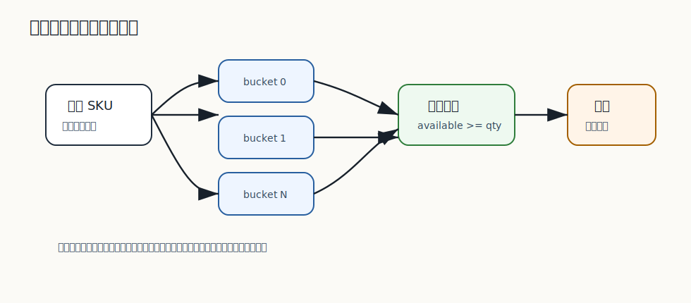

# 268 库存桶如何降低热点行竞争？

[返回逐题精讲目录](README.md) | [返回答案手册](../README.md)

完成标记：已完成

深度完善标记：已完成

## 题目

库存桶如何降低热点行竞争？

## 先给面试官的短答案

库存桶是把一个 SKU 的库存拆成多个子库存记录，请求按随机或哈希方式落到不同桶上扣减。
这样同一 SKU 的高并发写不再集中竞争一行，而是分散到多行，降低行锁等待。

库存桶提升并发，但会增加库存汇总、补桶和一致性处理复杂度。

## 基本设计

例如 SKU 总库存 1000，拆成 10 个桶：

```text
sku_id = 100, bucket = 0, stock = 100
sku_id = 100, bucket = 1, stock = 100
...
sku_id = 100, bucket = 9, stock = 100
```

扣减时选择一个桶执行条件更新。

## 优点

优点：

- 降低单行锁竞争。
- 提高并发扣减吞吐。
- 热点压力被分散。
- 可按桶扩展处理。

它适合热点 SKU 高并发扣减。

## 复杂度

复杂点：

- 如何分配初始库存。
- 某个桶扣完后如何换桶。
- 如何计算总可售库存。
- 如何防止总库存超卖。
- 如何做库存回滚和对账。

不能只拆表结构，不设计总量约束。

## 在 eMall 项目中怎么讲？

秒杀 SKU 可以把库存拆成多个库存桶，请求随机选择桶扣减。

如果某个桶扣减失败，可以尝试其他桶，但要限制尝试次数，避免请求在数据库内循环放大。

## 深度增强：库存桶示意图



库存桶的本质是把“一个 SKU 一行库存”的热点写，拆成“一个 SKU 多行子库存”的分散写。
数据库仍然负责每个桶内的条件更新，应用负责选桶、失败换桶、库存汇总和释放补偿。

## 深度增强：表结构和 SQL

库存桶表可以这样建：

```sql
CREATE TABLE sku_inventory_bucket (
    sku_id BIGINT NOT NULL,
    bucket_no INT NOT NULL,
    available INT NOT NULL,
    reserved INT NOT NULL,
    updated_at DATETIME NOT NULL,
    PRIMARY KEY (sku_id, bucket_no)
);
```

扣减某个桶仍然使用条件更新：

```sql
UPDATE sku_inventory_bucket
SET available = available - #{quantity},
    reserved = reserved + #{quantity},
    updated_at = CURRENT_TIMESTAMP
WHERE sku_id = #{skuId}
  AND bucket_no = #{bucketNo}
  AND available >= #{quantity};
```

## 深度增强：Java 17 选桶实现

```java
public final class InventoryBucketSelector {

    private final int bucketCount;

    public InventoryBucketSelector(int bucketCount) {
        if (bucketCount <= 0) {
            throw new IllegalArgumentException("Bucket count must be positive.");
        }
        this.bucketCount = bucketCount;
    }

    public int firstBucket(long skuId, long requestId) {
        return Math.floorMod(Objects.hash(skuId, requestId), bucketCount);
    }

    public int nextBucket(int currentBucket) {
        return (currentBucket + 1) % bucketCount;
    }
}
```

应用层要限制换桶次数，避免一次请求把所有桶都扫一遍：

```java
public ReservationResult reserve(ReserveCommand command) {
    int bucket = selector.firstBucket(command.skuId(), command.requestId());
    for (int attempt = 0; attempt < 3; attempt++) {
        int affectedRows = mapper.reserveBucket(command.skuId(), bucket, command.quantity());
        if (affectedRows == 1) {
            return ReservationResult.success(bucket);
        }
        bucket = selector.nextBucket(bucket);
    }
    return ReservationResult.outOfStock(command.skuId());
}
```

## 深度增强：生产边界

- 桶越多，行锁竞争越低，但库存汇总和释放越复杂。
- 换桶重试要有上限，否则会把数据库压力放大。
- 总可售库存不能只靠缓存，要能通过桶汇总校验。
- 订单取消或支付超时要释放到原桶，避免桶间数据漂移。
- 热点 SKU 可以动态增加桶数，但扩桶需要迁移和校验。

## 深度增强：面试高分表达

```text
库存桶是把一个热点 SKU 的库存拆成多行，让并发请求分散竞争不同的行锁。
每个桶内部仍然用 available >= quantity 的条件更新保证不超卖。
它提升写入吞吐，但代价是库存汇总、释放、补桶和对账更复杂，所以适合秒杀和爆款 SKU，
不应该对所有普通 SKU 默认使用。
```

## 专家级完整回答

```text
库存桶通过把一个 SKU 的库存拆成多条子库存记录，把并发扣减分散到多个行锁上，降低热点行竞争。
它适合秒杀和爆款 SKU，但会增加库存汇总、桶间均衡、回滚和对账复杂度。

设计时要确保所有桶的总扣减不超过总库存，并控制失败后换桶的重试次数。
```

## 回答评分点

高分答案应该覆盖：

- 库存桶把单行热点拆成多行。
- 能降低行锁竞争。
- 适合热点 SKU 扣减。
- 会增加汇总和一致性复杂度。
- 仍要保证总库存不超卖。
## 深度完善：专项验收清单

围绕「库存桶如何降低热点行竞争？」，这道题原本已经有专题深度增强；这里再补一层面向生产和 L6 面试的验收口径。
回答时要把概念、代码、数据、失败路径和指标串起来，证明自己不是只理解单点知识。

### 项目落点

- 先说明它在 eMall 哪个模块或链路中出现，例如交易、库存、支付、搜索、风控、发布或可观测性。
- 再说明它保护的核心目标：正确性、可用性、延迟、成本、安全或协作效率。
- 最后补失败场景：超时、重试、重复请求、状态不一致、热点流量、配置错误或发布回滚。

### 验收证据

- 代码证据：关键类、状态机、唯一约束、事务边界、线程池隔离或配置项。
- 测试证据：单元测试、集成测试、契约测试、压测、故障注入或回归用例。
- 运行证据：指标看板、Trace、结构化日志、告警、Runbook、对账结果或补偿记录。

### 高分收束

面试最后要回到取舍：当前方案为什么足够简单可靠，什么时候需要升级，升级时如何灰度、回滚和验证。
这样回答能体现生产系统判断力，而不是只罗列技术名词。

深度完善标记：专题增强答案已补项目落点、验收证据和取舍收束。
