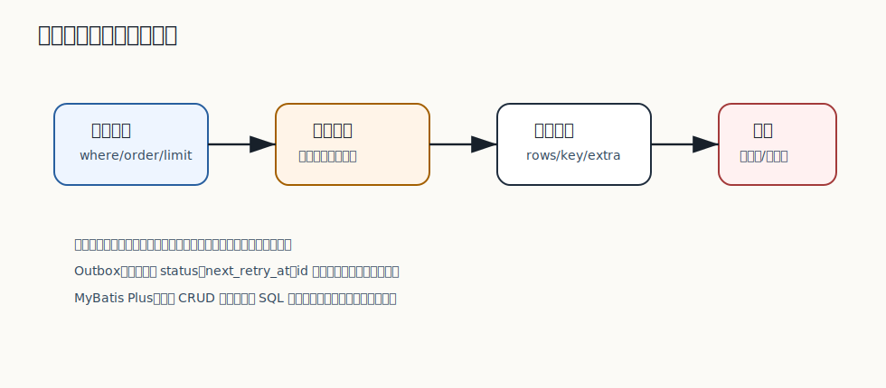
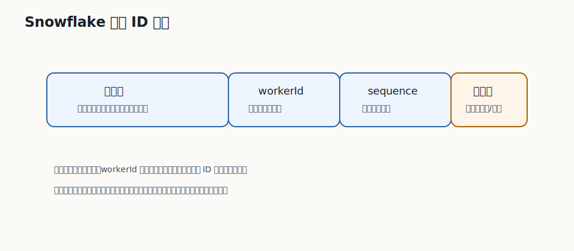

# 312 全局唯一 ID 如何生成？

[返回逐题精讲目录](README.md) | [返回答案手册](../README.md)

完成标记：已完成

## 题目

全局唯一 ID 如何生成？

## 先给面试官的短答案

全局唯一 ID 常见方案有数据库自增、号段模式、UUID、Snowflake、Redis 原子递增和专用发号服务。
大型电商常用 Snowflake 或号段服务，因为它们能在分布式环境下生成趋势递增、可路由、性能较高的 ID。

选择方案要看唯一性、趋势性、性能、可用性、可读性和是否需要携带业务路由。

## 常见方案

方案包括：

- 数据库自增 ID。
- UUID。
- Snowflake。
- 号段模式。
- Redis `INCR`。
- 专用 ID 服务。

每种方案都有成本。

## 选择标准

关注：

- 全局唯一。
- 高并发性能。
- 趋势递增。
- 可排序。
- 可读性。
- 可用性。
- 时钟依赖。
- 是否能包含分片信息。

订单 ID 通常还要考虑按时间排序和分片路由。

## 号段模式

号段模式从数据库批量申请一段 ID。

优点：

- 数据库压力低。
- 本地生成性能高。
- 可控且稳定。

缺点：

- 可能有 ID 空洞。
- 发号服务要高可用。

## 在 eMall 项目中怎么讲？

订单 ID 可以使用 Snowflake 或号段服务生成，保证高并发下全局唯一和趋势递增。

如果订单库分片，还可以在 ID 中加入分片位，提升路由效率。

## 深度增强：数据访问和扩展图


数据库题要从访问路径、索引、锁、事务和容量出发。电商系统的数据层既要支撑高并发读写，
又要保证订单、库存、支付等事实数据可追踪。缓存和消息可以提升性能，但不能替代数据库事实来源。

## 深度增强：Java 17 数据访问策略示例

```java
record QueryPlan(String accessPath, boolean usesIndex, boolean requiresPagination) {

    boolean safeForOnlineTraffic() {
        return usesIndex && requiresPagination;
    }
}

final class OnlineQueryPolicy {

    void verify(QueryPlan plan) {
        if (!plan.safeForOnlineTraffic()) {
            throw new IllegalArgumentException("Online query must use index and pagination");
        }
    }
}
```

这段代码体现线上查询治理：不是 SQL 能跑就可以上线，而是要确认走索引、可分页、可限流、可观测。

## 深度增强：生产边界

核心表设计要从典型查询倒推索引，避免全表扫描、深分页和大事务。分库分表要先选好分片键，
避免跨分片事务和热点分片。任何数据迁移都要支持灰度、校验、回滚或修复。

## 深度增强：面试高分表达

我会从访问模式回答数据题：谁查、按什么条件查、QPS 多少、数据量多大、是否强一致、是否需要分页和排序。
然后再决定索引、分片、缓存、读写分离和归档策略。

## 专家级完整回答

```text
全局唯一 ID 方案包括数据库自增、UUID、Snowflake、Redis INCR、号段模式和发号服务。
大型电商订单通常需要唯一、高性能、趋势递增、可排序，并最好携带分片路由信息。

我会优先考虑 Snowflake 或号段服务，同时处理时钟回拨、机器号分配、服务高可用和 ID 空洞问题。
```

## 回答评分点

高分答案应该覆盖：

- 能列出常见 ID 方案。
- 知道各自取舍。
- 订单 ID 需要高性能和趋势递增。
- Snowflake 和号段常见。
- 要考虑时钟、可用性和分片路由。

## 二次深度补强

题目：全局唯一 ID 如何生成？

二次补强标记：已完成

### 面试官真正想确认的能力

数据库题要从表结构、索引、事务、锁、分片和数据修复一起回答。
围绕这道题，要进一步把概念、项目实现、线上风险和验证闭环连起来。

### 深度和广度补充

- 先说明访问模式：按什么字段查询、更新频率多高、是否有热点。
- 再设计主键、唯一键、二级索引、状态字段和版本字段。
- 随后说明事务隔离、行锁、乐观锁、库存扣减和失败回滚。
- 最后说明分库分表、归档、对账和慢 SQL 治理。

### 图片讲解



- 图中把查询条件、索引顺序、回表和写入成本放在一起。
- 读图时要说明索引不是越多越好，写多读多的系统取舍不同。
- 库存和订单场景还要说明热点行、扣减条件和幂等请求。

### Java17 库存扣减边界示例

```java
public record DeductInventoryCommand(long skuId, long requestId, int quantity) {

    public DeductInventoryCommand {
        if (skuId <= 0 || requestId <= 0 || quantity <= 0) {
            throw new IllegalArgumentException("Inventory command is invalid.");
        }
    }
}

final class InventorySql {

    String conditionalDeductSql() {
        return """
                update sku_inventory
                   set available = available - ?,
                       version = version + 1
                 where sku_id = ?
                   and available >= ?
                """;
    }
}
```

### 高分表达要点

- 不要只回答定义，要说明为什么这样设计、在什么条件下失效、如何监控和回滚。
- 把答案和当前电商项目联系起来，例如订单、库存、支付、履约、搜索、风控或发布链路。
- 主动给出边界条件和反例，能让面试官看到你具备生产系统判断力。

## 逐题专项补强

逐题专项补强标记：已完成

### 本题专项切入

- 本题要围绕「全局唯一 ID 如何生成？」展开，不要只复述分类模板。
- 先说明访问模式、表结构、索引、事务隔离和锁冲突。
- 再补充分片、归档、对账、慢 SQL 和数据修复策略。

### 专项图解说明



- 这张图用于把「全局唯一 ID 如何生成？」放回生产链路中理解，重点看入口、状态、数据和恢复闭环。
- 面试时可以先按图说明主路径，再补失败路径、监控指标和回滚手段。

### 贴合本题的实现示例

```java
public record ArchitectureDecision(String goal, String option, String risk) {

    String explain() {
        return goal + " -> choose " + option + ", risk=" + risk;
    }
}
```

### 进一步追问时的回答边界

- 如果面试官继续追问，要主动说明这个实现是核心模型，不等于完整生产组件。
- 生产级落地还需要接入鉴权、幂等、限流、熔断、监控、告警、灰度和数据修复。
- 回答时把复杂度、失败场景、验证方式和 eMall 项目中的落地位置一起说清楚。

## 面试实战补强

面试实战补强标记：已完成

### 面试追问路线

- 这个查询或更新在高并发下会不会造成热点行、锁等待或慢 SQL？
- 索引顺序为什么这样设计，是否会影响写入吞吐和回表成本？
- 分库分表、归档、扩容和数据修复时，如何保护线上交易链路？

### eMall 项目落点

- 可以落到模块：inventory、order、payment、data-warehouse。
- 回答「全局唯一 ID 如何生成？」时，要从这些模块里选一个主链路做例子。
- 讲清入口、状态变化、数据写入、异步事件、失败补偿和观测指标。

### 生产验证指标

- 慢 SQL 数
- 锁等待时间
- 索引命中率
- 分片热点倾斜度

### 低分陷阱

- 只背定义，不说明业务场景和失败场景。
- 只讲正常路径，不讲超时、重试、回滚、补偿和监控。
- 只给方案，不给验证指标和取舍边界。

### 30 秒高分收束

这道题我会用 数据库、库存、分片、SQL 的视角回答。
先给结论，再给项目例子，然后补失败场景、验证指标和取舍边界。
这样能让面试官看到我不是只会背知识点，而是能把知识点落到生产系统。

## 架构取舍与反驳补强

架构取舍补强标记：已完成

### 先给立场

- 回答「全局唯一 ID 如何生成？」时，不能只给单一方案，要先说明约束、目标和失败边界。
- 高分回答要让面试官看到你能在正确性、可用性、成本、复杂度和团队能力之间做判断。

### 可选方案对比

- 简单方案：上线快、成本低，但容量和故障边界有限。
- 平台化方案：复用强、治理强，但建设成本和组织协调更高。
- 外部托管方案：交付快，但可控性、成本和供应商风险需要评估。

### 反驳和防守

- 如果面试官问为什么不直接上最复杂方案，可以回答：复杂方案只有在规模和风险证明必要时才值得引入。
- 如果面试官问为什么不用最简单方案，可以回答：简单方案可以做第一期，但必须提前设计观测和迁移边界。
- 我的判断原则是：如果约束不明确，先补齐规模、延迟、可用性、一致性、成本和团队能力，再做选择。

### 决策证据

- 业务指标
- 稳定性指标
- 成本指标
- 灰度和回滚记录

### 一句话总结

我会先用简单可靠的方案解决当前确定性问题，同时保留观测、灰度和迁移能力。
当指标证明瓶颈存在，再演进到更复杂的架构，而不是为了显得高级提前复杂化。

## 生产落地验收补强

生产验收补强标记：已完成

### 上线前检查

- 针对「全局唯一 ID 如何生成？」，先确认它影响的是正确性、稳定性、性能、安全还是成本。
- 确认需求边界、容量目标、失败场景、回滚路径和责任人。
- 上线前至少完成灰度计划、监控看板、告警规则和复盘模板。

### 灰度和回滚

- 先在测试环境和影子流量中验证，再做 1%、5%、25%、50%、100% 分阶段灰度。
- 每个阶段都设置自动暂停条件和人工回滚负责人。
- 回滚不是只回代码，还要确认配置、数据、缓存、消息和任务状态能一起回到安全状态。

### 监控和验收证据

- 测试报告
- 灰度看板
- 告警规则
- 回滚记录

### 面试表达

我不会只说方案能实现，还会说明上线前怎么验收、上线中怎么看指标、出问题怎么回滚。
这能证明我关注的是长期稳定运行，而不是只完成一次功能开发。

## 规模化与成本治理补强

规模成本补强标记：已完成

### 规模化视角

- 回答「全局唯一 ID 如何生成？」时，要主动放到 10 亿用户、1 亿 DAU、100W 峰值并发的背景下思考。
- 先按用户量、DAU、峰值并发、数据量和依赖容量建立估算模型。
- 再根据瓶颈决定拆分、异步化、缓存、分片、限流或降级。

### 成本治理

- 用单位成本看问题，例如单请求成本、单订单成本、单消息成本和单 GB 存储成本。
- 先优化浪费最高的环节，而不是平均用力。

### 自动化和 owner

- 为关键指标建立看板、告警、owner 和 Runbook。
- 把经验沉淀成自动化检查、流水线门禁或平台能力。

### 面试表达

我会补一句：方案能跑只是第一步，大规模下还要回答容量怎么估、成本怎么控、故障谁负责。
这能体现我不是只会实现单点功能，而是能长期运营一个高并发业务系统。

