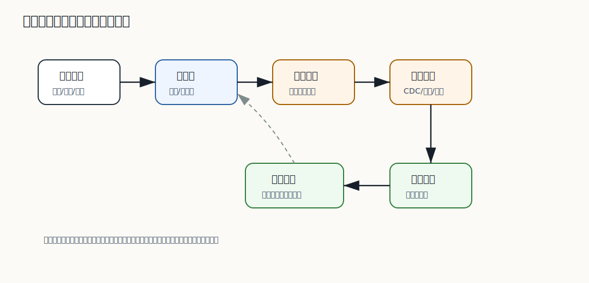

# 318 数据库扩容如何做？

[返回逐题精讲目录](README.md) | [返回答案手册](../README.md)

完成标记：已完成

深度完善标记：已完成

## 题目

数据库扩容如何做？

## 先给面试官的短答案

数据库扩容要先明确瓶颈，再选择垂直扩容、读写分离、分库分表、归档、缓存或迁移到新集群。
生产扩容要做数据迁移、双写或增量同步、校验、灰度切流、回滚和监控。

扩容不是简单加机器，尤其是有状态数据库。

## 扩容方式

方式包括：

- 升级机器配置。
- 增加只读副本。
- 分库分表。
- 数据归档。
- 缓存热点读。
- 拆分业务库。
- 新老集群迁移。

先选择成本最低且风险可控的方式。

## 迁移流程

典型流程：

- 全量数据迁移。
- 增量变更同步。
- 数据校验。
- 灰度读流量。
- 灰度写流量或双写。
- 切换主流量。
- 保留回滚窗口。

切流不能一刀切。

## 风险点

风险包括：

- 数据不一致。
- 主从延迟。
- 双写失败。
- 路由错误。
- 回滚困难。
- 扩容期间性能下降。

所以扩容要演练。

## 在 eMall 项目中怎么讲？

订单库容量接近瓶颈时，可以先做历史归档和读写分离。

如果写入仍无法承载，再按分片键分库分表，并通过全量加增量同步和灰度路由迁移。

## 深度增强：扩容迁移图



数据库扩容最重要的是风险控制。对有状态核心库来说，真正难点不是“建一个新库”，
而是怎么迁移数据、同步增量、校验一致、灰度切流和保留回滚窗口。

## 深度增强：迁移任务模型

```java
public enum MigrationPhase {
    FULL_COPY,
    INCREMENTAL_SYNC,
    CHECKSUM_VERIFY,
    GRAY_READ,
    GRAY_WRITE,
    CUTOVER,
    ROLLBACK_WINDOW
}

public record MigrationTask(
        String taskId,
        String sourceCluster,
        String targetCluster,
        MigrationPhase phase,
        Instant startedAt,
        Instant updatedAt) {
}
```

迁移校验不能只看行数，还要抽样或分段 checksum：

```java
public record ChecksumRange(long startId, long endId, String sourceHash, String targetHash) {
}

public interface MigrationVerifier {

    List<ChecksumRange> verify(String tableName, long startId, long endId, long rangeSize);
}
```

## 深度增强：生产扩容步骤

1. 先定位瓶颈：CPU、IO、连接数、慢 SQL、锁等待、容量还是主从延迟。
2. 优先低风险方案：索引优化、归档、读写分离、缓存热点读。
3. 必须迁移时：全量复制历史数据。
4. 用 CDC、binlog 或双写同步增量。
5. 做行数、checksum 和业务抽样校验。
6. 灰度读流量，再灰度写流量。
7. 切主流量，并保留回滚窗口。

## 深度增强：面试高分表达

```text
我不会把数据库扩容理解成直接加分片。先定位瓶颈，再选成本最低的方案。
如果必须迁移核心库，我会采用全量复制、增量同步、校验、灰度切流和回滚窗口。
扩容期间重点监控数据差异、主从延迟、写入失败、慢 SQL、业务成功率和回滚能力。
```

## 专家级完整回答

```text
数据库扩容要先定位瓶颈，再选择垂直扩容、只读副本、归档、缓存、业务拆库或分库分表。
有状态扩容需要全量迁移、增量同步、校验、灰度切流、回滚窗口和监控。

我不会直接一刀切迁移核心库，而是分阶段验证数据一致性和业务指标。
```

## 回答评分点

高分答案应该覆盖：

- 先定位瓶颈。
- 扩容方式不止分库分表。
- 数据迁移要全量加增量。
- 灰度切流和回滚很重要。
- 核心库扩容要演练。
## 深度完善：专项验收清单

围绕「数据库扩容如何做？」，这道题原本已经有专题深度增强；这里再补一层面向生产和 L6 面试的验收口径。
回答时要把概念、代码、数据、失败路径和指标串起来，证明自己不是只理解单点知识。

### 项目落点

- 先说明它在 eMall 哪个模块或链路中出现，例如交易、库存、支付、搜索、风控、发布或可观测性。
- 再说明它保护的核心目标：正确性、可用性、延迟、成本、安全或协作效率。
- 最后补失败场景：超时、重试、重复请求、状态不一致、热点流量、配置错误或发布回滚。

### 验收证据

- 代码证据：关键类、状态机、唯一约束、事务边界、线程池隔离或配置项。
- 测试证据：单元测试、集成测试、契约测试、压测、故障注入或回归用例。
- 运行证据：指标看板、Trace、结构化日志、告警、Runbook、对账结果或补偿记录。

### 高分收束

面试最后要回到取舍：当前方案为什么足够简单可靠，什么时候需要升级，升级时如何灰度、回滚和验证。
这样回答能体现生产系统判断力，而不是只罗列技术名词。

深度完善标记：专题增强答案已补项目落点、验收证据和取舍收束。
