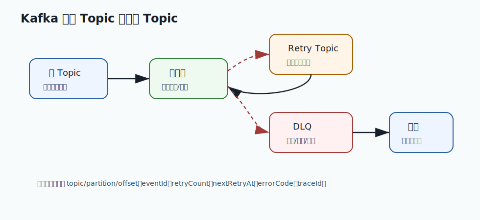

# 382 消息 schema 如何演进？

[返回逐题精讲目录](README.md) | [返回答案手册](../README.md)

完成标记：已完成

## 题目

消息 schema 如何演进？

## 先给面试官的短答案

消息 schema 演进要保证生产者和消费者在发布顺序不一致时仍能兼容。常见原则是只新增可选字段、
不随意删除字段、不改变字段语义、不改变字段类型，并使用版本号和兼容性测试。

消息是跨服务契约，演进必须比普通内部类更谨慎。

## 兼容原则

原则：

- 新增字段设置默认值或允许为空。
- 不改变已有字段含义。
- 不随意改字段类型。
- 删除字段前先确认所有消费者不再使用。
- 使用事件版本。
- 发布前做消费者兼容测试。

兼容性要面向所有消费者。

## 发布策略

安全顺序：

- 先发布能兼容新旧 schema 的消费者。
- 再发布生产者新增字段。
- 观察消费错误。
- 最后清理废弃字段。

不要先让生产者发送消费者无法识别的消息。

## 工具和治理

治理方式：

- 使用 Schema Registry。
- 约定兼容策略。
- 契约测试。
- 消息样例回放测试。
- 字段 owner 和变更评审。
- 反序列化失败告警。

schema 是平台治理的一部分。

## 在 eMall 项目中怎么讲？

eMall 订单事件从 v1 增加 `couponAmount` 字段时，应先让库存、履约、搜索消费者能忽略或读取该字段，
再由订单服务开始发送。

不能直接把 `totalAmount` 的含义从应付金额改成原价，否则旧消费者会产生业务错误。

## 深度增强：缓存和消息治理图


缓存和消息题要关注一致性、削峰、延迟、积压和恢复。
Redis 很快，但会遇到穿透、击穿、雪崩、热点 key 和内存淘汰；
MQ 能解耦和削峰，但会带来重复消费、乱序、积压和死信处理。

## 深度增强：Java 17 幂等消费示例

```java
import java.util.Set;
import java.util.concurrent.ConcurrentHashMap;

final class LocalIdempotentConsumer {
    private final Set<String> processedKeys = ConcurrentHashMap.newKeySet();

    boolean tryHandle(String messageKey, Runnable handler) {
        if (!processedKeys.add(messageKey)) {
            return false;
        }
        handler.run();
        return true;
    }
}
```

这个示例只适合解释幂等思想。生产环境不能用本地内存做全局幂等，要使用数据库唯一键、Redis 原子操作或业务状态机。

## 深度增强：生产边界

缓存要有 TTL、容量、降级和回源保护；消息要有重试、死信、延迟队列、消费幂等和积压告警。
缓存不一致要能修复，消息失败要能回放，不能只依赖人工查日志。

## 深度增强：面试高分表达

我会把缓存和消息都看成性能与稳定性工具，而不是正确性事实来源。
正确性由数据库事实、状态机、幂等和对账保证；缓存和 MQ 负责降低延迟、削峰填谷和解耦系统。

## 专家级完整回答

```text
消息 schema 演进要保证生产者和消费者独立发布时仍兼容。安全做法是新增可选字段，不改变已有字段
语义和类型，删除字段前先灰度并确认所有消费者不再依赖。

生产中应使用版本号、Schema Registry、契约测试和回放测试。消息是跨团队契约，不能像内部 DTO
一样随意修改。
```

## 回答评分点

高分答案应该覆盖：

- schema 是跨服务契约。
- 新增可选字段更安全。
- 不改变字段语义和类型。
- 发布顺序要先消费者后生产者。
- 需要契约测试和治理。

## 二次深度补强

题目：消息 schema 如何演进？

二次补强标记：已完成

### 面试官真正想确认的能力

缓存和消息题要覆盖数据新鲜度、乱序、重复、回放和降级读取。
围绕这道题，要进一步把概念、项目实现、线上风险和验证闭环连起来。

### 深度和广度补充

- 先说明主数据在哪里，缓存、搜索和读模型都不是事实源。
- 再说明写入后如何投递事件、如何更新读模型、如何处理版本。
- 随后补齐缓存穿透、击穿、雪崩、消息积压和索引延迟。
- 最后说明降级策略：读旧值、隐藏入口、异步修复或人工重建。

### 图片讲解


- 图中体现数据库、缓存、消息队列、搜索索引和读模型之间的数据流。
- 读图时要特别关注版本号，因为它决定乱序事件能否安全丢弃。
- 高分回答要说明用户看到旧数据时，系统如何最终修复。

### Java17 读模型版本保护示例

```java
public record VersionedEvent(long aggregateId, long version, String payload) {
}

public record ProjectionState(long aggregateId, long version, String view) {
}

final class ReadModelProjector {

    ProjectionState apply(ProjectionState current, VersionedEvent event) {
        if (event.version() <= current.version()) {
            return current;
        }
        return new ProjectionState(event.aggregateId(), event.version(), event.payload());
    }
}
```

### 高分表达要点

- 不要只回答定义，要说明为什么这样设计、在什么条件下失效、如何监控和回滚。
- 把答案和当前电商项目联系起来，例如订单、库存、支付、履约、搜索、风控或发布链路。
- 主动给出边界条件和反例，能让面试官看到你具备生产系统判断力。

## 逐题专项补强

逐题专项补强标记：已完成

### 本题专项切入

- 本题要围绕「消息 schema 如何演进？」展开，不要只复述分类模板。
- 先明确事实源在数据库，缓存、消息和搜索都是派生读模型。
- 重点说明版本号、TTL、回放、重建、降级和最终一致。

### 专项图解说明



- 这张图用于把「消息 schema 如何演进？」放回生产链路中理解，重点看入口、状态、数据和恢复闭环。
- 面试时可以先按图说明主路径，再补失败路径、监控指标和回滚手段。

### 贴合本题的实现示例

```java
import java.util.Set;
import java.util.concurrent.ConcurrentHashMap;

final class MessageDeduplicator {
    private final Set<String> consumed = ConcurrentHashMap.newKeySet();

    boolean shouldConsume(String messageId) {
        return consumed.add(messageId);
    }
}
```

### 进一步追问时的回答边界

- 如果面试官继续追问，要主动说明这个实现是核心模型，不等于完整生产组件。
- 生产级落地还需要接入鉴权、幂等、限流、熔断、监控、告警、灰度和数据修复。
- 回答时把复杂度、失败场景、验证方式和 eMall 项目中的落地位置一起说清楚。

## 面试实战补强

面试实战补强标记：已完成

### 面试追问路线

- 缓存、搜索索引、读模型和数据库之间出现不一致时，用户会看到什么？
- 如何处理缓存击穿、消息积压、索引延迟、事件回放和版本乱序？
- 降级时是读旧值、隐藏入口、走数据库，还是返回兜底结果？

### eMall 项目落点

- 可以落到模块：event-platform、order、payment、fulfillment。
- 回答「消息 schema 如何演进？」时，要从这些模块里选一个主链路做例子。
- 讲清入口、状态变化、数据写入、异步事件、失败补偿和观测指标。

### 生产验证指标

- 消费滞后量
- 重复消费拦截数
- 死信数量
- 端到端投递时延

### 低分陷阱

- 只背定义，不说明业务场景和失败场景。
- 只讲正常路径，不讲超时、重试、回滚、补偿和监控。
- 只给方案，不给验证指标和取舍边界。

### 30 秒高分收束

这道题我会用 Redis、Kafka、搜索读模型 的视角回答。
先给结论，再给项目例子，然后补失败场景、验证指标和取舍边界。
这样能让面试官看到我不是只会背知识点，而是能把知识点落到生产系统。

## 架构取舍与反驳补强

架构取舍补强标记：已完成

### 先给立场

- 回答「消息 schema 如何演进？」时，不能只给单一方案，要先说明约束、目标和失败边界。
- 高分回答要让面试官看到你能在正确性、可用性、成本、复杂度和团队能力之间做判断。

### 可选方案对比

- 本地事务加 Outbox：可靠性高，延迟和存储成本会增加。
- 直接发 MQ：实现简单，但本地事务和消息发送之间存在不一致窗口。
- TCC 或 Saga：业务可控性强，但侵入性和状态管理复杂度更高。

### 反驳和防守

- 如果面试官问为什么不直接上最复杂方案，可以回答：复杂方案只有在规模和风险证明必要时才值得引入。
- 如果面试官问为什么不用最简单方案，可以回答：简单方案可以做第一期，但必须提前设计观测和迁移边界。
- 我的判断原则是：如果约束不明确，先补齐规模、延迟、可用性、一致性、成本和团队能力，再做选择。

### 决策证据

- 状态机和幂等记录
- 对账差异趋势
- 补偿任务成功率
- 核心链路错误率

### 一句话总结

我会先用简单可靠的方案解决当前确定性问题，同时保留观测、灰度和迁移能力。
当指标证明瓶颈存在，再演进到更复杂的架构，而不是为了显得高级提前复杂化。

## 生产落地验收补强

生产验收补强标记：已完成

### 上线前检查

- 针对「消息 schema 如何演进？」，先确认它影响的是正确性、稳定性、性能、安全还是成本。
- 确认消息唯一键、消费幂等、死信处理、补偿任务和重放脚本。
- 验收必须覆盖重复、乱序、积压、消费失败和人工重放。

### 灰度和回滚

- 先在测试环境和影子流量中验证，再做 1%、5%、25%、50%、100% 分阶段灰度。
- 每个阶段都设置自动暂停条件和人工回滚负责人。
- 回滚不是只回代码，还要确认配置、数据、缓存、消息和任务状态能一起回到安全状态。

### 监控和验收证据

- 幂等测试通过
- 补偿任务可重复执行
- 对账差异可解释
- 灰度期间核心链路无新增错误

### 面试表达

我不会只说方案能实现，还会说明上线前怎么验收、上线中怎么看指标、出问题怎么回滚。
这能证明我关注的是长期稳定运行，而不是只完成一次功能开发。

## 规模化与成本治理补强

规模成本补强标记：已完成

### 规模化视角

- 回答「消息 schema 如何演进？」时，要主动放到 10 亿用户、1 亿 DAU、100W 峰值并发的背景下思考。
- 按写入 TPS、消息大小、保留周期、消费并发和重放速度估算集群容量。
- 异步链路必须能在积压后追平，否则削峰会变成延迟债务。

### 成本治理

- 控制消息大小、保留周期、重试次数、死信堆积和跨机房复制成本。
- 对低价值事件做采样、合并或降级，而不是全部永久保存。

### 自动化和 owner

- 补偿、对账、死信重放和幂等校验都要任务化、可观测、可重复执行。
- 人工介入只能兜底，不能成为常态运维手段。

### 面试表达

我会补一句：方案能跑只是第一步，大规模下还要回答容量怎么估、成本怎么控、故障谁负责。
这能体现我不是只会实现单点功能，而是能长期运营一个高并发业务系统。

