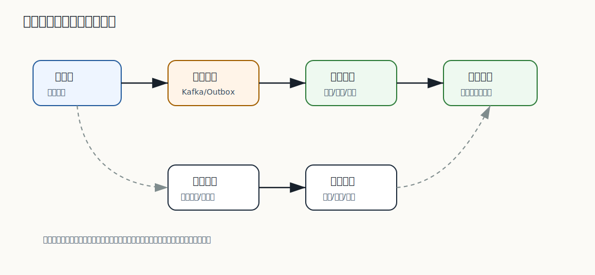

# 393 搜索索引和商品库不一致怎么办？

[返回逐题精讲目录](README.md) | [返回答案手册](../README.md)

完成标记：已完成

深度完善标记：已完成

## 题目

搜索索引和商品库不一致怎么办？

## 先给面试官的短答案

搜索索引和商品库不一致是最终一致读模型的常见问题。处理思路是先明确商品库是事实来源，然后用
事件重试、死信回放、定时对账、单文档重建和全量重建修复索引。

交易正确性不能依赖搜索索引。

## 不一致类型

类型：

- 商品库已更新，索引未更新。
- 商品库已下架，索引仍可搜。
- 索引文档字段缺失。
- 价格或库存展示滞后。
- 索引中存在脏文档。

不同字段的不一致影响不同。

## 处理方式

方式：

- 消费失败重试。
- 死信修复后回放。
- 按商品 ID 单独重建。
- 定时抽样对账。
- 增量事件加全量校准。
- 查询详情页时回源校验。

核心是可发现、可修复、可重建。

## 用户侧保护

保护：

- 搜索结果只做导流。
- 商品详情页校验上下架。
- 下单校验价格和库存。
- 高风险字段不完全信任索引。

这样索引短暂不一致不会变成交易错误。

## 在 eMall 项目中怎么讲？

eMall 搜索结果中如果出现已下架商品，商品详情服务应返回已下架，并触发单商品索引修复。

同时搜索同步任务记录死信和 lag，定时对比商品库 `updated_at` 与索引 `version`，发现落后后重建。

## 深度增强：搜索读模型图



搜索索引必须被当成可重建读模型，而不是事实来源。商品上下架、价格和库存这类影响交易正确性的字段，
在详情页和下单链路必须回源校验。

## 深度增强：版本化索引文档

```java
public record ProductSearchDocument(
        long skuId,
        String title,
        String brand,
        String category,
        boolean onShelf,
        long sourceVersion,
        Instant sourceUpdatedAt) {
}
```

同步事件要带版本，避免旧事件覆盖新索引：

```java
public final class ProductIndexUpdater {

    private final ProductRepository productRepository;
    private final SearchIndexGateway searchIndexGateway;

    public void update(ProductChangedEvent event) {
        Product product = productRepository.findBySkuId(event.skuId());
        ProductSearchDocument current = searchIndexGateway.get(event.skuId());
        if (current != null && current.sourceVersion() >= product.version()) {
            return;
        }
        searchIndexGateway.upsert(ProductSearchDocumentFactory.from(product));
    }
}
```

## 深度增强：修复路径

- 单商品修复：详情页发现索引异常时，触发单 SKU 重建。
- 死信回放：修复 schema 或数据后回放失败事件。
- 定时对账：比较商品库 `updated_at/version` 和索引文档版本。
- 全量重建：mapping 变更或大面积不一致时重建新索引。

## 深度增强：面试高分表达

```text
搜索索引和商品库不一致是最终一致读模型的正常风险。我的设计是商品库为事实来源，
索引同步用事件重试、死信和版本号保护，定时对账发现落后文档，支持单文档修复和全量重建。
同时，详情页和下单链路必须回源校验，不能因为搜索索引错了就卖下架商品。
```

## 专家级完整回答

```text
搜索索引是读模型，商品库是事实来源。不一致时要通过事件重试、死信回放、单文档重建、定时对账
和全量重建来修复。

系统设计上要允许短暂不一致，但不能让它影响交易正确性。详情页和下单链路必须回到商品、价格和
库存服务做最终校验。
```

## 回答评分点

高分答案应该覆盖：

- 商品库是事实来源。
- 搜索索引是最终一致读模型。
- 重试、死信、对账和重建。
- 详情和下单要回源校验。
- 不一致要可观测。
## 深度完善：专项验收清单

围绕「搜索索引和商品库不一致怎么办？」，这道题原本已经有专题深度增强；这里再补一层面向生产和 L6 面试的验收口径。
回答时要把概念、代码、数据、失败路径和指标串起来，证明自己不是只理解单点知识。

### 项目落点

- 先说明它在 eMall 哪个模块或链路中出现，例如交易、库存、支付、搜索、风控、发布或可观测性。
- 再说明它保护的核心目标：正确性、可用性、延迟、成本、安全或协作效率。
- 最后补失败场景：超时、重试、重复请求、状态不一致、热点流量、配置错误或发布回滚。

### 验收证据

- 代码证据：关键类、状态机、唯一约束、事务边界、线程池隔离或配置项。
- 测试证据：单元测试、集成测试、契约测试、压测、故障注入或回归用例。
- 运行证据：指标看板、Trace、结构化日志、告警、Runbook、对账结果或补偿记录。

### 高分收束

面试最后要回到取舍：当前方案为什么足够简单可靠，什么时候需要升级，升级时如何灰度、回滚和验证。
这样回答能体现生产系统判断力，而不是只罗列技术名词。

深度完善标记：专题增强答案已补项目落点、验收证据和取舍收束。
