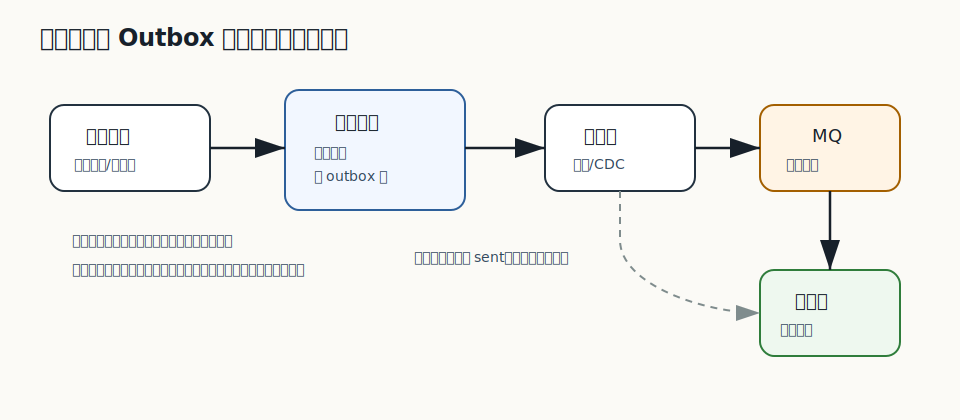

# 496 如何测试补偿任务？

[返回逐题精讲目录](README.md) | [返回答案手册](../README.md)

完成标记：已完成

## 题目

如何测试补偿任务？

## 先给面试官的短答案

测试补偿任务要验证它能发现不一致状态、按规则修复、可幂等重复执行、支持限速和重试，并且不会误修正常数据。
要覆盖部分失败、超时订单、支付成功但订单未更新、库存预占未释放、消息发送失败和补偿任务自身失败。

## 补偿任务的目标

补偿任务不是简单定时脚本，而是生产系统的自愈机制。它负责处理主链路中因为超时、网络、消息失败或第三方延迟造成的
不一致状态。

测试时要证明两点：该修的能修，不该修的不会修。

## 关键测试场景

发现能力：构造异常数据，例如支付单成功但订单仍待支付，补偿任务能扫描出来。

修复能力：任务执行后，订单状态、支付状态、库存状态或消息状态恢复到正确状态。

幂等能力：同一个补偿任务重复执行多次，不会重复退款、重复释放库存或重复发送消息。

失败重试：补偿过程中下游失败时，任务能记录失败原因并下次继续处理。

限速隔离：大量异常数据存在时，任务不会打爆数据库、消息队列或第三方接口。

误伤保护：正常订单、人工锁定订单、已进入争议流程的订单不能被自动补偿错误修改。

## 断言方式

补偿任务测试要断言扫描条件、状态变更、重试次数、处理日志、告警事件和业务副作用。
如果任务支持 dry run，也应测试 dry run 只输出计划，不修改数据。

## 在 eMall 项目中怎么讲？

eMall 可以测试订单超时关闭、支付成功补单、库存预占释放、Outbox 重发和退款状态同步。补偿任务应有幂等键和处理记录，
避免人工重复触发或定时任务重入造成二次损害。

## 深度增强：现场编码工程化图


现场编码题不只是写出算法，还要说明输入输出、边界条件、复杂度、线程安全和可测试性。
面试官通常更看重思考过程、代码结构和验证意识，而不是只看最终代码。

## 深度增强：Java 17 编码模板示例

```java
import java.util.LinkedHashMap;
import java.util.Map;

final class LruCache<K, V> extends LinkedHashMap<K, V> {
    private final int capacity;

    LruCache(int capacity) {
        super(capacity, 0.75f, true);
        this.capacity = capacity;
    }

    @Override
    protected boolean removeEldestEntry(Map.Entry<K, V> eldest) {
        return size() > capacity;
    }
}
```

这段代码展示现场编码的表达方式：先选合适数据结构，再说明复杂度和边界。
若用于生产，还要考虑并发、监控、容量和淘汰策略。

## 深度增强：生产边界

面试中的简化实现通常不是生产实现。生产需要线程安全、容量限制、指标、异常处理、单元测试和压测验证。
如果题目涉及分布式场景，还要说明单机实现和多实例实现的差异。

## 深度增强：面试高分表达

我会先澄清需求和边界，再写最小正确实现，最后补充复杂度、测试用例和生产化改造。
这样即使代码题不复杂，也能体现工程成熟度。

## 专家级完整回答

```text
补偿任务测试要验证系统是否具备自愈能力。

我会构造主链路中常见的不一致状态，例如支付成功但订单未更新、库存预占未释放、Outbox 消息未发送。
然后运行补偿任务，断言它能发现异常、正确修复、记录处理结果，并且重复执行不会产生新的副作用。

同时要测试误伤保护和限速。补偿任务如果扫描条件过宽或没有限速，可能比原始故障造成更大事故。
```

## 回答评分点

高分答案应该覆盖：

- 说明补偿任务是自愈机制。
- 覆盖发现、修复、幂等、失败重试、限速和误伤保护。
- 能举出支付补单、库存释放、Outbox 重发等场景。
- 知道要断言处理记录和业务副作用。
- 能指出补偿任务本身也可能造成事故。

## 二次深度补强

题目：如何测试补偿任务？

二次补强标记：已完成

### 面试官真正想确认的能力

测试题要覆盖测试分层、可重复性、隔离性、数据构造和质量门禁。
围绕这道题，要进一步把概念、项目实现、线上风险和验证闭环连起来。

### 深度和广度补充

- 先区分单元测试、集成测试、契约测试、端到端测试和压测。
- 再说明哪些逻辑必须自动化，哪些场景不适合放在慢速流水线。
- 随后补齐测试数据、Mock 边界、Testcontainers 和失败诊断。
- 最后说明覆盖率不是目标，能阻止生产事故才是目标。

### 图片讲解


- 图中把代码模式、测试入口、质量检查和发布门禁连接起来。
- 读图时要说明越靠近底层的测试越快，越靠近真实环境的测试越贵。
- 高分回答要能讲清每类测试发现什么风险。

### Java17 JUnit5 测试示例

```java
import static org.junit.jupiter.api.Assertions.assertEquals;

import org.junit.jupiter.api.Test;

final class OrderStateTest {

    @Test
    void shouldRejectInvalidTransition() {
        OrderStateMachine machine = new OrderStateMachine();

        assertEquals("REJECTED", machine.transition("CANCELLED", "PAY"));
    }
}

final class OrderStateMachine {

    String transition(String current, String event) {
        return "CANCELLED".equals(current) && "PAY".equals(event) ? "REJECTED" : "ACCEPTED";
    }
}
```

### 高分表达要点

- 不要只回答定义，要说明为什么这样设计、在什么条件下失效、如何监控和回滚。
- 把答案和当前电商项目联系起来，例如订单、库存、支付、履约、搜索、风控或发布链路。
- 主动给出边界条件和反例，能让面试官看到你具备生产系统判断力。

## 逐题专项补强

逐题专项补强标记：已完成

### 本题专项切入

- 本题要围绕「如何测试补偿任务？」展开，不要只复述分类模板。
- 先说明这个题目对应哪类风险，再选择单元、集成、契约或压测。
- 不要只谈覆盖率，要说明测试能阻止什么生产事故。

### 专项图解说明



- 这张图用于把「如何测试补偿任务？」放回生产链路中理解，重点看入口、状态、数据和恢复闭环。
- 面试时可以先按图说明主路径，再补失败路径、监控指标和回滚手段。

### 贴合本题的实现示例

```java
import java.util.List;

interface OutboxRepository {
    List<OutboxMessage> lockPending(int limit);

    void markSent(long id);
}

record OutboxMessage(long id, String topic, String payload) {
}

final class OutboxRelay {

    void relay(OutboxRepository repository, MessagePublisher publisher) {
        for (OutboxMessage message : repository.lockPending(100)) {
            publisher.publish(message.topic(), message.payload());
            repository.markSent(message.id());
        }
    }
}

interface MessagePublisher {
    void publish(String topic, String payload);
}
```

### 进一步追问时的回答边界

- 如果面试官继续追问，要主动说明这个实现是核心模型，不等于完整生产组件。
- 生产级落地还需要接入鉴权、幂等、限流、熔断、监控、告警、灰度和数据修复。
- 回答时把复杂度、失败场景、验证方式和 eMall 项目中的落地位置一起说清楚。

## 面试实战补强

面试实战补强标记：已完成

### 面试追问路线

- 这道题对应的生产风险，应该由单元测试、集成测试还是契约测试覆盖？
- 测试数据如何构造，如何避免测试只覆盖 happy path？
- 质量门禁失败时，如何快速定位是代码、环境、依赖还是数据问题？

### eMall 项目落点

- 可以落到模块：common、smoke、chaos、loadtest。
- 回答「如何测试补偿任务？」时，要从这些模块里选一个主链路做例子。
- 讲清入口、状态变化、数据写入、异步事件、失败补偿和观测指标。

### 生产验证指标

- 流水线通过率
- 缺陷逃逸率
-  flaky 测试数
- 关键路径覆盖率

### 低分陷阱

- 只背定义，不说明业务场景和失败场景。
- 只讲正常路径，不讲超时、重试、回滚、补偿和监控。
- 只给方案，不给验证指标和取舍边界。

### 30 秒高分收束

这道题我会用 测试、CI、工程质量 的视角回答。
先给结论，再给项目例子，然后补失败场景、验证指标和取舍边界。
这样能让面试官看到我不是只会背知识点，而是能把知识点落到生产系统。

## 架构取舍与反驳补强

架构取舍补强标记：已完成

### 先给立场

- 回答「如何测试补偿任务？」时，不能只给单一方案，要先说明约束、目标和失败边界。
- 高分回答要让面试官看到你能在正确性、可用性、成本、复杂度和团队能力之间做判断。

### 可选方案对比

- 本地事务加 Outbox：可靠性高，延迟和存储成本会增加。
- 直接发 MQ：实现简单，但本地事务和消息发送之间存在不一致窗口。
- TCC 或 Saga：业务可控性强，但侵入性和状态管理复杂度更高。

### 反驳和防守

- 如果面试官问为什么不直接上最复杂方案，可以回答：复杂方案只有在规模和风险证明必要时才值得引入。
- 如果面试官问为什么不用最简单方案，可以回答：简单方案可以做第一期，但必须提前设计观测和迁移边界。
- 我的判断原则是：如果约束不明确，先补齐规模、延迟、可用性、一致性、成本和团队能力，再做选择。

### 决策证据

- 业务指标
- 稳定性指标
- 成本指标
- 灰度和回滚记录

### 一句话总结

我会先用简单可靠的方案解决当前确定性问题，同时保留观测、灰度和迁移能力。
当指标证明瓶颈存在，再演进到更复杂的架构，而不是为了显得高级提前复杂化。

## 生产落地验收补强

生产验收补强标记：已完成

### 上线前检查

- 针对「如何测试补偿任务？」，先确认它影响的是正确性、稳定性、性能、安全还是成本。
- 确认消息唯一键、消费幂等、死信处理、补偿任务和重放脚本。
- 验收必须覆盖重复、乱序、积压、消费失败和人工重放。

### 灰度和回滚

- 先在测试环境和影子流量中验证，再做 1%、5%、25%、50%、100% 分阶段灰度。
- 每个阶段都设置自动暂停条件和人工回滚负责人。
- 回滚不是只回代码，还要确认配置、数据、缓存、消息和任务状态能一起回到安全状态。

### 监控和验收证据

- 测试报告
- 灰度看板
- 告警规则
- 回滚记录

### 面试表达

我不会只说方案能实现，还会说明上线前怎么验收、上线中怎么看指标、出问题怎么回滚。
这能证明我关注的是长期稳定运行，而不是只完成一次功能开发。

## 规模化与成本治理补强

规模成本补强标记：已完成

### 规模化视角

- 回答「如何测试补偿任务？」时，要主动放到 10 亿用户、1 亿 DAU、100W 峰值并发的背景下思考。
- 按写入 TPS、消息大小、保留周期、消费并发和重放速度估算集群容量。
- 异步链路必须能在积压后追平，否则削峰会变成延迟债务。

### 成本治理

- 用单位成本看问题，例如单请求成本、单订单成本、单消息成本和单 GB 存储成本。
- 先优化浪费最高的环节，而不是平均用力。

### 自动化和 owner

- 补偿、对账、死信重放和幂等校验都要任务化、可观测、可重复执行。
- 人工介入只能兜底，不能成为常态运维手段。

### 面试表达

我会补一句：方案能跑只是第一步，大规模下还要回答容量怎么估、成本怎么控、故障谁负责。
这能体现我不是只会实现单点功能，而是能长期运营一个高并发业务系统。

