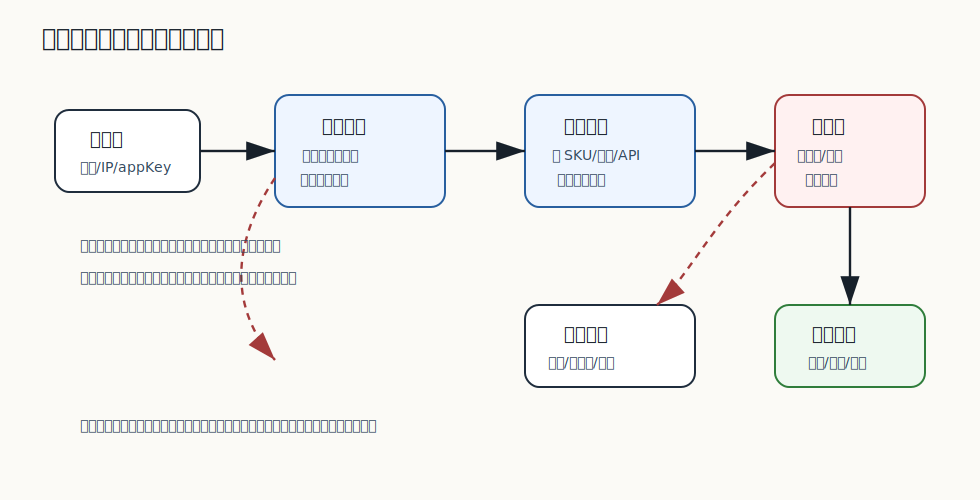

# 497 如何测试限流和熔断？

[返回逐题精讲目录](README.md) | [返回答案手册](../README.md)

完成标记：已完成

## 题目

如何测试限流和熔断？

## 先给面试官的短答案

测试限流要验证超过阈值时请求被拒绝、返回码和错误体符合约定，并且不会把后端打垮。测试熔断要验证下游失败率或慢调用
达到阈值后断路器打开，随后进入半开探测，恢复后平滑关闭，避免瞬间放大全量流量。

## 限流测试

限流测试要覆盖正常流量、超过阈值、突发流量、不同用户或租户隔离、不同接口独立限流和配置变更生效。
断言不只是“返回 429”，还要确认限流指标、日志、错误码、降级文案和后端调用次数。

如果是分布式限流，要用真实 Redis 或网关组件验证原子计数、时间窗口和多实例一致性。

## 熔断测试

熔断测试要模拟下游超时、异常、慢调用和恢复。需要验证关闭、打开、半开三个状态：

- 关闭状态下正常放行。
- 失败率或慢调用比例达到阈值后打开。
- 打开状态下快速失败或降级，不继续压垮下游。
- 半开状态只放少量探测请求。
- 探测成功后逐步恢复，失败则重新打开。

## 在 eMall 项目中怎么讲？

eMall 的网关、商品详情、库存、支付和促销都需要限流熔断测试。比如支付通道超时后，订单服务应该快速失败或进入待确认，
不能让线程池被支付通道拖死；通道恢复后，也不能瞬间把积压请求全部打过去。

## 深度增强：现场编码工程化图


现场编码题不只是写出算法，还要说明输入输出、边界条件、复杂度、线程安全和可测试性。
面试官通常更看重思考过程、代码结构和验证意识，而不是只看最终代码。

## 深度增强：Java 17 编码模板示例

```java
import java.util.LinkedHashMap;
import java.util.Map;

final class LruCache<K, V> extends LinkedHashMap<K, V> {
    private final int capacity;

    LruCache(int capacity) {
        super(capacity, 0.75f, true);
        this.capacity = capacity;
    }

    @Override
    protected boolean removeEldestEntry(Map.Entry<K, V> eldest) {
        return size() > capacity;
    }
}
```

这段代码展示现场编码的表达方式：先选合适数据结构，再说明复杂度和边界。
若用于生产，还要考虑并发、监控、容量和淘汰策略。

## 深度增强：生产边界

面试中的简化实现通常不是生产实现。生产需要线程安全、容量限制、指标、异常处理、单元测试和压测验证。
如果题目涉及分布式场景，还要说明单机实现和多实例实现的差异。

## 深度增强：面试高分表达

我会先澄清需求和边界，再写最小正确实现，最后补充复杂度、测试用例和生产化改造。
这样即使代码题不复杂，也能体现工程成熟度。

## 专家级完整回答

```text
限流测试关注流量是否被挡住，熔断测试关注故障是否被隔离并能平滑恢复。

我会用压测或并发测试制造超过阈值的请求，断言被限流请求、后端调用次数、指标和错误响应。
熔断则要模拟下游失败、慢调用和恢复，验证关闭、打开、半开和重新关闭的状态机。

生产级测试还要验证多实例一致性、配置变更、告警和恢复节奏。否则限流和熔断可能只在单机测试里有效。
```

## 回答评分点

高分答案应该覆盖：

- 区分限流和熔断的测试目标。
- 能覆盖正常、超限、突发、多租户和配置变更。
- 能讲清熔断关闭、打开、半开和恢复。
- 知道要断言指标、日志、后端调用次数和错误响应。
- 能结合支付通道、库存、网关举例。

## 二次深度补强

题目：如何测试限流和熔断？

二次补强标记：已完成

### 面试官真正想确认的能力

测试题要覆盖测试分层、可重复性、隔离性、数据构造和质量门禁。
围绕这道题，要进一步把概念、项目实现、线上风险和验证闭环连起来。

### 深度和广度补充

- 先区分单元测试、集成测试、契约测试、端到端测试和压测。
- 再说明哪些逻辑必须自动化，哪些场景不适合放在慢速流水线。
- 随后补齐测试数据、Mock 边界、Testcontainers 和失败诊断。
- 最后说明覆盖率不是目标，能阻止生产事故才是目标。

### 图片讲解


- 图中把代码模式、测试入口、质量检查和发布门禁连接起来。
- 读图时要说明越靠近底层的测试越快，越靠近真实环境的测试越贵。
- 高分回答要能讲清每类测试发现什么风险。

### Java17 JUnit5 测试示例

```java
import static org.junit.jupiter.api.Assertions.assertEquals;

import org.junit.jupiter.api.Test;

final class OrderStateTest {

    @Test
    void shouldRejectInvalidTransition() {
        OrderStateMachine machine = new OrderStateMachine();

        assertEquals("REJECTED", machine.transition("CANCELLED", "PAY"));
    }
}

final class OrderStateMachine {

    String transition(String current, String event) {
        return "CANCELLED".equals(current) && "PAY".equals(event) ? "REJECTED" : "ACCEPTED";
    }
}
```

### 高分表达要点

- 不要只回答定义，要说明为什么这样设计、在什么条件下失效、如何监控和回滚。
- 把答案和当前电商项目联系起来，例如订单、库存、支付、履约、搜索、风控或发布链路。
- 主动给出边界条件和反例，能让面试官看到你具备生产系统判断力。

## 逐题专项补强

逐题专项补强标记：已完成

### 本题专项切入

- 本题要围绕「如何测试限流和熔断？」展开，不要只复述分类模板。
- 先说明这个题目对应哪类风险，再选择单元、集成、契约或压测。
- 不要只谈覆盖率，要说明测试能阻止什么生产事故。

### 专项图解说明



- 这张图用于把「如何测试限流和熔断？」放回生产链路中理解，重点看入口、状态、数据和恢复闭环。
- 面试时可以先按图说明主路径，再补失败路径、监控指标和回滚手段。

### 贴合本题的实现示例

```java
import java.time.Clock;
import java.util.ArrayDeque;
import java.util.Deque;

final class SlidingWindowRateLimiter {
    private final int limit;
    private final long windowMillis;
    private final Clock clock;
    private final Deque<Long> hits = new ArrayDeque<>();

    SlidingWindowRateLimiter(int limit, long windowMillis, Clock clock) {
        this.limit = limit;
        this.windowMillis = windowMillis;
        this.clock = clock;
    }

    synchronized boolean allow() {
        long now = clock.millis();
        while (!hits.isEmpty() && now - hits.peekFirst() >= windowMillis) {
            hits.removeFirst();
        }
        if (hits.size() >= limit) {
            return false;
        }
        hits.addLast(now);
        return true;
    }
}
```

### 进一步追问时的回答边界

- 如果面试官继续追问，要主动说明这个实现是核心模型，不等于完整生产组件。
- 生产级落地还需要接入鉴权、幂等、限流、熔断、监控、告警、灰度和数据修复。
- 回答时把复杂度、失败场景、验证方式和 eMall 项目中的落地位置一起说清楚。

## 面试实战补强

面试实战补强标记：已完成

### 面试追问路线

- 这道题对应的生产风险，应该由单元测试、集成测试还是契约测试覆盖？
- 测试数据如何构造，如何避免测试只覆盖 happy path？
- 质量门禁失败时，如何快速定位是代码、环境、依赖还是数据问题？

### eMall 项目落点

- 可以落到模块：common、smoke、chaos、loadtest。
- 回答「如何测试限流和熔断？」时，要从这些模块里选一个主链路做例子。
- 讲清入口、状态变化、数据写入、异步事件、失败补偿和观测指标。

### 生产验证指标

- 限流拒绝率
- 熔断打开次数
- 半开恢复成功率
- 核心链路错误率

### 低分陷阱

- 只背定义，不说明业务场景和失败场景。
- 只讲正常路径，不讲超时、重试、回滚、补偿和监控。
- 只给方案，不给验证指标和取舍边界。

### 30 秒高分收束

这道题我会用 测试、CI、工程质量 的视角回答。
先给结论，再给项目例子，然后补失败场景、验证指标和取舍边界。
这样能让面试官看到我不是只会背知识点，而是能把知识点落到生产系统。

## 架构取舍与反驳补强

架构取舍补强标记：已完成

### 先给立场

- 回答「如何测试限流和熔断？」时，不能只给单一方案，要先说明约束、目标和失败边界。
- 高分回答要让面试官看到你能在正确性、可用性、成本、复杂度和团队能力之间做判断。

### 可选方案对比

- 入口限流：保护整体容量，但可能误伤部分真实用户。
- 线程池隔离：保护调用方资源，但需要额外容量规划和拒绝策略。
- 熔断降级：能快速止血，但需要半开探测和平滑恢复避免二次雪崩。

### 反驳和防守

- 如果面试官问为什么不直接上最复杂方案，可以回答：复杂方案只有在规模和风险证明必要时才值得引入。
- 如果面试官问为什么不用最简单方案，可以回答：简单方案可以做第一期，但必须提前设计观测和迁移边界。
- 我的判断原则是：如果影响系统稳定性，优先保护核心链路和整体可用性，而不是追求单次请求成功。

### 决策证据

- P95/P99 延迟
- CPU 和内存水位
- 拒绝率和熔断次数
- 压测容量曲线

### 一句话总结

我会先用简单可靠的方案解决当前确定性问题，同时保留观测、灰度和迁移能力。
当指标证明瓶颈存在，再演进到更复杂的架构，而不是为了显得高级提前复杂化。

## 生产落地验收补强

生产验收补强标记：已完成

### 上线前检查

- 针对「如何测试限流和熔断？」，先确认它影响的是正确性、稳定性、性能、安全还是成本。
- 确认限流阈值、熔断窗口、半开探测、降级文案和白名单策略。
- 灰度期间观察拒绝率、恢复成功率和核心链路错误率。

### 灰度和回滚

- 先在测试环境和影子流量中验证，再做 1%、5%、25%、50%、100% 分阶段灰度。
- 每个阶段都设置自动暂停条件和人工回滚负责人。
- 回滚不是只回代码，还要确认配置、数据、缓存、消息和任务状态能一起回到安全状态。

### 监控和验收证据

- 压测报告
- P99 对比曲线
- 容量水位表
- 降级和恢复演练记录

### 面试表达

我不会只说方案能实现，还会说明上线前怎么验收、上线中怎么看指标、出问题怎么回滚。
这能证明我关注的是长期稳定运行，而不是只完成一次功能开发。

## 规模化与成本治理补强

规模成本补强标记：已完成

### 规模化视角

- 回答「如何测试限流和熔断？」时，要主动放到 10 亿用户、1 亿 DAU、100W 峰值并发的背景下思考。
- 按入口峰值、下游容量、线程池容量和排队长度共同设置保护阈值。
- 容量策略要支持按用户、商家、SKU、接口和机房分层保护。

### 成本治理

- 用单位成本看问题，例如单请求成本、单订单成本、单消息成本和单 GB 存储成本。
- 先优化浪费最高的环节，而不是平均用力。

### 自动化和 owner

- 为关键指标建立看板、告警、owner 和 Runbook。
- 把经验沉淀成自动化检查、流水线门禁或平台能力。

### 面试表达

我会补一句：方案能跑只是第一步，大规模下还要回答容量怎么估、成本怎么控、故障谁负责。
这能体现我不是只会实现单点功能，而是能长期运营一个高并发业务系统。

