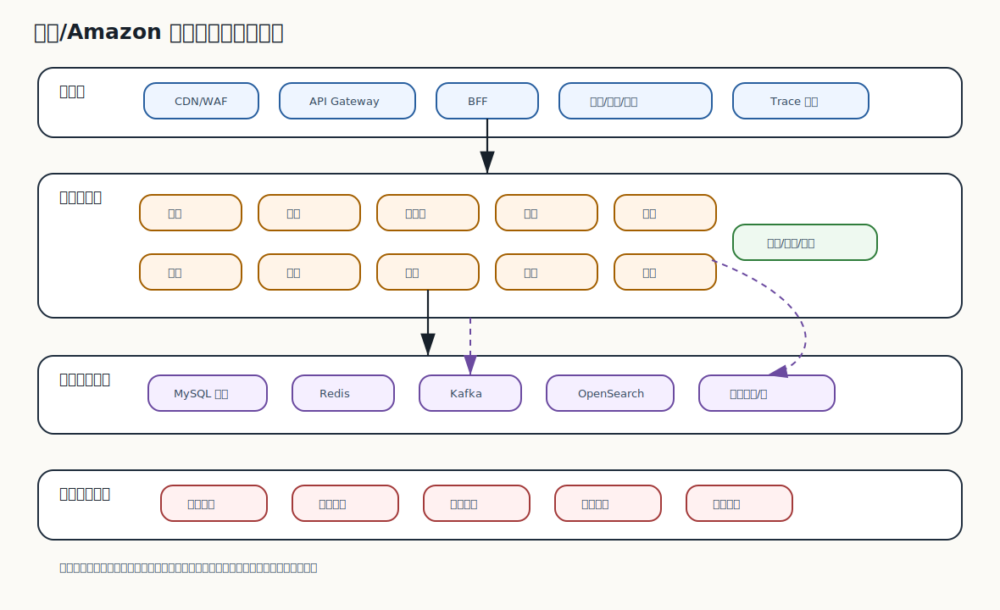
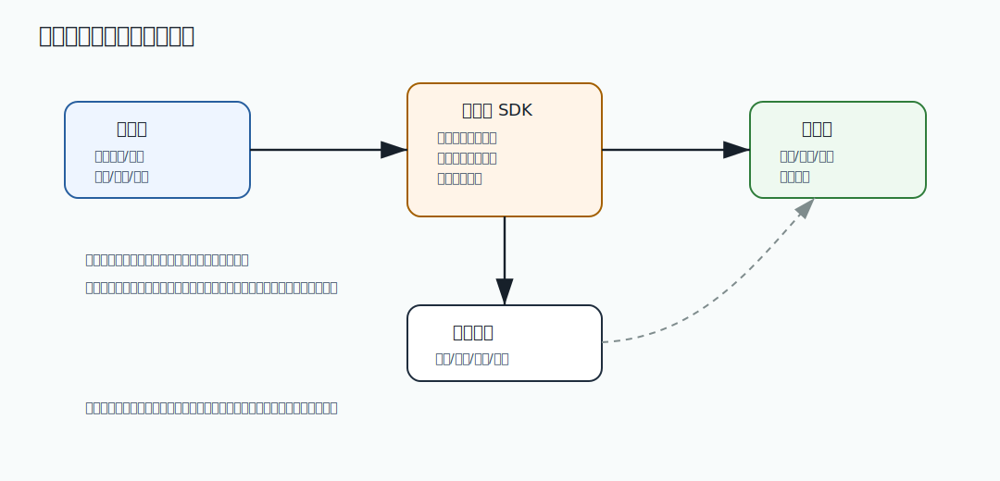

# 543 设计多区域电商系统。

[返回逐题精讲目录](README.md) | [返回答案手册](../README.md)

完成标记：已完成

## 题目

设计多区域电商系统。

## 先给面试官的短答案

这道题要先明确业务目标、容量目标、核心链路、数据模型和故障边界，再给出可演进的架构方案。

## 核心拆解

- 明确 SLO、QPS、峰值并发、数据规模和一致性要求。
- 拆入口、核心服务、数据存储、异步事件和治理平台。
- 说明限流、降级、熔断、容灾、对账和补偿。
- 给出灰度演进、容量扩展和成本治理路径。

## 深度增强：图解



这张图用于把问题放到生产系统中理解。面试时不要只讲单点技术，而要说明它在容量、稳定性、
一致性、可观测性和故障恢复中的位置。

## 深度增强：Java 17 或 SQL 示例

```java
record ArchitectureDecision(String goal, String option, String benefit, String risk) {

    String explain() {
        return goal + " -> choose " + option + ", benefit=" + benefit + ", risk=" + risk;
    }
}
```

## 生产边界和常见坑

这个问题的关键不是“能不能做”，而是能否在高并发、灰度发布、故障恢复和数据修复场景下安全运行。
如果方案缺少监控、限流、幂等、回滚、审计或补偿，就只能算 demo，不能算生产级方案。

## 在 eMall 项目中怎么讲？

可以结合 eMall 的 `gateway`、`order`、`inventory`、`payment`、`risk`、`traffic`、
`reliability`、`release`、`operations` 和 `analytics` 模块说明。核心表达是：
先保护交易主链路，再保证数据可追踪，最后通过观测、补偿和复盘把风险沉淀为平台能力。

## 专家级完整回答

```text
我会先明确这个问题影响的是容量、可用性、一致性、安全还是工程效率。
然后拆解核心链路和失败场景，给出当前规模下最务实的方案。
生产系统里我会同时设计指标、告警、灰度、回滚、审计和补偿，避免方案只在正常路径成立。
如果规模继续增长，我会再从分片、异步化、多区域、自动化治理和成本优化上演进。
```

## 回答评分点

- 能先讲业务目标和生产影响。
- 能拆解核心链路、数据流和失败场景。
- 能给出 Java 17、SQL 或工程实现示例。
- 能说明监控、告警、回滚、补偿和审计。
- 能结合 eMall 项目说明落地方式。

## 二次深度补强

题目：设计多区域电商系统。

二次补强标记：已完成

### 面试官真正想确认的能力

系统设计题要给出目标、边界、架构、数据模型、容量和演进路径。
围绕这道题，要进一步把概念、项目实现、线上风险和验证闭环连起来。

### 深度和广度补充

- 先澄清需求：用户规模、写入量、查询量、延迟、可用性和一致性。
- 再画核心组件：入口、服务、存储、缓存、消息、任务和观测。
- 随后补齐数据模型、分片、幂等、容灾、降级和成本。
- 最后说明第一期怎么落地，后续如何平滑扩展。

### 图片讲解



- 图中展示平台型能力如何服务多个业务线和治理流程。
- 读图时要说明控制面负责配置，数据面负责高吞吐执行。
- 高分回答要能把架构图和容量估算、故障恢复结合。

### Java17 容量规划示例

```java
import java.time.Duration;

public record CapacityPlan(long dailyActiveUsers, long peakQps, Duration p99Target) {

    long instances(long qpsPerInstance) {
        long base = Math.ceilDiv(peakQps, qpsPerInstance);
        return Math.max(2, base + 1);
    }
}
```

### 高分表达要点

- 不要只回答定义，要说明为什么这样设计、在什么条件下失效、如何监控和回滚。
- 把答案和当前电商项目联系起来，例如订单、库存、支付、履约、搜索、风控或发布链路。
- 主动给出边界条件和反例，能让面试官看到你具备生产系统判断力。

## 逐题专项补强

逐题专项补强标记：已完成

### 本题专项切入

- 本题要围绕「设计多区域电商系统。」展开，不要只复述分类模板。
- 先澄清目标和约束，再给出架构、数据流、容量和失败路径。
- 回答要同时覆盖当前实现、扩展路线、成本和风险。

### 专项图解说明


- 这张图用于把「设计多区域电商系统。」放回生产链路中理解，重点看入口、状态、数据和恢复闭环。
- 面试时可以先按图说明主路径，再补失败路径、监控指标和回滚手段。

### 贴合本题的实现示例

```java
public record ArchitectureDecision(String goal, String option, String risk) {

    String explain() {
        return goal + " -> choose " + option + ", risk=" + risk;
    }
}
```

### 进一步追问时的回答边界

- 如果面试官继续追问，要主动说明这个实现是核心模型，不等于完整生产组件。
- 生产级落地还需要接入鉴权、幂等、限流、熔断、监控、告警、灰度和数据修复。
- 回答时把复杂度、失败场景、验证方式和 eMall 项目中的落地位置一起说清楚。

## 面试实战补强

面试实战补强标记：已完成

### 面试追问路线

- 这个设计的目标、非目标、容量、可用性和一致性要求是什么？
- 正常路径之外，失败、超时、重试、回滚、对账和补偿怎么处理？
- 如果规模扩大十倍，架构瓶颈和演进顺序是什么？

### eMall 项目落点

- 可以落到模块：gateway、order、inventory、payment、analytics。
- 回答「设计多区域电商系统。」时，要从这些模块里选一个主链路做例子。
- 讲清入口、状态变化、数据写入、异步事件、失败补偿和观测指标。

### 生产验证指标

- 可用性
- P99 延迟
- 成本
- 数据一致性延迟

### 低分陷阱

- 只背定义，不说明业务场景和失败场景。
- 只讲正常路径，不讲超时、重试、回滚、补偿和监控。
- 只给方案，不给验证指标和取舍边界。

### 30 秒高分收束

这道题我会用 新增系统设计题 的视角回答。
先给结论，再给项目例子，然后补失败场景、验证指标和取舍边界。
这样能让面试官看到我不是只会背知识点，而是能把知识点落到生产系统。

## 架构取舍与反驳补强

架构取舍补强标记：已完成

### 先给立场

- 回答「设计多区域电商系统。」时，不能只给单一方案，要先说明约束、目标和失败边界。
- 高分回答要让面试官看到你能在正确性、可用性、成本、复杂度和团队能力之间做判断。

### 可选方案对比

- 简单方案：上线快、成本低，但容量和故障边界有限。
- 平台化方案：复用强、治理强，但建设成本和组织协调更高。
- 外部托管方案：交付快，但可控性、成本和供应商风险需要评估。

### 反驳和防守

- 如果面试官问为什么不直接上最复杂方案，可以回答：复杂方案只有在规模和风险证明必要时才值得引入。
- 如果面试官问为什么不用最简单方案，可以回答：简单方案可以做第一期，但必须提前设计观测和迁移边界。
- 我的判断原则是：如果约束不明确，先补齐规模、延迟、可用性、一致性、成本和团队能力，再做选择。

### 决策证据

- 业务指标
- 稳定性指标
- 成本指标
- 灰度和回滚记录

### 一句话总结

我会先用简单可靠的方案解决当前确定性问题，同时保留观测、灰度和迁移能力。
当指标证明瓶颈存在，再演进到更复杂的架构，而不是为了显得高级提前复杂化。

## 生产落地验收补强

生产验收补强标记：已完成

### 上线前检查

- 针对「设计多区域电商系统。」，先确认它影响的是正确性、稳定性、性能、安全还是成本。
- 确认需求边界、容量目标、失败场景、回滚路径和责任人。
- 上线前至少完成灰度计划、监控看板、告警规则和复盘模板。

### 灰度和回滚

- 先在测试环境和影子流量中验证，再做 1%、5%、25%、50%、100% 分阶段灰度。
- 每个阶段都设置自动暂停条件和人工回滚负责人。
- 回滚不是只回代码，还要确认配置、数据、缓存、消息和任务状态能一起回到安全状态。

### 监控和验收证据

- 测试报告
- 灰度看板
- 告警规则
- 回滚记录

### 面试表达

我不会只说方案能实现，还会说明上线前怎么验收、上线中怎么看指标、出问题怎么回滚。
这能证明我关注的是长期稳定运行，而不是只完成一次功能开发。

## 规模化与成本治理补强

规模成本补强标记：已完成

### 规模化视角

- 回答「设计多区域电商系统。」时，要主动放到 10 亿用户、1 亿 DAU、100W 峰值并发的背景下思考。
- 先按用户量、DAU、峰值并发、数据量和依赖容量建立估算模型。
- 再根据瓶颈决定拆分、异步化、缓存、分片、限流或降级。

### 成本治理

- 用单位成本看问题，例如单请求成本、单订单成本、单消息成本和单 GB 存储成本。
- 先优化浪费最高的环节，而不是平均用力。

### 自动化和 owner

- 为关键指标建立看板、告警、owner 和 Runbook。
- 把经验沉淀成自动化检查、流水线门禁或平台能力。

### 面试表达

我会补一句：方案能跑只是第一步，大规模下还要回答容量怎么估、成本怎么控、故障谁负责。
这能体现我不是只会实现单点功能，而是能长期运营一个高并发业务系统。

