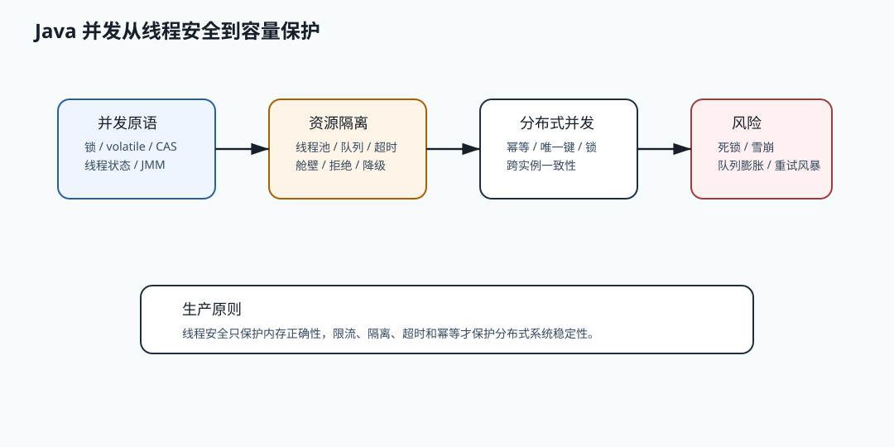
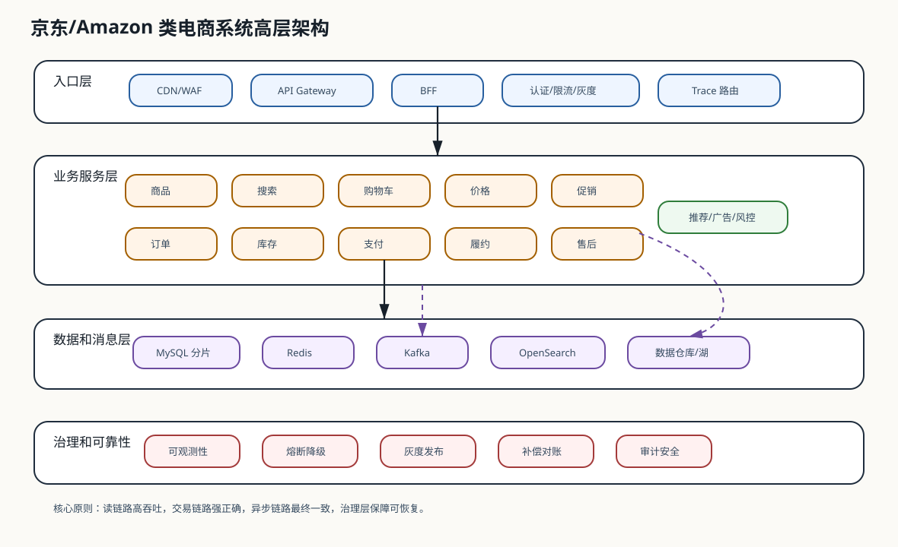

# 面试答案共享模型

[返回按分类学习面试题](README.md)

本文集中说明多道题都会使用的分析框架、示意图和 Java 17 示例。具体答案只保留题目特有的原理、
取舍和落地细节，避免在几十个文件中复制同一套模板。学习时应先回答具体问题，再按需引用这里的共性模型，
不能用通用框架代替题目分析。

## 有界并发和舱壁隔离



并发治理需要同时处理三个层次：

- JMM、锁和原子类保证单个 JVM 内的可见性、原子性与有序性。
- 有界线程池、信号量、超时和拒绝策略限制资源占用，防止过载扩散。
- 唯一键、幂等记录和状态机处理多实例下的业务正确性，不能用单机锁替代。

下面的舱壁只允许固定数量的调用同时进入受保护资源：

```java
import java.util.Objects;
import java.util.concurrent.Semaphore;
import java.util.function.Supplier;

final class BulkheadGuard {
    private final Semaphore permits;

    BulkheadGuard(int maxConcurrentCalls) {
        if (maxConcurrentCalls <= 0) {
            throw new IllegalArgumentException("maxConcurrentCalls must be positive");
        }
        this.permits = new Semaphore(maxConcurrentCalls);
    }

    <T> T execute(Supplier<T> supplier) {
        Objects.requireNonNull(supplier, "supplier");
        if (!permits.tryAcquire()) {
            throw new IllegalStateException("Bulkhead rejected the call");
        }
        try {
            return supplier.get();
        } finally {
            permits.release();
        }
    }
}
```

这段代码只展示准入控制。生产实现还需要调用超时、等待上限、拒绝指标、按下游隔离、动态容量配置和降级结果。
线程安全也不等于系统安全：无界队列会把过载转化为内存上涨和长尾延迟，`ConcurrentHashMap` 则不能替代
数据库唯一约束或分布式幂等。

## 最终一致、状态机和补偿


跨服务交易不能只讨论“是否一致”，而要明确事实来源、状态所有者、允许的延迟窗口和失败后的恢复责任。
本地事务与 Outbox 保证事实和待发布事件一起提交；消费者仍要处理重复、乱序、失败、死信和重放。

```java
enum TradeState {
    INIT,
    RESERVED,
    PAID,
    CLOSED
}

record TradeTransition(TradeState from, TradeState to, String reason) {

    boolean valid() {
        return switch (from) {
            case INIT -> to == TradeState.RESERVED || to == TradeState.CLOSED;
            case RESERVED -> to == TradeState.PAID || to == TradeState.CLOSED;
            case PAID, CLOSED -> false;
        };
    }
}
```

状态机阻止重复推进、逆向推进和越级推进，但它不能自行修复跨服务差异。完整闭环还需要：

- 用业务键或消息 ID 幂等消费，并保存处理结果而不是只保存布尔标记。
- 对暂时性失败做有上限的指数退避，对永久失败进入死信和人工审批流程。
- 用对账重新比较权威事实，用补偿命令恢复状态，并记录执行人、前后状态和原因。
- 为事件定义版本、聚合键和分区策略，避免不兼容升级与同一聚合内乱序。

最终一致不是“最终随便一致”。资金和库存必须可追踪、可审计、可重放、可对账和可修复。

## 安全分层和最小权限


安全设计至少要区分身份认证、资源授权、传输保护、数据保护、审计和风险控制。认证只证明调用者是谁，
授权还要检查租户和资源归属；TLS 保护传输链路，签名保护消息完整性，二者不能互相替代。

```java
import java.util.Set;

record SecurityDecision(boolean allowed, String reason) {
}

final class ScopePolicy {

    SecurityDecision check(Set<String> scopes, String requiredScope) {
        if (scopes.contains(requiredScope)) {
            return new SecurityDecision(true, "allowed");
        }
        return new SecurityDecision(false, "missing scope: " + requiredScope);
    }
}
```

Scope 校验只是最小示例。生产授权通常还要组合角色、属性、资源所有权、设备、IP、风险等级和操作类型。
服务层必须再次做资源级授权，不能只靠前端隐藏按钮或网关放行。日志不得泄露令牌、密钥和个人敏感信息，
密钥必须支持版本化、轮换、吊销和审计。

## 系统设计回答框架



系统设计题应按目标、规模、核心链路、数据、失败路径和演进路线展开。先定义 SLO 和业务不变量，
再选择技术；不能先罗列网关、Redis、Kafka 和数据库，然后倒推问题。

### 六层分析

1. 目标和约束：用户、租户、地域、合规、成功率、延迟和成本上限。
2. 容量：平均与峰值 QPS、并发、读写比、对象大小、保留周期和增长速度。
3. 架构和数据流：入口、领域服务、事实库、缓存、搜索、事件和离线链路。
4. 正确性：权威事实、幂等键、状态机、事务边界、对账和补偿。
5. 故障：超时、隔离、熔断、降级、积压、容灾、灰度和回滚。
6. 演进：分片、迁移、兼容、容量门禁、可观测性与单位请求成本。

### 可恢复的数据模型

业务主表只能回答当前状态，操作流水负责解释状态为什么变化，并提供审计和恢复证据：

```sql
create table operation_journal (
    id bigint primary key,
    business_key varchar(64) not null,
    operation_type varchar(64) not null,
    before_state varchar(64),
    after_state varchar(64),
    created_at timestamp not null
);
```

这只是抽象模型，不代表每个系统都应创建同名表。链路追踪应设计 trace/span 模型，配置中心应设计版本和发布记录，
缓存系统应设计 key、版本和失效事件。数据模型必须由题目的权威事实和查询模式推导。

### 取舍表达

```java
record DesignTradeoff(String option, String benefit, String cost, String risk) {

    String summary() {
        return option + " improves " + benefit + ", costs " + cost + ", risks " + risk;
    }
}
```

每个关键选择都应说明收益、成本、风险、适用条件和退出方案。无法监控、回滚、对账或补偿的方案，
不能视为完整的生产设计。

## 生产事故处置框架

事故回答应沿时间线推进，而不是直接猜根因。具体答案必须给出该事故独有的指标、证据、止血动作和恢复方法，
下面的框架只负责保证处置过程不遗漏关键阶段。

### T0 到 T5 时间线

- T0 确认影响：核对成功率、错误率、P99、QPS、投诉、核心业务指标和影响租户。
- T1 立即止血：暂停灰度、回滚配置、限流、降级、隔离下游或暂停非核心任务。
- T2 建立时间线：对齐发布、配置、流量突增、数据库、缓存、MQ、下游和定时任务。
- T3 定位根因：使用 Trace 定位调用链，使用日志定位错误码，使用指标确认资源瓶颈。
- T4 数据恢复：补偿失败请求、重放消息、修复状态、执行对账并保留审计记录。
- T5 复盘固化：补告警、测试、Runbook 和自动化门禁，防止同类事故再次发生。

### 证据分层

```text
gateway: QPS、4xx、5xx、限流命中、请求体大小、认证失败
service: P99、线程池、连接池、熔断状态、异常类型、Trace span
database: 慢 SQL、锁等待、死锁、连接数、主从延迟、事务耗时
cache/mq: 命中率、热 key、Redis P99、consumer lag、DLQ、重试次数
release: 版本、配置、灰度比例、变更人、变更时间、回滚记录
```

### 指挥和操作边界

- 值班工程师确认告警、影响面、最近变更并执行已授权预案。
- 模块负责人决定降级、回滚、暂停任务或切流，事故指挥统一时间线和恢复目标。
- 数据负责人审批补偿、对账、重放和人工修复，所有操作都要有记录和回滚方案。
- 保存 dump、日志和指标后再重启；服务恢复后仍要完成数据恢复和复盘。

## 架构取舍答题框架

架构取舍不是给技术贴标签，而是在明确约束下比较方案。回答顺序如下：

1. 先说明业务不变量、规模、SLO、团队能力和当前主要矛盾。
2. 给出所选方案解决了什么问题，以及没有选择的方案在哪些约束下更合适。
3. 主动说明引入的成本、故障模式和配套治理，不把任何技术描述成银弹。
4. 用压测、事故、成本和交付数据验证选择，并给出指标恶化后的迁移或退出方案。

项目尚未真实经历的规模和事故不能包装成个人成绩。可以说明设计、代码和测试证据，同时明确哪些结论仍需生产验证。

## STAR 行为面试框架

行为题必须使用自己的真实经历，不能照抄示例数据。每个故事按下面的证据链组织：

- Situation：交代业务影响、技术约束、时间压力和涉及团队，不做冗长项目介绍。
- Task：说明自己的职责、目标、判断标准，以及为什么需要主动承担。
- Action：突出本人做出的分析、设计、取舍、推动和风险控制，区分团队共同工作。
- Result：给出可核验的前后指标、交付结果和影响范围，并说明复盘后沉淀的长期机制。

面试前还要准备失败、反对意见、替代方案、个人贡献和“如果重做一次”的追问。没有真实数字时应说明证据类型，
不要编造 P99、成本或收入结果。

## 现场编码答题框架

现场编码先澄清输入输出、数据规模、异常策略、并发要求和可用标准库，再实现最小正确版本。完成后主动说明：

- 正常、边界、异常和并发测试。
- 时间与空间复杂度，以及最坏情况。
- 线程安全、资源上限、取消和超时。
- 面试实现与生产实现的差异，哪些能力应交给成熟组件。

代码应优先保证正确、可读、可测试，不能为了展示设计模式而提前复杂化。

## 反问面试官判断框架

反问用于验证岗位，而不是展示术语。应从回答中判断：

- 团队是否说得清业务指标、SLO、系统规模和当前最重要的问题。
- 是否有明确 owner、on-call、复盘、灰度、回滚、容量验证和技术债治理机制。
- Senior/L6 的职责是否包含技术判断、跨团队影响和可量化结果，而不只是承担更多需求。
- 入职目标、决策权限、资源投入和成长反馈是否明确。

风险信号包括只谈技术名词、不谈指标和事故；所有问题依赖人肉处理；岗位目标模糊；技术债没有 owner、优先级或预算。
